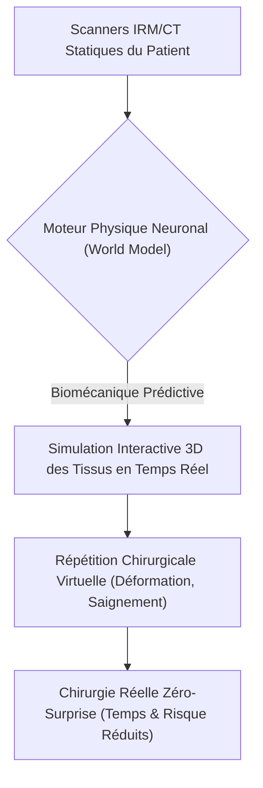
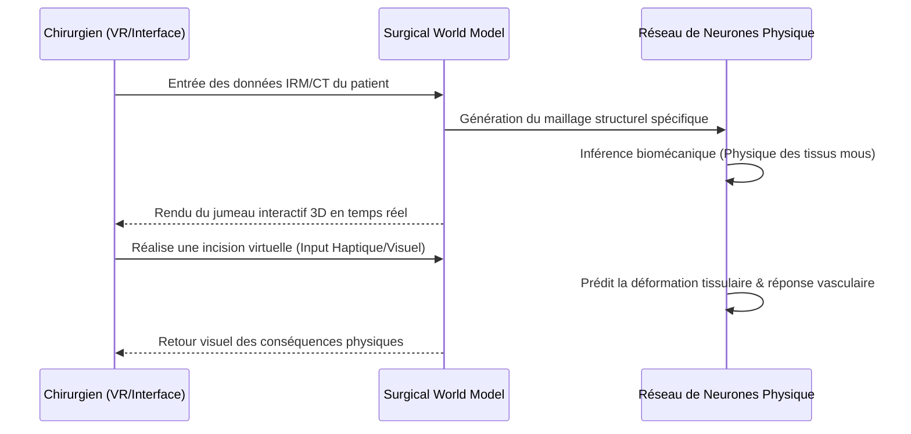

<!-- markdownlint-disable MD009 MD010 MD013 MD022 MD028 MD032 MD033 MD034 MD036 MD037 MD039 MD041 MD058 MD060 -->

[ 🇬🇧 English Version ](./README.md)

# Surgical World Model

> **Résumé exécutif :** Un moteur physique neuronal qui génère une simulation 3D prédictive et en temps réel de la biomécanique des tissus mous, permettant aux chirurgiens de répéter et d'optimiser des procédures complexes sur des jumeaux numériques spécifiques au patient avant même la première incision.

---

## 1. Aperçu visuel & Effet Wahou

## 2. La thèse contrariante (Peter Thiel Style)

**La croyance populaire :** Une meilleure imagerie statique (IRM 4K, visualisation 3D) est suffisante pour améliorer les résultats chirurgicaux et réduire les complications.
**La vérité cachée :** L'anatomie est fondamentalement dynamique, non statique. Les complications surviennent parce que les chirurgiens ne peuvent pas prédire comment un tissu mou vivant va se déformer, saigner ou se déchirer lorsqu'il est coupé ; la véritable avancée nécessite un "World Model" prédictif, entraîné sur des milliers d'heures de chirurgie pour simuler la causalité biomécanique exacte en temps réel, éliminant ainsi les surprises chirurgicales.

## 3. Le problème & La cible

**Modèle économique :** B2B
**Cible précise :** Hôpitaux, cliniques chirurgicales spécialisées, et constructeurs de matériel médical (MedTech).
**La douleur urgente :** Les chirurgiens planifient des opérations complexes et à haut risque à l'aide d'images statiques 2D/3D. Les imprévus anatomiques pendant la chirurgie entraînent une prolongation du temps de bloc opératoire (qui coûte des milliers d'euros la minute), des complications graves et des réclamations massives en responsabilité médicale.

## 4. Architecture technique & Plomberie

## 5. Modèle économique & Viabilité financière

| Métrique                    | Valeur                                                          |
| --------------------------- | --------------------------------------------------------------- |
| Structure de prix           | Frais de génération par scan + Licence SaaS Entreprise Hôpital  |
| Objectif 12 mois            | 4 hôpitaux de recherche chirurgicale spécialisés (à 25 000€/an) |
| Calcul du CA (Target 100k€) | 4 \* 25 000€ = 100 000€ de revenus annuels récurrents           |
| Marge brute estimée         | 85%                                                             |

## 6. Moteur de distribution & Fossé défensif (Moat)

**Stratégie d'acquisition :** Ventes B2B directes aux Directeurs Médicaux et partenariats avec les géants de l'imagerie MedTech (ex: Siemens, GE Healthcare) pour un déploiement intégré.
**Moat (Barrière à l'entrée) :** Les LLM génériques ou les logiciels de rendu 3D standards (Unity/Unreal) ne peuvent pas simuler une physique biologique précise. Construire ce modèle nécessite des milliers d'heures de données vidéo chirurgicales propriétaires et annotées, fusionnées avec des réseaux de neurones informés par la physique pour obtenir une émulation des tissus mous cliniquement précise et sans latence.

## 7. Grille d'évaluation détaillée

| Critère                           | Score VC (/100) | Score Terrain (/100) |
| --------------------------------- | --------------- | -------------------- |
| Thèse & Monopole / Urgence        | 23 / 25         | -- / 25              |
| Moat / Résistance aux LLM natifs  | 25 / 25         | -- / 25              |
| Scalabilité / Friction d'adoption | 20 / 25         | -- / 25              |
| Unit Economics / ROI direct       | 22 / 25         | -- / 25              |
| **TOTAL**                         | **90 / 100**    | **-- / 100**         |

> **Verdict VC :** Surgical World Model redéfinit la robotique médicale en dotant les robots d'une compréhension implicite de la physique des tissus mous. Passer de la programmation explicite à un modèle du monde physique appris est essentiel pour l'autonomie dans des environnements complexes. Le rempart profond provient de l'accès exclusif aux données vidéo chirurgicales et des contraintes de simulation biomécanique.
> **Verdict Terrain :** En attente d'évaluation.
