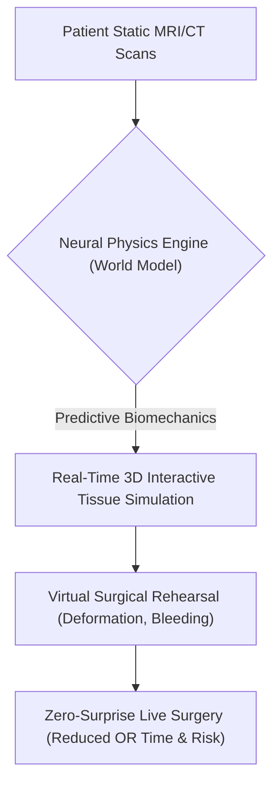
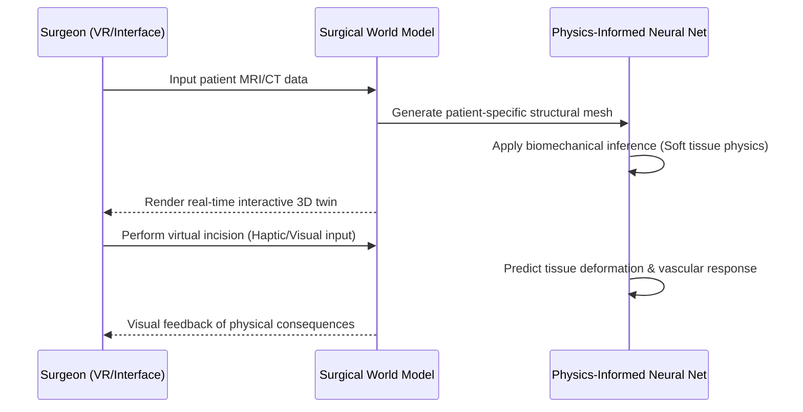

<!-- markdownlint-disable MD009 MD010 MD013 MD022 MD028 MD032 MD033 MD034 MD036 MD037 MD039 MD041 MD058 MD060 -->

[ 🇫🇷 Version Française ](./README.fr.md)

# Surgical World Model

> **Executive Summary:** A neural physics engine that generates a predictive, real-time 3D simulation of soft tissue biomechanics, allowing surgeons to rehearse and optimize complex procedures on patient-specific digital twins before the first incision.

---

## 1. Visual Overview & Wow Effect

## 2. Contrarian Thesis (Peter Thiel Style)

**Popular Belief:** Better static imaging (4K MRI, 3D visualization) is sufficient to improve surgical outcomes and reduce complications.
**Hidden Truth:** Anatomy is inherently dynamic, not static. Complications arise because surgeons cannot predict how living soft tissue will deform, bleed, or tear when cut; the true breakthrough requires a predictive "World Model" trained on thousands of surgical hours to simulate exact biomechanical causality in real-time, effectively eliminating surgical surprises.

## 3. Problem & Target Market

**Business Model:** B2B
**Target Audience:** Hospitals, specialized surgical clinics, and MedTech hardware manufacturers.
**Urgent Pain Point:** Surgeons currently plan complex, high-stakes operations using static 2D/3D images. Anatomical surprises during surgery lead to prolonged Operating Room (OR) time (costing thousands per minute), severe complications, and massive medical liability claims.

## 4. Technical Architecture & Infrastructure

## 5. Business Model & Financial Viability

| Metric                 | Value                                                       |
| ---------------------- | ----------------------------------------------------------- |
| Pricing Structure      | Per-scan generation fee + Hospital Enterprise SaaS License  |
| 12-Month Target        | 4 specialized surgical research hospitals (at 25,000€/year) |
| Revenue Formula        | 4 \* 25,000€ = 100,000€ ARR                                 |
| Estimated Gross Margin | 85%                                                         |

## 6. Distribution Engine & Moat

**Acquisition Strategy:** Direct B2B sales to Chief Medical Officers and partnerships with major MedTech imaging giants (e.g., Siemens, GE Healthcare) for integrated deployment.
**Moat (Defensibility):** Generic LLMs or standard 3D rendering software (Unity/Unreal) cannot simulate accurate biological physics. Building this requires thousands of hours of proprietary, annotated surgical video data fused with physics-informed neural networks to achieve zero-latency, clinically accurate soft-tissue emulation.

## 7. Detailed Evaluation Grid

| Criterion                   | VC Score (/100) | Market Score (/100) |
| --------------------------- | --------------- | ------------------- |
| Thesis & Monopoly / Urgency | -- / 25         | -- / 25             |
| Moat / LLM Immunity         | -- / 25         | -- / 25             |
| Scalability / UX Friction   | -- / 25         | -- / 25             |
| Unit Economics / ROI        | -- / 25         | -- / 25             |
| **TOTAL**                   | **-- / 100**    | **-- / 100**        |

> **VC Verdict:** Pending evaluation.
> **Market Verdict:** Pending evaluation.
