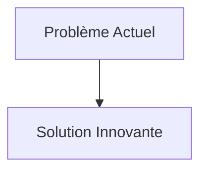
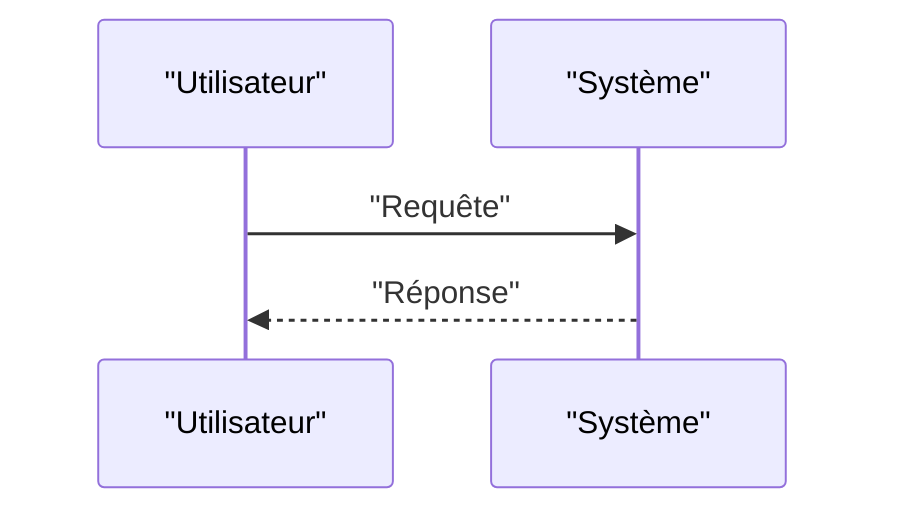

<!-- markdownlint-disable MD009 MD010 MD013 MD022 MD028 MD032 MD033 MD034 MD036 MD037 MD039 MD041 MD058 MD060 -->

[ 🇬🇧 English Version ](./README.md)

# Swarm Hijack Defender

> **Résumé exécutif :** Un protocole de consensus décentralisé byzantin ultra-léger (embarqué sur les microcontrôleurs des drones) couplé à une analyse comportementale en temps réel (machine learning). Chaque drone surveille la cinématique et les communications de ses voisins (Swarm Immunology).

---

## 1. Aperçu visuel & Effet Wahou

## 2. La thèse contrariante (Peter Thiel Style)

- **La croyance populaire :** Les solutions existantes sont suffisantes.
- **La vérité cachée :** En réalité, Les solutions de cybersécurité cloud ont trop de latence. Dans un essaim, les décisions de rejet doivent se prendre en millisecondes, sans connexion centrale (edge-natif), en s'appuyant sur les lois de la physique (vérification que le message est cohérent avec la position physique du drone émetteur).

## 3. Le problème & La cible

- **Modèle économique :** B2B / B2G
- **Cible précise :** Armées, opérateurs logistiques de drones (Amazon, Zipline), services de secours.
- **La douleur urgente :** Avec le déploiement massif de flottes de drones autonomes (swarms) communicant entre eux, une nouvelle menace apparaît : la subversion de l'essaim. Un attaquant injectant un faux nœud ou des données erronées (spoofing GPS/RF) peut provoquer des réactions en chaîne (brouillage de la topologie, crashs collectifs, détournement de la mission).

## 4. Architecture technique & Plomberie

## 5. Modèle économique & Viabilité financière

| Métrique                        | Valeur                   |
| :------------------------------ | :----------------------- |
| **Structure de prix**           | Abonnement B2B           |
| **Objectif 12 mois**            | 100 clients à 1000€/mois |
| **Calcul du CA (Target 100k€)** | 100 \* 1000 = 100k€      |
| **Marge brute estimée**         | 80%                      |

## 6. Moteur de distribution & Fossé défensif (Moat)

- **Stratégie d'acquisition :** Ventes directes
- **Moat (Barrière à l'entrée) :** Un protocole de consensus décentralisé byzantin ultra-léger (embarqué sur les microcontrôleurs des drones) couplé à une analyse comportementale en temps réel (machine learning). Chaque drone surveille la cinématique et les communications de ses voisins (Swarm Immunology). Si un nœud dévie physiquement de l'intention collective ou émet des vecteurs aberrants, il est cryptographiquement isolé (quarantaine) par le reste de l'essaim. (Difficile à copier à cause de : Faux positifs conduisant l'essaim à se fragmenter inutilement ; consommation énergétique des calculs cryptographiques et de l'IA sur la batterie limitée du drone.)

## 7. Grille d'évaluation détaillée

| Critère                               | Score VC (/100) | Score Terrain (/100) |
| :------------------------------------ | :-------------: | :------------------: |
| **Thèse & Monopole / Urgence**        |     -- / 25     |       -- / 25        |
| **Moat / Résistance aux LLM natifs**  |     -- / 25     |       -- / 25        |
| **Scalabilité / Friction d'adoption** |     -- / 25     |       -- / 25        |
| **Unit Economics / ROI direct**       |     -- / 25     |       -- / 25        |
| **TOTAL**                             |  **-- / 100**   |     **-- / 100**     |

> **Verdict VC :** En attente d'évaluation.
> **Verdict Terrain :** En attente d'évaluation.
