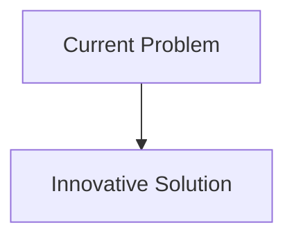
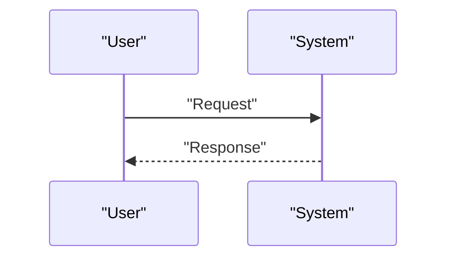

<!-- markdownlint-disable MD009 MD010 MD013 MD022 MD028 MD032 MD033 MD034 MD036 MD037 MD039 MD041 MD058 MD060 -->

[ 🇫🇷 Version Française ](./README.fr.md)

# Swarm Hijack Defender

> **Executive Summary:** An ultra-lightweight Byzantine decentralized consensus protocol (embedded on drone microcontrollers) coupled with real-time behavioral analysis (machine learning). Each drone monitors the kinematics and communications of its neighbors (Swarm Immunology).

---

## 1. Visual Overview & Wow Effect

## 2. Contrarian Thesis (Peter Thiel Style)

- **Popular Belief:** Existing solutions are sufficient.
- **Hidden Truth:** In reality, cloud cybersecurity solutions have too much latency. In a swarm, rejection decisions must be made in milliseconds, without a central connection (edge-native), relying on the laws of physics (verification that the message is consistent with the physical position of the transmitting drone).

## 3. Problem & Target Market

- **Business Model:** B2B / B2G
- **Target Audience:** Armies, drone logistics operators (Amazon, Zipline), rescue services.
- **Urgent Pain Point:** With the massive deployment of fleets of autonomous drones (swarms) communicating with each other, a new threat appears: the subversion of the swarm. An attacker injecting a false node or erroneous data (GPS/RF spoofing) can cause chain reactions (topology scrambling, collective crashes, mission diversion).

## 4. Technical Architecture & Infrastructure

## 5. Business Model & Financial Viability

| Metric                     | Value                        |
| :------------------------- | :--------------------------- |
| **Pricing Structure**      | B2B Subscription             |
| **12-Month Target**        | 100 customers at 1000€/month |
| **Revenue Formula**        | 100 \* 1000 = 100k€          |
| **Estimated Gross Margin** | 80%                          |

## 6. Distribution Engine & Moat

- **Acquisition Strategy:** Direct Sales
- **Moat (Defensibility):** An ultra-lightweight Byzantine decentralized consensus protocol (embedded on drone microcontrollers) coupled with real-time behavioral analysis (machine learning). Each drone monitors the kinematics and communications of its neighbors (Swarm Immunology). If a node physically deviates from the collective intent or emits aberrant vectors, it is cryptographically isolated (quarantined) by the rest of the swarm.(Difficult to copy because of: False positives leading the swarm to fragment unnecessarily; energy consumption of cryptographic calculations and AI on the drone's limited battery.)

## 7. Detailed Evaluation Grid

| Criterion                       | VC Score (/100) | Market Score (/100) |
| :------------------------------ | :-------------: | :-----------------: |
| **Thesis & Monopoly / Urgency** |     -- / 25     |       -- / 25       |
| **Moat / LLM Immunity**         |     -- / 25     |       -- / 25       |
| **Scalability / UX Friction**   |     -- / 25     |       -- / 25       |
| **Unit Economics / ROI**        |     -- / 25     |       -- / 25       |
| **TOTAL**                       |  **-- / 100**   |    **-- / 100**     |

> **VC Verdict:** Pending evaluation.
> **Market Verdict:** Pending evaluation.
