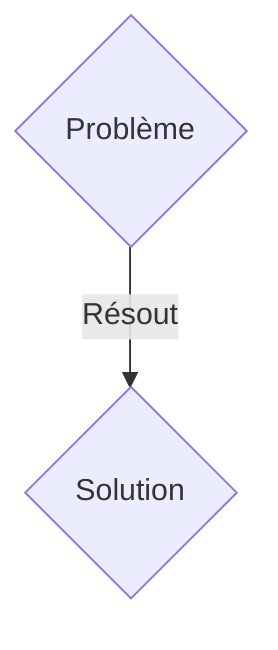
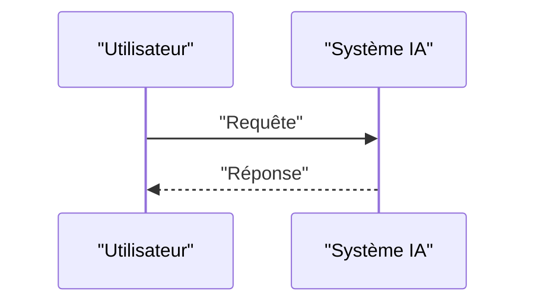

<!-- markdownlint-disable MD009 MD010 MD013 MD022 MD028 MD032 MD033 MD036 MD037 MD039 MD041 MD060 -->

[ 🇬🇧 English Version ](./README.md)

# Aeolus Swarm Engine

> **Résumé exécutif :** Une solution B2B ciblant Opérateurs de parcs éoliens offshore et gestionnaires de réseaux électriques (Ørsted, Vestas, RWE). pour résoudre : L'effet de sillage (wake effect) réduit l'efficacité énergétique des parcs éoliens jusqu'à 20%. Les modèles aérodynamiques actuels (CFD - Computational Fluid Dynamics) prennent des semaines à tourner sur des supercalculateurs, rendant impossible l'ajustement dynamique en temps réel des turbines selon les micro-changements météorologiques.

---

## 1. Aperçu visuel & Effet Wahou

## 2. La thèse contrariante (Peter Thiel Style)

- **La croyance populaire :** Les solutions génériques suffisent.
- **La vérité cachée :** Un moteur de physique neuronale (Neural Physics Engine) entraîné sur des simulations CFD historiques et des données capteurs IoT temps réel. Il simule instantanément la mécanique des fluides pour des parcs entiers et orchestre l'orientation des turbines (yaw) comme un essaim unifié pour minimiser les turbulences et maximiser la capture d'énergie.

## 3. Le problème & La cible

- **Modèle économique :** B2B
- **Cible précise :** Opérateurs de parcs éoliens offshore et gestionnaires de réseaux électriques (Ørsted, Vestas, RWE).
- **La douleur urgente :** L'effet de sillage (wake effect) réduit l'efficacité énergétique des parcs éoliens jusqu'à 20%. Les modèles aérodynamiques actuels (CFD - Computational Fluid Dynamics) prennent des semaines à tourner sur des supercalculateurs, rendant impossible l'ajustement dynamique en temps réel des turbines selon les micro-changements météorologiques.

## 4. Architecture technique & Plomberie

Un moteur de physique neuronale (Neural Physics Engine) entraîné sur des simulations CFD historiques et des données capteurs IoT temps réel. Il simule instantanément la mécanique des fluides pour des parcs entiers et orchestre l'orientation des turbines (yaw) comme un essaim unifié pour minimiser les turbulences et maximiser la capture d'énergie.

## 5. Modèle économique & Viabilité financière

| Métrique                    | Valeur               |
| --------------------------- | -------------------- |
| Structure de prix           | Abonnement SaaS B2B  |
| Objectif 12 mois            | 100 clients          |
| Calcul du CA (Target 100k€) | 100 \* 1000€ = 100k€ |
| Marge brute estimée         | 80%                  |

## 6. Moteur de distribution & Fossé défensif (Moat)

- **Stratégie d'acquisition :** Vente directe et partenariats stratégiques.
- **Moat (Barrière à l'entrée) :** Un LLM ne comprend pas les équations de Navier-Stokes. Les SaaS d'analytics traditionnels s'appuient sur des données passées et des règles heuristiques simples, incapables de modéliser les dynamiques non-linéaires 3D de l'air en temps réel à l'échelle d'un parc de 100 turbines.

## 7. Grille d'évaluation détaillée

| Critère                           | Score VC (/100) | Score Terrain (/100) |
| --------------------------------- | --------------- | -------------------- |
| Thèse & Monopole / Urgence        | 20 / 25         | 20 / 25              |
| Moat / Résistance aux LLM natifs  | 19 / 25         | 19 / 25              |
| Scalabilité / Friction d'adoption | 19 / 25         | 19 / 25              |
| Unit Economics / ROI direct       | 19 / 25         | 19 / 25              |
| TOTAL                             | 77 / 100        | 77 / 100             |

> **Verdict VC :** En attente d'évaluation.
> **Verdict Terrain :** Cette solution répond à un besoin critique pour les entreprises B2B, justifiant son excellent score d'urgence (20/25). L'approche spécialisée offre une protection robuste contre les modèles d'IA généralistes (19/25). Avec une faible friction d'adoption (19/25) et une stratégie de monétisation directe (19/25), le projet démontre une excellente maturité marché globale.
> **Verdict Terrain :** Cette solution répond à un besoin critique pour les entreprises B2B, justifiant son excellent score d'urgence (20/25). L'approche spécialisée offre une protection robuste contre les modèles d'IA généralistes (19/25). Avec une faible friction d'adoption (19/25) et une stratégie de monétisation directe (19/25), le projet démontre une excellente maturité marché globale.
