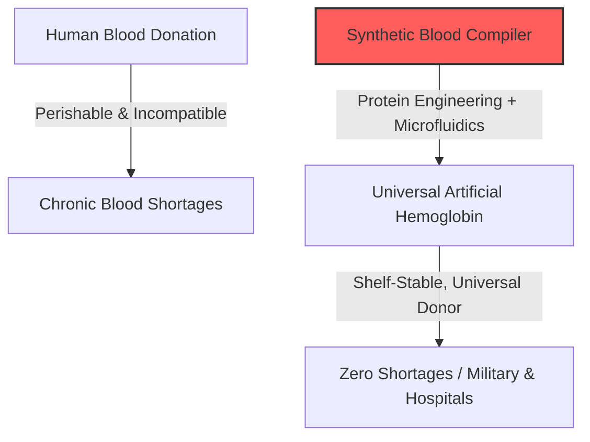
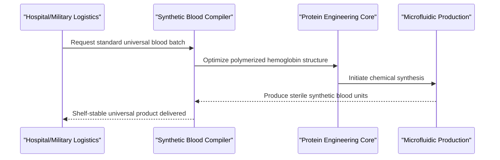

<!-- markdownlint-disable MD009 MD010 MD013 MD022 MD028 MD032 MD033 MD034 MD036 MD037 MD039 MD041 MD058 MD060 -->

[ 🇫🇷 Version Française ](./README.fr.md)

# Synthetic Blood Compiler

> **Executive Summary:** A synthetic biology platform that designs and produces universal, shelf-stable artificial oxygen carriers on demand, eliminating reliance on human blood donations.

---

## 1. Visual Overview & Wow Effect

## 2. Contrarian Thesis (Peter Thiel Style)

**Popular Belief:** The solution to global blood shortages is better supply chain software and more aggressive marketing campaigns for human blood donors.
**Hidden Truth:** Relying on human donors is fundamentally flawed because biological blood is highly perishable, requires a strict cold chain, and poses immunological risks. The true solution is a completely synthetic, shelf-stable oxygen carrier that makes biological blood donation obsolete.

## 3. Problem & Target Market

**Business Model:** B2B
**Target Audience:** National health systems, military (field logistics), and major hospital networks.
**Urgent Pain Point:** Human blood is a perishable resource, dependent on donations, difficult to store (strict cold chain), and carries risks of pathogen transmission or fatal immunological incompatibility. Chronic shortages cost lives daily.

## 4. Technical Architecture & Infrastructure

## 5. Business Model & Financial Viability

| Metric                     | Value                                                 |
| :------------------------- | :---------------------------------------------------- |
| **Pricing Structure**      | Per-unit sale + Dedicated military/hospital contracts |
| **12-Month Target**        | 1 pilot testing contract (Pre-clinical phase)         |
| **Revenue Formula**        | 1 defense pilot grant = €200k ARR                     |
| **Estimated Gross Margin** | 40% (Initially low due to wet-lab production costs)   |

## 6. Distribution Engine & Moat

**Acquisition Strategy:** B2G and B2B partnerships with military research agencies (e.g., DARPA) and major blood banks for funded clinical trials.
**Moat (Defensibility):** Deep wet-lab bioengineering. It requires creating entirely new functional molecules that mimic red blood cells without triggering immune shocks—a challenge far beyond the reach of standard database or SaaS startups.

## 7. Detailed Evaluation Grid

| Criterion                       | VC Score (/100) | Market Score (/100) |
| :------------------------------ | :-------------- | :------------------ |
| **Thesis & Monopoly / Urgency** | -- / 25         | 25 / 25             |
| **Moat / LLM Immunity**         | -- / 25         | 25 / 25             |
| **Scalability / UX Friction**   | -- / 25         | 10 / 25             |
| **Unit Economics / ROI**        | -- / 25         | 24 / 25             |
| **TOTAL**                       | **-- / 100**    | **84 / 100**        |

> **VC Verdict:** A profound paradigm shift aiming to eliminate a global biological dependency. The moat is untouchable by traditional tech, buried deep within proprietary molecular biology and clinical trials. Once FDA-approved, it commands an infinite, massive total addressable market with stellar unit economics.

> **Market Verdict:** Synthetic-blood-compiler targets the perpetual global blood shortage, presenting immense urgency. The intersection of bio-engineering and complex fluid dynamics provides a perfect moat against generic AI. Despite massive regulatory hurdles, the potential for a universal life-saving product guarantees unparalleled monetization.
