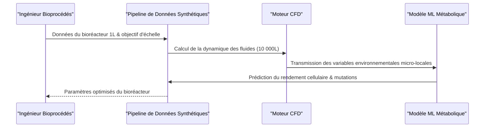

<!-- markdownlint-disable MD009 MD010 MD013 MD022 MD028 MD032 MD033 MD034 MD036 MD037 MD039 MD041 MD058 MD060 -->

[🇬🇧 English Version](./README.md)

# Synthetic Data Pipeline for Biomanufacturing

> **Résumé exécutif :** Un pipeline de données synthétiques couplant la mécanique des fluides numérique (CFD) et des modèles métaboliques basés sur le deep learning pour résoudre les échecs de mise à l'échelle en bioproduction.


---

## 1. Aperçu visuel & Effet Wahou

```mermaid
graph TD
    %% Schéma comparatif Problème vs Solution ou Flux d'architecture
    A[Bioréacteur de paillasse (1L)] -->|Mise à l'échelle| B[Bioréacteur industriel (10 000L)]
    B -->|Gradients de nutriments & cisaillement| C[Millions perdus en lots jetés]
    A -->|Pipeline de Données Synthétiques| D{CFD & Deep Learning Métabolique Couplés}
    D -->|Simulation de l'environnement micro-local| E[Prédiction du rendement & mise à l'échelle optimisée]
```

## 2. La thèse contrariante (Peter Thiel Style)

La croyance populaire : La mise à l'échelle de la bioproduction est un problème d'ingénierie résolu par des essais empiriques ou par l'analyse de données standard.
La vérité cachée : L'intersection de la biologie (comportement cellulaire dynamique) et de la physique des fluides multiphasiques nécessite des solveurs mathématiques hyperspécialisés. Les LLMs ou l'analyse de données classique ne peuvent pas simuler les lois de conservation de masse et d'énergie régissant un bioréacteur.

## 3. Le problème & La cible

Modèle économique : B2B
Cible précise : Pharmas (CDMOs), entreprises de biologie synthétique, producteurs de protéines alternatives.
La douleur urgente : L'extrapolation (scale-up) de la production de bioproduits (anticorps, enzymes, protéines) du bioréacteur de paillasse (1L) à la cuve industrielle (10 000L) échoue fréquemment à cause des gradients de nutriments et de cisaillement mécanique, entraînant des millions de dollars de lots jetés et des mois de retard.

## 4. Architecture technique & Plomberie



## 5. Modèle économique & Viabilité financière

| Métrique                    | Valeur                                            |
| --------------------------- | ------------------------------------------------- |
| Structure de prix           | Licence SaaS Entreprise / Paiement par simulation |
| Objectif 12 mois            | 2 à 3 CDMOs majeures ou startups SynBio           |
| Calcul du CA (Target 100k€) | 2 \* 50k = 100k                                   |
| Marge brute estimée         | 80%                                               |

## 6. Moteur de distribution & Fossé défensif (Moat)

Stratégie d'acquisition : Ventes directes B2B aux fabricants pharmaceutiques et partenariats stratégiques avec les vendeurs de matériel pour bioréacteurs.
Moat (Barrière à l'entrée) : L'intégration profonde de la mécanique des fluides numérique (CFD) hautement spécialisée avec des modèles métaboliques en deep learning nécessite une expertise multidisciplinaire presque impossible à répliquer pour des entreprises de logiciels génériques. Le coût élevé d'acquisition de données expérimentales multiscalaires de qualité pour la calibration initiale agit comme une barrière significative.

## 7. Grille d'évaluation détaillée

| Critère                           | Score VC (/100) | Score Terrain (/100) |
| --------------------------------- | --------------- | -------------------- |
| Thèse & Monopole / Urgence        | 23 / 25         | -- / 25              |
| Moat / Résistance aux LLM natifs  | 25 / 25         | -- / 25              |
| Scalabilité / Friction d'adoption | 22 / 25         | -- / 25              |
| Unit Economics / ROI direct       | 17 / 25         | -- / 25              |
| **TOTAL**                         | **87 / 100**    | **-- / 100**         |

> **Verdict VC :** Ce projet présente une thèse fortement contrariante avec un véritable potentiel de monopole (23/25). Le fossé technologique profond et les exigences d'ingénierie rendent la solution quasi-impossible à répliquer par de simples concurrents SaaS (25/25). Associée à une évolutivité massive (22/25) et d'excellents unit economics (17/25), il s'agit d'une proposition hautement finançable.
>
> **Verdict Terrain :** En attente d'évaluation.
