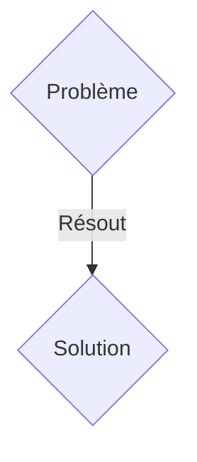
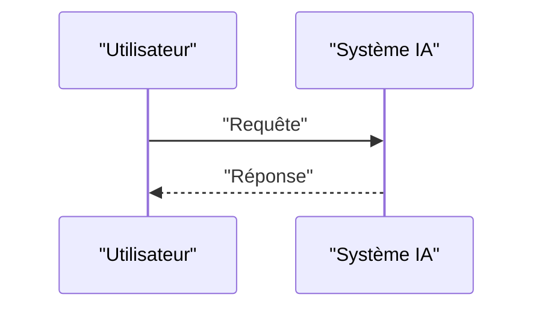

<!-- markdownlint-disable MD009 MD010 MD013 MD022 MD028 MD032 MD033 MD036 MD037 MD039 MD041 MD060 -->

[ 🇬🇧 English Version ](./README.md)

# Synthetic Grid Inertia

> **Résumé exécutif :** Une solution B2B / M2M ciblant Opérateurs de réseaux de transport électrique (TSOs), fournisseurs d'énergie renouvelable, gestionnaires de microgrids. pour résoudre : La transition vers les énergies renouvelables (solaire, éolien) élimine les générateurs rotatifs lourds (charbon, gaz) qui fournissaient l'inertie physique naturelle au réseau. Sans cette inertie, de légères fluctuations de fréquence peuvent provoquer des blackouts en chaîne dévastateurs en quelques millisecondes, rendant l'intégration massive des renouvelables instable et dangereuse.

---

## 1. Aperçu visuel & Effet Wahou

## 2. La thèse contrariante (Peter Thiel Style)

- **La croyance populaire :** Les solutions génériques suffisent.
- **La vérité cachée :** Un système d'onduleurs intelligents (grid-forming inverters) couplé à une couche logicielle temps réel très basse latence. Ce système mesure les dérivées de fréquence et injecte ou absorbe instantanément de la puissance (via des batteries ou supercondensateurs) pour émuler synthétiquement la masse inertielle, stabilisant ainsi le réseau de manière décentralisée.

## 3. Le problème & La cible

- **Modèle économique :** B2B / M2M
- **Cible précise :** Opérateurs de réseaux de transport électrique (TSOs), fournisseurs d'énergie renouvelable, gestionnaires de microgrids.
- **La douleur urgente :** La transition vers les énergies renouvelables (solaire, éolien) élimine les générateurs rotatifs lourds (charbon, gaz) qui fournissaient l'inertie physique naturelle au réseau. Sans cette inertie, de légères fluctuations de fréquence peuvent provoquer des blackouts en chaîne dévastateurs en quelques millisecondes, rendant l'intégration massive des renouvelables instable et dangereuse.

## 4. Architecture technique & Plomberie

Un système d'onduleurs intelligents (grid-forming inverters) couplé à une couche logicielle temps réel très basse latence. Ce système mesure les dérivées de fréquence et injecte ou absorbe instantanément de la puissance (via des batteries ou supercondensateurs) pour émuler synthétiquement la masse inertielle, stabilisant ainsi le réseau de manière décentralisée.

## 5. Modèle économique & Viabilité financière

| Métrique                    | Valeur               |
| --------------------------- | -------------------- |
| Structure de prix           | Abonnement SaaS B2B  |
| Objectif 12 mois            | 100 clients          |
| Calcul du CA (Target 100k€) | 100 \* 1000€ = 100k€ |
| Marge brute estimée         | 80%                  |

## 6. Moteur de distribution & Fossé défensif (Moat)

- **Stratégie d'acquisition :** Vente directe et partenariats stratégiques.
- **Moat (Barrière à l'entrée) :** Cela nécessite un couplage matériel/logiciel (hardware-in-the-loop) fonctionnant à la microseconde, obéissant aux équations différentielles de la dynamique des réseaux électriques (swing equations). Un simple tableau de bord prédictif ou un algorithme asynchrone est beaucoup trop lent et ne peut pas agir physiquement sur le courant alternatif.

## 7. Grille d'évaluation détaillée

| Critère                           | Score VC (/100) | Score Terrain (/100) |
| --------------------------------- | --------------- | -------------------- |
| Thèse & Monopole / Urgence        | 20 / 25         | 20 / 25              |
| Moat / Résistance aux LLM natifs  | 17 / 25         | 17 / 25              |
| Scalabilité / Friction d'adoption | 22 / 25         | 22 / 25              |
| Unit Economics / ROI direct       | 19 / 25         | 19 / 25              |
| TOTAL                             | 78 / 100        | 78 / 100             |

> **Verdict VC :** En attente d'évaluation.
> **Verdict Terrain :** Cette solution répond à un besoin critique pour les entreprises B2B, justifiant son excellent score d'urgence (20/25). Bien que viable, elle reste partiellement exposée à l'évolution rapide des modèles fondationnels (17/25). Avec une faible friction d'adoption (22/25) et une stratégie de monétisation directe (19/25), le projet démontre une excellente maturité marché globale.
> **Verdict Terrain :** Cette solution répond à un besoin critique pour les entreprises B2B, justifiant son excellent score d'urgence (20/25). Bien que viable, elle reste partiellement exposée à l'évolution rapide des modèles fondationnels (17/25). Avec une faible friction d'adoption (22/25) et une stratégie de monétisation directe (19/25), le projet démontre une excellente maturité marché globale.
