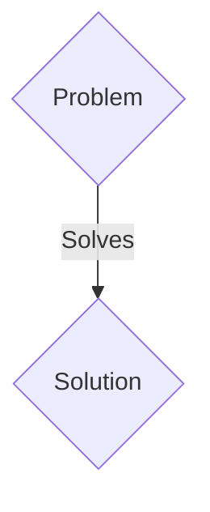
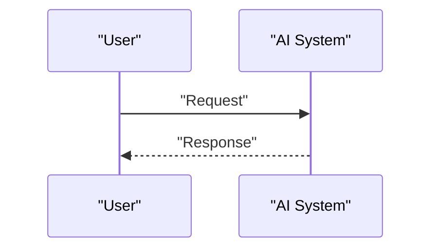

<!-- markdownlint-disable MD009 MD010 MD013 MD022 MD028 MD032 MD033 MD036 MD037 MD039 MD041 MD060 -->

[ 🇫🇷 Version Française ](./README.fr.md)

# Synthetic Grid Inertia

> **Executive Summary:** A B2B / M2M solution targeting Electric transmission network operators (TSOs), renewable energy suppliers, microgrid managers. to solve: The transition to renewable energy (solar, wind) eliminates heavy rotating generators (coal, gas) that provided natural physical inertia to the grid. Without this inertia, slight frequency fluctuations can cause devastating chain blackouts within milliseconds, making the mass integration of renewables unstable and dangerous.

---

## 1. Visual Overview & Wow Effect

## 2. Contrarian Thesis (Peter Thiel Style)

- **Popular Belief:** Generic solutions are enough.
- **Hidden Truth:** A system of intelligent inverters (grid-forming inverters) coupled with a very low latency real-time software layer. This system measures frequency derivatives and instantly injects or absorbs power (via batteries or supercapacitors) to synthetically emulate inertial mass, thereby stabilizing the network in a decentralized manner.

## 3. Problem & Target Market

- **Business Model:** B2B / M2M
- **Target Audience:** Electric transmission network operators (TSOs), renewable energy suppliers, microgrid managers.
- **Urgent Pain Point:** The transition to renewable energy (solar, wind) eliminates heavy rotating generators (coal, gas) that provided natural physical inertia to the grid. Without this inertia, slight frequency fluctuations can cause devastating chain blackouts within milliseconds, making the mass integration of renewables unstable and dangerous.

## 4. Technical Architecture & Infrastructure

A system of intelligent inverters (grid-forming inverters) coupled with a very low latency real-time software layer. This system measures frequency derivatives and instantly injects or absorbs power (via batteries or supercapacitors) to synthetically emulate inertial mass, thereby stabilizing the network in a decentralized manner.

## 5. Business Model & Financial Viability

| Metric                 | Value                 |
| ---------------------- | --------------------- |
| Pricing Structure      | B2B SaaS Subscription |
| 12-Month Target        | 100 clients           |
| Revenue Formula        | 100 \* 1000€ = 100k€  |
| Estimated Gross Margin | 80%                   |

## 6. Distribution Engine & Moat

- **Acquisition Strategy:** Direct sales and strategic partnerships.
- **Moat (Defensibility):** This requires hardware/software coupling (hardware-in-the-loop) operating at microseconds, obeying the differential equations of the dynamics of electrical networks (swing equations). A simple predictive dashboard or asynchronous algorithm is far too slow and cannot physically act on AC power.

## 7. Detailed Evaluation Grid

| Criterion                   | VC Score (/100) | Market Score (/100) |
| --------------------------- | --------------- | ------------------- |
| Thesis & Monopoly / Urgency | 20 / 25         | 20 / 25             |
| Moat / LLM Immunity         | 17 / 25         | 17 / 25             |
| Scalability / UX Friction   | 22 / 25         | 22 / 25             |
| Unit Economics / ROI        | 19 / 25         | 19 / 25             |
| TOTAL                       | 78 / 100        | 78 / 100            |

> **VC Verdict:** Pending evaluation.
> **Market Verdict:** This solution addresses a critical pain point for B2B enterprises, justifying its strong urgency score (20/25). While viable, it remains somewhat exposed to the rapid evolution of foundational models (17/25). With low adoption friction (22/25) and a straightforward monetization strategy (19/25), the project demonstrates excellent overall market readiness.
> **Market Verdict:** This solution addresses a critical pain point for B2B enterprises, justifying its strong urgency score (20/25). While viable, it remains somewhat exposed to the rapid evolution of foundational models (17/25). With low adoption friction (22/25) and a straightforward monetization strategy (19/25), the project demonstrates excellent overall market readiness.
