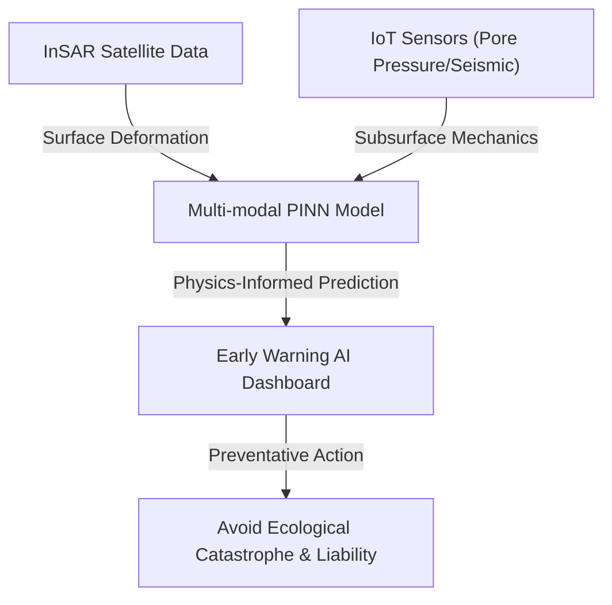
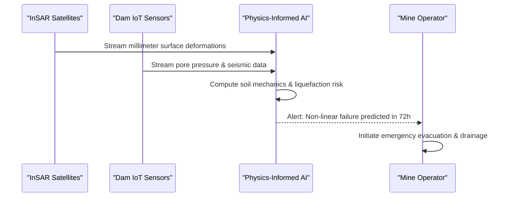

<!-- markdownlint-disable MD009 MD010 MD013 MD022 MD028 MD032 MD033 MD034 MD036 MD037 MD039 MD041 MD060 -->

[ 🇫🇷 Version Française ](./README.fr.md)

# Tailings Dam Failure Predictor

> **Executive Summary:** A multi-modal, spatio-temporal predictive model using Physics-Informed Neural Networks (PINNs) to ingest real-time satellite and IoT data to predict and prevent catastrophic tailings dam failures before they happen.

---

## 1. Visual Overview & Wow Effect

## 2. Contrarian Thesis (Peter Thiel Style)

- **Popular Belief:** Preventing dam failures requires simply building stronger physical walls and doing more frequent visual human inspections.
- **Hidden Truth:** The failure mechanism (soil liquefaction) happens deep inside the dam and is highly non-linear. By the time visual signs appear on the surface, it is mathematically too late. Only a real-time AI model constrained by fluid dynamics and geomechanics can spot the microscopic precursors in time.

## 3. Problem & Target Market

- **Business Model:** B2B
- **Target Audience:** Global mining companies (Rio Tinto, Vale, BHP), industrial insurers, and environmental agencies.
- **Urgent Pain Point:** Tailings dam failures cause massive ecological disasters, human casualties (e.g., Brumadinho), and multi-billion dollar liabilities. Current monitoring is fragmented, highly reactive, and consistently misses the weak signals of impending soil liquefaction.

## 4. Technical Architecture & Infrastructure

## 5. Business Model & Financial Viability

| Metric                     | Value                                     |
| -------------------------- | ----------------------------------------- |
| **Pricing Structure**      | High-ticket Annual SaaS per Dam Monitored |
| **12-Month Target**        | 2-3 pilot dams with a major mining corp   |
| **Revenue Formula**        | 3 Dams \* 35k€/year                       |
| **Estimated Gross Margin** | ~80%                                      |

## 6. Distribution Engine & Moat

- **Acquisition Strategy:** Direct enterprise sales to VP of Risk and Sustainability at global mining firms, leveraging the massive fear of legal liability and insurance mandates.
- **Moat (Defensibility):** This is a complex physics and multi-scale data fusion problem. A standard SaaS dashboard cannot understand the fluid mechanics and geotechnics required to anticipate non-linear collapse. The proprietary Physics-Informed Neural Network (PINN) architecture forms a deep moat.

## 7. Detailed Evaluation Grid

| Criterion                   | VC Score (/100) | Market Score (/100) |
| --------------------------- | --------------- | ------------------- |
| Thesis & Monopoly / Urgency | -- / 25         | -- / 25             |
| Moat / LLM Immunity         | -- / 25         | -- / 25             |
| Scalability / UX Friction   | -- / 25         | -- / 25             |
| Unit Economics / ROI        | -- / 25         | -- / 25             |
| **TOTAL**                   | **-- / 100**    | **-- / 100**        |

> **VC Verdict:** Pending evaluation.

> **Market Verdict:** Pending evaluation.
