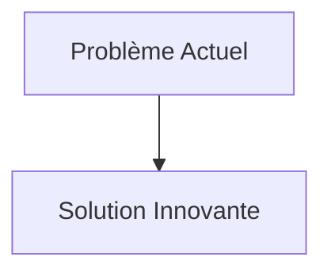
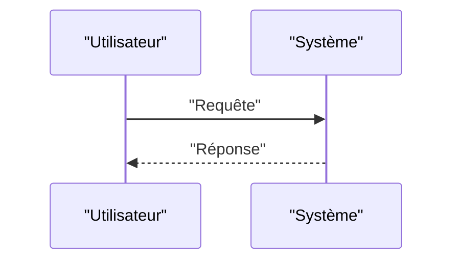

<!-- markdownlint-disable MD009 MD010 MD013 MD022 MD028 MD032 MD033 MD034 MD036 MD037 MD039 MD041 MD058 MD060 -->

[ 🇬🇧 English Version ](./README.md)

# Tectonic Strain Predictor Engine

> **Résumé exécutif :** Création d'un "World Model" sous-terrain temps réel (Physics-Informed Neural Networks - PINNs) qui ingère massivement des données InSAR (radar satellite), des données de déformation GPS à haute fréquence et des capteurs de gravité quantique. Le modèle simule la rhéologie et l'accumulation de contraintes dans la croûte terrestre avec une résolution kilométrique pour prédire les probabilités de rupture des failles.

---

## 1. Aperçu visuel & Effet Wahou

## 2. La thèse contrariante (Peter Thiel Style)

- **La croyance populaire :** Les solutions existantes sont suffisantes.
- **La vérité cachée :** En réalité, L'analyse de séries temporelles classique ou les LLMs ne comprennent pas la mécanique des roches ou la physique de la propagation des ondes sismiques. Il faut un moteur de simulation physique inversée capable de déduire les stress profonds à partir d'observations de surface en temps réel.

## 3. Le problème & La cible

- **Modèle économique :** B2G / B2B
- **Cible précise :** Gouvernements (zones sismiques : Japon, Californie, Chili), compagnies d'assurance réassurance, gestionnaires d'infrastructures critiques (barrages, centrales nucléaires).
- **La douleur urgente :** La prédiction des tremblements de terre reste le Saint Graal de la géophysique. Les méthodes actuelles s'appuient sur des statistiques historiques et des modèles de stress de croûte terrestre trop grossiers, empêchant des alertes précoces (au-delà de quelques secondes) et une évaluation dynamique précise du risque de rupture imminente.

## 4. Architecture technique & Plomberie

## 5. Modèle économique & Viabilité financière

| Métrique                        | Valeur                   |
| :------------------------------ | :----------------------- |
| **Structure de prix**           | Abonnement B2B           |
| **Objectif 12 mois**            | 100 clients à 1000€/mois |
| **Calcul du CA (Target 100k€)** | 100 \* 1000 = 100k€      |
| **Marge brute estimée**         | 80%                      |

## 6. Moteur de distribution & Fossé défensif (Moat)

- **Stratégie d'acquisition :** Ventes directes
- **Moat (Barrière à l'entrée) :** Création d'un "World Model" sous-terrain temps réel (Physics-Informed Neural Networks - PINNs) qui ingère massivement des données InSAR (radar satellite), des données de déformation GPS à haute fréquence et des capteurs de gravité quantique. Le modèle simule la rhéologie et l'accumulation de contraintes dans la croûte terrestre avec une résolution kilométrique pour prédire les probabilités de rupture des failles. (Difficile à copier à cause de : Le problème pourrait s'avérer intrinsèquement chaotique et imprévisible au-delà d'un certain seuil (effet papillon géologique), nécessité d'un accès constant aux données satellitaires radar très coûteuses, énorme responsabilité en cas de fausse alerte.)

## 7. Grille d'évaluation détaillée

| Critère                               | Score VC (/100) | Score Terrain (/100) |
| :------------------------------------ | :-------------: | :------------------: |
| **Thèse & Monopole / Urgence**        |     -- / 25     |       -- / 25        |
| **Moat / Résistance aux LLM natifs**  |     -- / 25     |       -- / 25        |
| **Scalabilité / Friction d'adoption** |     -- / 25     |       -- / 25        |
| **Unit Economics / ROI direct**       |     -- / 25     |       -- / 25        |
| **TOTAL**                             |  **-- / 100**   |     **-- / 100**     |

> **Verdict VC :** En attente d'évaluation.
> **Verdict Terrain :** En attente d'évaluation.
