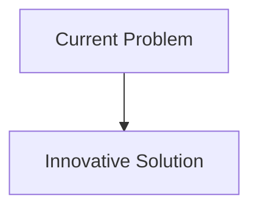
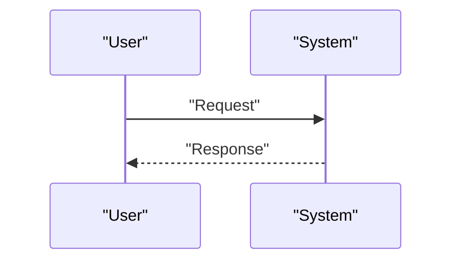

<!-- markdownlint-disable MD009 MD010 MD013 MD022 MD028 MD032 MD033 MD034 MD036 MD037 MD039 MD041 MD058 MD060 -->

[ 🇫🇷 Version Française ](./README.fr.md)

# Tectonic Strain Predictor Engine

> **Executive Summary:** Creation of a real-time underground "World Model" (Physics-Informed Neural Networks - PINNs) which massively ingests InSAR (satellite radar) data, high-frequency GPS deformation data and quantum gravity sensors. The model simulates rheology and stress accumulation in the Earth's crust with kilometer resolution to predict fault rupture probabilities.

---

## 1. Visual Overview & Wow Effect

## 2. Contrarian Thesis (Peter Thiel Style)

- **Popular Belief:** Existing solutions are sufficient.
- **Hidden Truth:** In reality, Classical time series analysis or LLMs do not understand rock mechanics or the physics of seismic wave propagation. What is needed is a reverse physics simulation engine capable of inferring deep stresses from real-time surface observations.

## 3. Problem & Target Market

- **Business Model:** B2G / B2B
- **Target Audience:** Governments (seismic zones: Japan, California, Chile), reinsurance insurance companies, critical infrastructure managers (dams, nuclear power plants).
- **Urgent Pain Point:** Predicting earthquakes remains the holy grail of geophysics. Current methods rely on historical statistics and crustal stress models that are too coarse, preventing early warnings (beyond a few seconds) and precise dynamic assessment of the risk of imminent rupture.

## 4. Technical Architecture & Infrastructure

## 5. Business Model & Financial Viability

| Metric                     | Value                        |
| :------------------------- | :--------------------------- |
| **Pricing Structure**      | B2B Subscription             |
| **12-Month Target**        | 100 customers at 1000€/month |
| **Revenue Formula**        | 100 \* 1000 = 100k€          |
| **Estimated Gross Margin** | 80%                          |

## 6. Distribution Engine & Moat

- **Acquisition Strategy:** Direct Sales
- **Moat (Defensibility):** Creation of a real-time underground "World Model" (Physics-Informed Neural Networks - PINNs) which massively ingests InSAR (satellite radar) data, high-frequency GPS deformation data and quantum gravity sensors. The model simulates rheology and stress accumulation in the Earth's crust with kilometer resolution to predict fault rupture probabilities.(Difficult to copy because of: The problem could turn out to be inherently chaotic and unpredictable beyond a certain threshold (geological butterfly effect), need for constant access to very expensive radar satellite data, huge liability in the event of a false alarm.)

## 7. Detailed Evaluation Grid

| Criterion                       | VC Score (/100) | Market Score (/100) |
| :------------------------------ | :-------------: | :-----------------: |
| **Thesis & Monopoly / Urgency** |     -- / 25     |       -- / 25       |
| **Moat / LLM Immunity**         |     -- / 25     |       -- / 25       |
| **Scalability / UX Friction**   |     -- / 25     |       -- / 25       |
| **Unit Economics / ROI**        |     -- / 25     |       -- / 25       |
| **TOTAL**                       |  **-- / 100**   |    **-- / 100**     |

> **VC Verdict:** Pending evaluation.
> **Market Verdict:** Pending evaluation.
