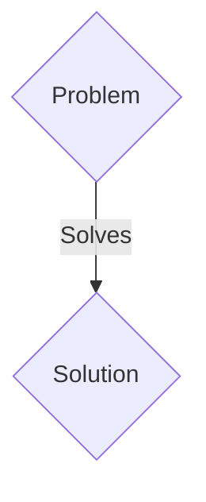
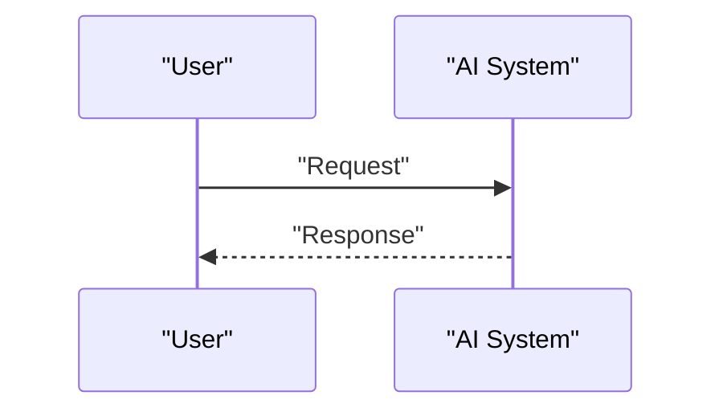

<!-- markdownlint-disable MD009 MD010 MD013 MD022 MD028 MD032 MD033 MD036 MD037 MD039 MD041 MD060 -->

[ 🇫🇷 Version Française ](./README.fr.md)

# Neural TeleOp Engine

> **Executive Summary:** A B2B (Software Licensing / Edge API) solution targeting Robotic surgery companies, underwater drone (ROV) operators, remote mining, intercontinental logistics. to solve: Long-distance robot teleoperation suffers from network latency (ping from 200ms to 2s). This latency causes cognitive seasickness in the operator and makes precision manipulation dangerous or impossible, blocking industry adoption.

---

## 1. Visual Overview & Wow Effect

## 2. Contrarian Thesis (Peter Thiel Style)

- **Popular Belief:** Generic solutions are enough.
- **Hidden Truth:** A generative state prediction model (World Model) embedded at the edge on the operator side. It synthesizes an artificial video and haptic stream without latency by predicting the immediate future state of the physical environment and the robot (Next-Frame Prediction).

## 3. Problem & Target Market

- **Business Model:** B2B (Software Licensing / Edge API)
- **Target Audience:** Robotic surgery companies, underwater drone (ROV) operators, remote mining, intercontinental logistics.
- **Urgent Pain Point:** Long-distance robot teleoperation suffers from network latency (ping from 200ms to 2s). This latency causes cognitive seasickness in the operator and makes precision manipulation dangerous or impossible, blocking industry adoption.

## 4. Technical Architecture & Infrastructure

A generative state prediction model (World Model) embedded at the edge on the operator side. It synthesizes an artificial video and haptic stream without latency by predicting the immediate future state of the physical environment and the robot (Next-Frame Prediction).

## 5. Business Model & Financial Viability

| Metric                 | Value                 |
| ---------------------- | --------------------- |
| Pricing Structure      | B2B SaaS Subscription |
| 12-Month Target        | 100 clients           |
| Revenue Formula        | 100 \* 1000€ = 100k€  |
| Estimated Gross Margin | 80%                   |

## 6. Distribution Engine & Moat

- **Acquisition Strategy:** Direct sales and strategic partnerships.
- **Moat (Defensibility):** We need video prediction consistent with the laws of physics in less than 10ms, which current LLM/Vision APIs or video compression algorithms cannot do.

## 7. Detailed Evaluation Grid

| Criterion                   | VC Score (/100) | Market Score (/100) |
| --------------------------- | --------------- | ------------------- |
| Thesis & Monopoly / Urgency | 18 / 25         | 18 / 25             |
| Moat / LLM Immunity         | 18 / 25         | 18 / 25             |
| Scalability / UX Friction   | 20 / 25         | 20 / 25             |
| Unit Economics / ROI        | 21 / 25         | 21 / 25             |
| TOTAL                       | 77 / 100        | 77 / 100            |

> **VC Verdict:** Pending evaluation.
> **Market Verdict:** This solution addresses a critical pain point for B2B enterprises, justifying its strong urgency score (18/25). The specialized approach provides robust protection against generalist AI models (18/25). With low adoption friction (20/25) and a straightforward monetization strategy (21/25), the project demonstrates excellent overall market readiness.
> **Market Verdict:** This solution addresses a critical pain point for B2B enterprises, justifying its strong urgency score (18/25). The specialized approach provides robust protection against generalist AI models (18/25). With low adoption friction (20/25) and a straightforward monetization strategy (21/25), the project demonstrates excellent overall market readiness.
