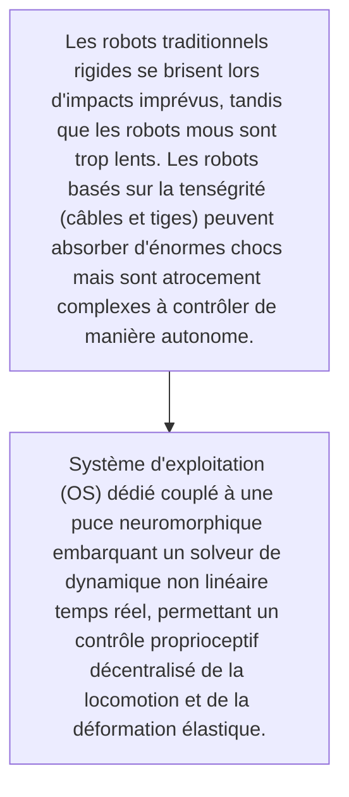
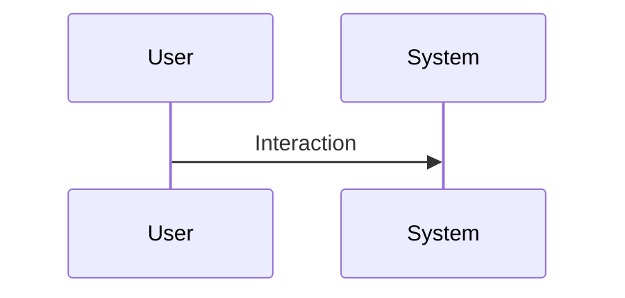

<!-- markdownlint-disable MD009 MD010 MD013 MD022 MD028 MD032 MD033 MD034 MD036 MD037 MD039 MD041 MD060 -->

[ 🇬🇧 English Version ](./README.md)

# Tensegrity OS

> **Résumé exécutif :** Système d'exploitation (OS) dédié couplé à une puce neuromorphique embarquant un solveur de dynamique non linéaire temps réel, permettant un contrôle proprioceptif décentralisé de la locomotion et de la déformation élastique.

---

## 1. Aperçu visuel & Effet Wahou

## 2. La thèse contrariante (Peter Thiel Style)

- **La croyance populaire :** Le contrôle d'un robot de tenségrité exige un traitement temps réel embarqué sans latence (edge computing) avec des modèles de physique complexes impossibles à déléguer au cloud ou à gérer avec des contrôleurs PID classiques.
- **La vérité cachée :** Système d'exploitation (OS) dédié couplé à une puce neuromorphique embarquant un solveur de dynamique non linéaire temps réel, permettant un contrôle proprioceptif décentralisé de la locomotion et de la déformation élastique.

## 3. Le problème & La cible

- **Modèle économique :** B2B
- **Cible précise :** Agences spatiales, logistique en milieux dangereux, inspection d'infrastructures souterraines/effondrées
- **La douleur urgente :** Les robots traditionnels rigides se brisent lors d'impacts imprévus, tandis que les robots mous sont trop lents. Les robots basés sur la tenségrité (câbles et tiges) peuvent absorber d'énormes chocs mais sont atrocement complexes à contrôler de manière autonome.

## 4. Architecture technique & Plomberie

## 5. Modèle économique & Viabilité financière

| Métrique                    | Valeur                                                          |
| --------------------------- | --------------------------------------------------------------- |
| Structure de prix           | [Prix / Modèle d'abonnement / Commission]                       |
| Objectif 12 mois            | [Nombre exact de clients/utilisateurs/transactions nécessaires] |
| Calcul du CA (Target 100k€) | [Formule mathématique exacte]                                   |
| Marge brute estimée         | [Marge en %]                                                    |

## 6. Moteur de distribution & Fossé défensif (Moat)

- **Stratégie d'acquisition :** [Viralité B2C, réseau C2C, acquisition B2B directe, adhésion dev M2M]
- **Moat (Barrière à l'entrée) :** Hardware très spécifique à co-développer, complexité mécanique de la miniaturisation des actuateurs, marché d'adoption initiale de niche.

## 7. Grille d'évaluation détaillée

| Critère                           | Score VC (/100) | Score Terrain (/100) |
| --------------------------------- | --------------- | -------------------- |
| Thèse & Monopole / Urgence        | -- / 25         | -- / 25              |
| Moat / Résistance aux LLM natifs  | -- / 25         | -- / 25              |
| Scalabilité / Friction d'adoption | -- / 25         | -- / 25              |
| Unit Economics / ROI direct       | -- / 25         | -- / 25              |
| TOTAL                             | -- / 100        | -- / 100             |

> **Verdict VC :** En attente d'évaluation.
> **Verdict Terrain :** En attente d'évaluation.
