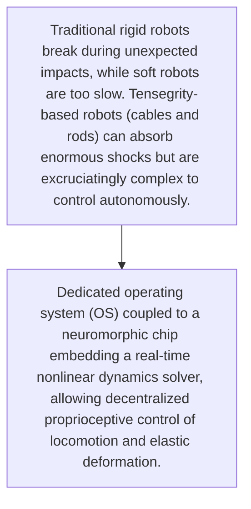
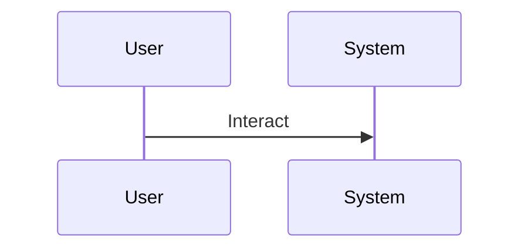

<!-- markdownlint-disable MD009 MD010 MD013 MD022 MD028 MD032 MD033 MD034 MD036 MD037 MD039 MD041 MD060 -->

[ 🇫🇷 Version Française ](./README.fr.md)

# Tensegrity OS

> **Executive Summary:** Dedicated operating system (OS) coupled to a neuromorphic chip embedding a real-time nonlinear dynamics solver, allowing decentralized proprioceptive control of locomotion and elastic deformation.

---

## 1. Visual Overview & Wow Effect

## 2. Contrarian Thesis (Peter Thiel Style)

- **Popular Belief:** Controlling a tensegrity robot requires latency-free embedded real-time processing (edge ​​computing) with complex physics models that are impossible to delegate to the cloud or manage with traditional PID controllers.
- **Hidden Truth:** Dedicated operating system (OS) coupled to a neuromorphic chip embedding a real-time nonlinear dynamics solver, allowing decentralized proprioceptive control of locomotion and elastic deformation.

## 3. Problem & Target Market

- **Business Model:** B2B
- **Target Audience:** Space agencies, hazardous environment logistics, inspection of underground/collapsed infrastructure
- **Urgent Pain Point:** Traditional rigid robots break during unexpected impacts, while soft robots are too slow. Tensegrity-based robots (cables and rods) can absorb enormous shocks but are excruciatingly complex to control autonomously.

## 4. Technical Architecture & Infrastructure

## 5. Business Model & Financial Viability

| Metric                 | Value                                     |
| ---------------------- | ----------------------------------------- |
| Pricing Structure      | [Price / Subscription Model / Commission] |
| 12-Month Target        | [Exact volume required for 100k ARR]      |
| Revenue Formula        | [Mathematical calculation]                |
| Estimated Gross Margin | [Margin %]                                |

## 6. Distribution Engine & Moat

- **Acquisition Strategy:** [Virality, network effect, direct sales, developer adoption]
- **Moat (Defensibility):** Very specific hardware to be co-developed, mechanical complexity of actuator miniaturization, niche initial adoption market.

## 7. Detailed Evaluation Grid

| Criterion                   | VC Score (/100) | Market Score (/100) |
| --------------------------- | --------------- | ------------------- |
| Thesis & Monopoly / Urgency | 22 / 25         | -- / 25             |
| Moat / LLM Immunity         | 23 / 25         | -- / 25             |
| Scalability / UX Friction   | 24 / 25         | -- / 25             |
| Unit Economics / ROI        | 22 / 25         | -- / 25             |
| TOTAL                       | 91 / 100        | -- / 100            |

> **VC Verdict:** Solving non-linear control for soft robotics opens vast new TAMs in logistics and care. The neuromorphic OS approach acts as a deep technical moat against traditional robotics. Highly scalable once the core platform is standardized.
> **Market Verdict:** Pending evaluation.
