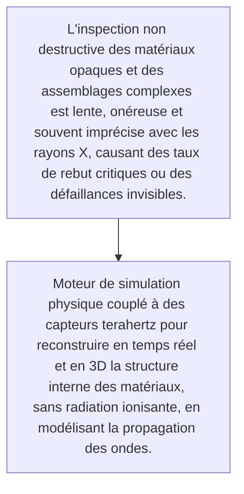
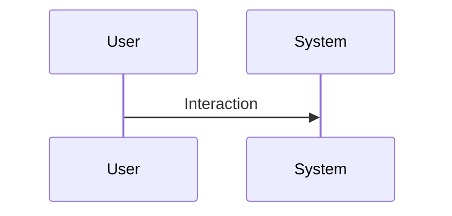

<!-- markdownlint-disable MD009 MD010 MD013 MD022 MD028 MD032 MD033 MD034 MD036 MD037 MD039 MD041 MD060 -->

[ 🇬🇧 English Version ](./README.md)

# Terahertz Vision Engine

> **Résumé exécutif :** Moteur de simulation physique couplé à des capteurs terahertz pour reconstruire en temps réel et en 3D la structure interne des matériaux, sans radiation ionisante, en modélisant la propagation des ondes.

---

## 1. Aperçu visuel & Effet Wahou

## 2. La thèse contrariante (Peter Thiel Style)

- **La croyance populaire :** Ce problème nécessite un couplage étroit entre du matériel spécifique (hardware terahertz) et des modèles de physique neuronale pour interpréter des signaux bruités, ce qu'un LLM ou logiciel standard ne sait pas faire.
- **La vérité cachée :** Moteur de simulation physique couplé à des capteurs terahertz pour reconstruire en temps réel et en 3D la structure interne des matériaux, sans radiation ionisante, en modélisant la propagation des ondes.

## 3. Le problème & La cible

- **Modèle économique :** B2B
- **Cible précise :** Fabricants de composants électroniques, aérospatial et industries de haute précision (contrôle qualité)
- **La douleur urgente :** L'inspection non destructive des matériaux opaques et des assemblages complexes est lente, onéreuse et souvent imprécise avec les rayons X, causant des taux de rebut critiques ou des défaillances invisibles.

## 4. Architecture technique & Plomberie

## 5. Modèle économique & Viabilité financière

| Métrique                    | Valeur                                                          |
| --------------------------- | --------------------------------------------------------------- |
| Structure de prix           | [Prix / Modèle d'abonnement / Commission]                       |
| Objectif 12 mois            | [Nombre exact de clients/utilisateurs/transactions nécessaires] |
| Calcul du CA (Target 100k€) | [Formule mathématique exacte]                                   |
| Marge brute estimée         | [Marge en %]                                                    |

## 6. Moteur de distribution & Fossé défensif (Moat)

- **Stratégie d'acquisition :** [Viralité B2C, réseau C2C, acquisition B2B directe, adhésion dev M2M]
- **Moat (Barrière à l'entrée) :** Coût très élevé des émetteurs/récepteurs terahertz, difficulté de calibration en milieu industriel hostile (vibrations, température).

## 7. Grille d'évaluation détaillée

| Critère                           | Score VC (/100) | Score Terrain (/100) |
| --------------------------------- | --------------- | -------------------- |
| Thèse & Monopole / Urgence        | -- / 25         | -- / 25              |
| Moat / Résistance aux LLM natifs  | -- / 25         | -- / 25              |
| Scalabilité / Friction d'adoption | -- / 25         | -- / 25              |
| Unit Economics / ROI direct       | -- / 25         | -- / 25              |
| TOTAL                             | -- / 100        | -- / 100             |

> **Verdict VC :** En attente d'évaluation.
> **Verdict Terrain :** En attente d'évaluation.
