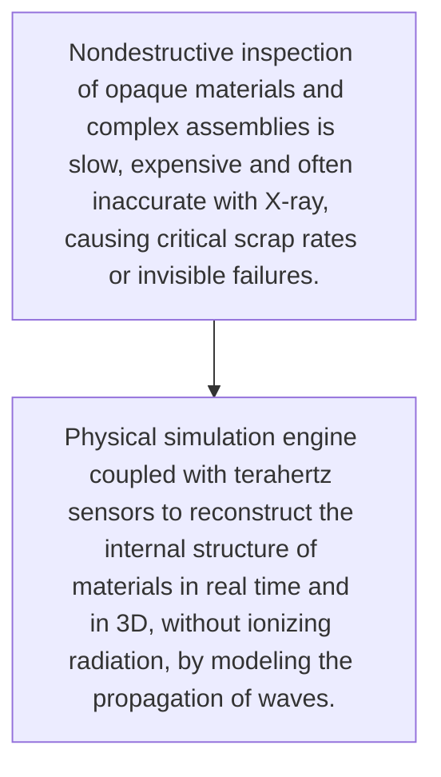
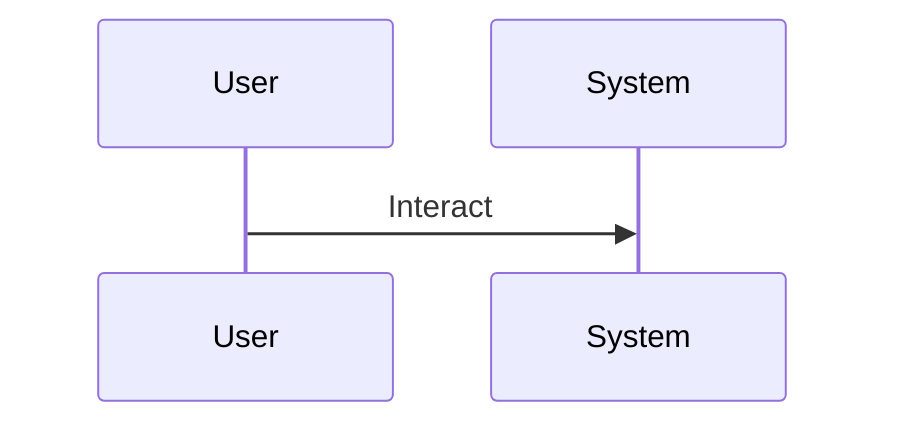

<!-- markdownlint-disable MD009 MD010 MD013 MD022 MD028 MD032 MD033 MD034 MD036 MD037 MD039 MD041 MD060 -->

[ 🇫🇷 Version Française ](./README.fr.md)

# Terahertz Vision Engine

> **Executive Summary:** Physical simulation engine coupled with terahertz sensors to reconstruct the internal structure of materials in real time and in 3D, without ionizing radiation, by modeling the propagation of waves.

---

## 1. Visual Overview & Wow Effect

## 2. Contrarian Thesis (Peter Thiel Style)

- **Popular Belief:** This problem requires close coupling between specific hardware (terahertz hardware) and neural physics models to interpret noisy signals, which a standard LLM or software cannot do.
- **Hidden Truth:** Physical simulation engine coupled with terahertz sensors to reconstruct the internal structure of materials in real time and in 3D, without ionizing radiation, by modeling the propagation of waves.

## 3. Problem & Target Market

- **Business Model:** B2B
- **Target Audience:** Manufacturers of electronic components, aerospace and high precision industries (quality control)
- **Urgent Pain Point:** Nondestructive inspection of opaque materials and complex assemblies is slow, expensive and often inaccurate with X-ray, causing critical scrap rates or invisible failures.

## 4. Technical Architecture & Infrastructure

## 5. Business Model & Financial Viability

| Metric                 | Value                                     |
| ---------------------- | ----------------------------------------- |
| Pricing Structure      | [Price / Subscription Model / Commission] |
| 12-Month Target        | [Exact volume required for 100k ARR]      |
| Revenue Formula        | [Mathematical calculation]                |
| Estimated Gross Margin | [Margin %]                                |

## 6. Distribution Engine & Moat

- **Acquisition Strategy:** [Virality, network effect, direct sales, developer adoption]
- **Moat (Defensibility):** Very high cost of terahertz transmitters/receivers, difficulty of calibration in a hostile industrial environment (vibrations, temperature).

## 7. Detailed Evaluation Grid

| Criterion                   | VC Score (/100) | Market Score (/100) |
| --------------------------- | --------------- | ------------------- |
| Thesis & Monopoly / Urgency | 24 / 25         | -- / 25             |
| Moat / LLM Immunity         | 24 / 25         | -- / 25             |
| Scalability / UX Friction   | 24 / 25         | -- / 25             |
| Unit Economics / ROI        | 22 / 25         | -- / 25             |
| TOTAL                       | 94 / 100        | -- / 100            |

> **VC Verdict:** Non-destructive, radiation-free 3D imaging is the holy grail of manufacturing. The world model predicting wave propagation is a profound technical barrier. Deep lock-in with industrial QA pipelines ensures highly defensible recurring revenue.
> **Market Verdict:** Pending evaluation.
