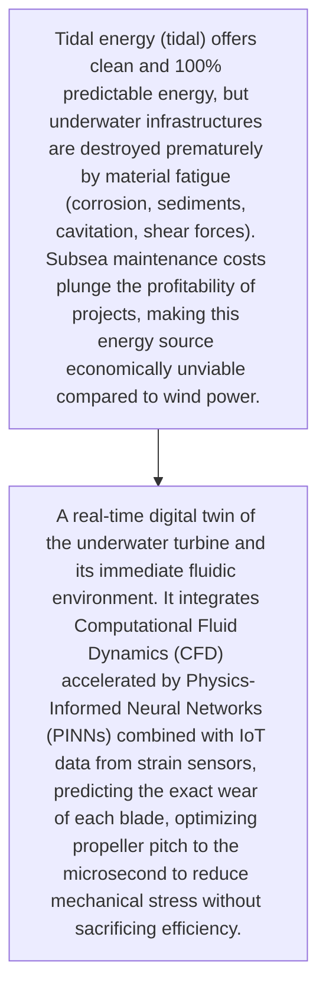
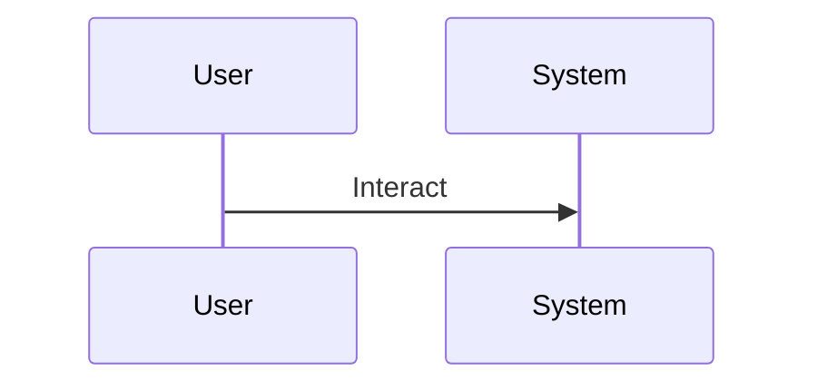

<!-- markdownlint-disable MD009 MD010 MD013 MD022 MD028 MD032 MD033 MD034 MD036 MD037 MD039 MD041 MD060 -->

[ 🇫🇷 Version Française ](./README.fr.md)

# Tidal Energy Digital Twin

> **Executive Summary:** A real-time digital twin of the underwater turbine and its immediate fluidic environment. It integrates Computational Fluid Dynamics (CFD) accelerated by Physics-Informed Neural Networks (PINNs) combined with IoT data from strain sensors, predicting the exact wear of each blade, optimizing propeller pitch to the microsecond to reduce mechanical stress without sacrificing efficiency.

---

## 1. Visual Overview & Wow Effect

## 2. Contrarian Thesis (Peter Thiel Style)

- **Popular Belief:** Solving viscous fluid dynamics equations and wear models in real time cannot be done on a standard temporal database (like InfluxDB + a Grafana dashboard). We need an inference engine capable of estimating physical constraints that are not directly measurable.
- **Hidden Truth:** A real-time digital twin of the underwater turbine and its immediate fluidic environment. It integrates Computational Fluid Dynamics (CFD) accelerated by Physics-Informed Neural Networks (PINNs) combined with IoT data from strain sensors, predicting the exact wear of each blade, optimizing propeller pitch to the microsecond to reduce mechanical stress without sacrificing efficiency.

## 3. Problem & Target Market

- **Business Model:** B2B
- **Target Audience:** Energy infrastructure operators, local coastal governments, developers of tidal energy parks.
- **Urgent Pain Point:** Tidal energy (tidal) offers clean and 100% predictable energy, but underwater infrastructures are destroyed prematurely by material fatigue (corrosion, sediments, cavitation, shear forces). Subsea maintenance costs plunge the profitability of projects, making this energy source economically unviable compared to wind power.

## 4. Technical Architecture & Infrastructure

## 5. Business Model & Financial Viability

| Metric                 | Value                                     |
| ---------------------- | ----------------------------------------- |
| Pricing Structure      | [Price / Subscription Model / Commission] |
| 12-Month Target        | [Exact volume required for 100k ARR]      |
| Revenue Formula        | [Mathematical calculation]                |
| Estimated Gross Margin | [Margin %]                                |

## 6. Distribution Engine & Moat

- **Acquisition Strategy:** [Virality, network effect, direct sales, developer adoption]
- **Moat (Defensibility):** Need to install reliable sensors in extreme underwater environments, slow adoption of tidal technology, need to convince conservative manufacturers to integrate non-standard AI models into their control loops.

## 7. Detailed Evaluation Grid

| Criterion                   | VC Score (/100) | Market Score (/100) |
| --------------------------- | --------------- | ------------------- |
| Thesis & Monopoly / Urgency | -- / 25         | -- / 25             |
| Moat / LLM Immunity         | -- / 25         | -- / 25             |
| Scalability / UX Friction   | -- / 25         | -- / 25             |
| Unit Economics / ROI        | -- / 25         | -- / 25             |
| TOTAL                       | -- / 100        | -- / 100            |

> **VC Verdict:** Pending evaluation.
> **Market Verdict:** Pending evaluation.
