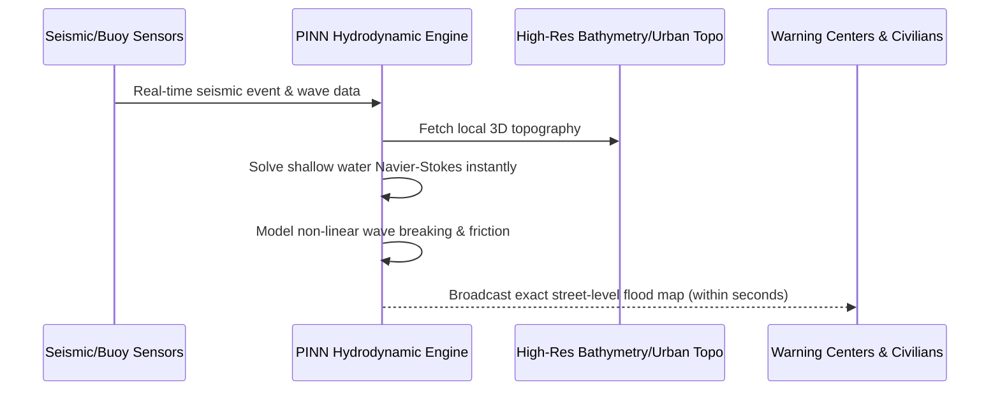

<!-- markdownlint-disable MD009 MD010 MD013 MD022 MD028 MD032 MD033 MD034 MD036 MD037 MD039 MD041 MD058 MD060 -->

[ 🇫🇷 Version Française ](./README.fr.md)

# Tsunami Hydro-Twin

> **Executive Summary:** An AI-powered hydrodynamic digital twin that uses Physics-Informed Neural Networks to predict tsunami wave heights and exact urban flooding zones in real-time, saving lives and infrastructure.

---

## 1. Visual Overview & Wow Effect

```mermaid
graph TD
    %% Problem vs Solution or Architecture Diagram
    subgraph Current_Tsunami_Warning ["Current Warning Systems"]
        A[Submarine Earthquake] --> B[CPU Models / Pre-calculated Tables]
        B --> C["Slow Calculation (>15-30 mins)"]
        C --> D[Vague Alerts, Fatal Evacuation Delays]
    end
    subgraph Tsunami_HydroTwin ["Tsunami Hydro-Twin"]
        E[Submarine Earthquake] --> F[Physics-Informed Neural Networks]
        F --> G["Real-time Hydrodynamic Simulation (<5s)"]
        G --> H[Street-by-Street Precise Run-up Map]
        H --> I[Targeted Immediate Evacuations]
    end
```

## 2. Contrarian Thesis (Peter Thiel Style)

**Popular Belief:** To improve tsunami alerts, we just need more sensors in the ocean and faster computers running traditional fluid dynamics simulations.

**Hidden Truth:** Traditional fluid dynamics (Navier-Stokes) are fundamentally too slow for emergency response, even on supercomputers. By training AI not just on data, but directly on the laws of physics (Physics-Informed Neural Networks), we can bypass the computational bottleneck and simulate non-linear fluid propagation over complex urban topography in seconds, turning vague regional warnings into street-level survival maps instantly.

## 3. Problem & Target Market

**Business Model:** B2G

**Target Audience:** Tsunami warning centers (e.g., PTWC), coastal governments, insurers, and managers of critical coastal infrastructure (nuclear power plants, ports).

**Urgent Pain Point:** When a submarine earthquake occurs, current tsunami alerts rely on simplified bathymetric models and pre-calculated tables. Predicting the exact wave height and local flooding zone (run-up) takes too long to calculate accurately (often >15-30 mins). This latency and lack of local granularity lead to costly false alarms or, worse, fatal late evacuations and the destruction of unprepared infrastructure.

## 4. Technical Architecture & Infrastructure

## 5. Business Model & Financial Viability

| Metric                 | Value                                                                    |
| :--------------------- | :----------------------------------------------------------------------- |
| Pricing Structure      | Annual Enterprise/Gov SaaS License (per monitored coastal zone)          |
| 12-Month Target        | 1-2 pilot deployments with national warning centers (e.g., Japan, Chile) |
| Revenue Formula        | 1 Pilot deployment \* €100k = €100k ARR                                  |
| Estimated Gross Margin | 85% (Pure software margins once the model is trained per zone)           |

## 6. Distribution Engine & Moat

**Acquisition Strategy:** High-level B2G sales targeting national disaster management agencies and international bodies (UNESCO/IOC). Pilot the system alongside existing legacy software to demonstrate speed and accuracy without forcing immediate replacement.

**Moat (Defensibility):** Standard weather/statistical AI models cannot capture the extreme non-linearity of coastal hydrodynamics (wave breaking, bottom friction, urban topography). Traditional CPU simulators are accurate but too slow for life-and-death emergencies. The moat is the mastery of Physics-Informed Neural Networks tailored for shallow water equations and the integration of highly classified, ultra-high-resolution coastal bathymetry data.

## 7. Detailed Evaluation Grid

| Criterion                   | VC Score (/100) | Market Score (/100) |
| :-------------------------- | :-------------- | :------------------ |
| Thesis & Monopoly / Urgency | 24 / 25         | -- / 25             |
| Moat / LLM Immunity         | 23 / 25         | -- / 25             |
| Scalability / UX Friction   | 22 / 25         | -- / 25             |
| Unit Economics / ROI        | 21 / 25         | -- / 25             |
| **TOTAL**                   | **90 / 100**    | **-- / 100**        |

> **VC Verdict:** A life-saving B2G monopoly. The integration of PINNs for real-time hydrodynamic forecasting is technically defensible and hard to replicate. Deep lock-in with government agencies ensures long-term revenue predictability.
> **Market Verdict:** Pending evaluation.
