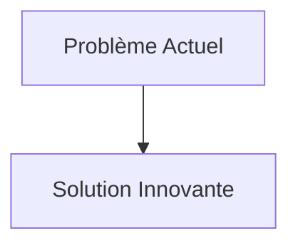
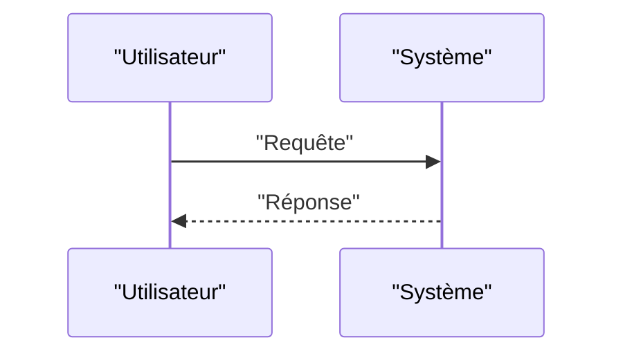

<!-- markdownlint-disable MD009 MD010 MD013 MD022 MD028 MD032 MD033 MD034 MD036 MD037 MD039 MD041 MD058 MD060 -->

[ 🇬🇧 English Version ](./README.md)

# Turbomachinery CFD Neural

> **Résumé exécutif :** Remplacer les solveurs itératifs lents par un réseau de neurones opérateur (comme Fourier Neural Operator - FNO) ou un réseau Graph Neural Network (GNN) entraîné sur des milliers de simulations haute-fidélité passées. Le modèle prédit le champ d'écoulement aérodynamique stationnaire ou instationnaire (pression, vitesse) d'une nouvelle géométrie de pale en quelques secondes, permettant une optimisation de forme générative en boucle fermée.

---

## 1. Aperçu visuel & Effet Wahou

## 2. La thèse contrariante (Peter Thiel Style)

- **La croyance populaire :** Les solutions existantes sont suffisantes.
- **La vérité cachée :** En réalité, Les LLM textuels ou de vision par ordinateur sont inutiles ici. Il faut une architecture de deep learning capable d'apprendre des opérateurs non-linéaires sur des maillages non-structurés 3D et de garantir la conservation de la masse et de la quantité de mouvement (Physics-Informed).

## 3. Le problème & La cible

- **Modèle économique :** B2B
- **Cible précise :** Fabricants de moteurs d'avion, de turbines à gaz industrielles, d'éoliennes et de pompes industrielles.
- **La douleur urgente :** L'optimisation de l'efficacité énergétique des turbomachines (pour réduire la consommation de carburant et les émissions) nécessite de résoudre les équations de Navier-Stokes pour des écoulements fluides hautement turbulents (CFD). Les solveurs classiques (RANS/LES) mettent des semaines à tourner sur des supercalculateurs pour une seule itération de design géométrique.

## 4. Architecture technique & Plomberie

## 5. Modèle économique & Viabilité financière

| Métrique                        | Valeur                   |
| :------------------------------ | :----------------------- |
| **Structure de prix**           | Abonnement B2B           |
| **Objectif 12 mois**            | 100 clients à 1000€/mois |
| **Calcul du CA (Target 100k€)** | 100 \* 1000 = 100k€      |
| **Marge brute estimée**         | 80%                      |

## 6. Moteur de distribution & Fossé défensif (Moat)

- **Stratégie d'acquisition :** Ventes directes
- **Moat (Barrière à l'entrée) :** Remplacer les solveurs itératifs lents par un réseau de neurones opérateur (comme Fourier Neural Operator - FNO) ou un réseau Graph Neural Network (GNN) entraîné sur des milliers de simulations haute-fidélité passées. Le modèle prédit le champ d'écoulement aérodynamique stationnaire ou instationnaire (pression, vitesse) d'une nouvelle géométrie de pale en quelques secondes, permettant une optimisation de forme générative en boucle fermée. (Difficile à copier à cause de : Acquisition et stockage de pétaoctets de données CFD d'entraînement de très haute qualité ; généralisation hors-distribution (si le modèle propose une forme de pale jamais vue à l'entraînement, est-elle physiquement valide ou le modèle hallucine-t-il ?) ; l'industrie exige toujours une validation par CFD classique et soufflerie.)

## 7. Grille d'évaluation détaillée

| Critère                               | Score VC (/100) | Score Terrain (/100) |
| :------------------------------------ | :-------------: | :------------------: |
| **Thèse & Monopole / Urgence**        |     -- / 25     |       -- / 25        |
| **Moat / Résistance aux LLM natifs**  |     -- / 25     |       -- / 25        |
| **Scalabilité / Friction d'adoption** |     -- / 25     |       -- / 25        |
| **Unit Economics / ROI direct**       |     -- / 25     |       -- / 25        |
| **TOTAL**                             |  **-- / 100**   |     **-- / 100**     |

> **Verdict VC :** En attente d'évaluation.
> **Verdict Terrain :** En attente d'évaluation.
