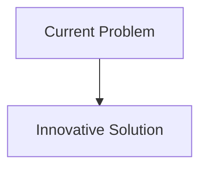
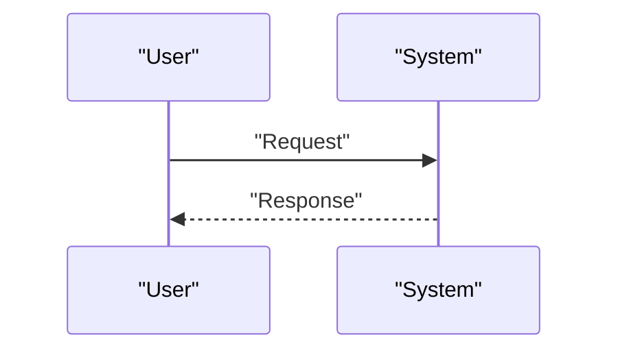

<!-- markdownlint-disable MD009 MD010 MD013 MD022 MD028 MD032 MD033 MD034 MD036 MD037 MD039 MD041 MD058 MD060 -->

[ 🇫🇷 Version Française ](./README.fr.md)

# Turbomachinery CFD Neural

> **Executive Summary:** Replace slow iterative solvers with an operator neural network (like Fourier Neural Operator - FNO) or a Graph Neural Network (GNN) trained on thousands of past high-fidelity simulations. The model predicts the steady or unsteady aerodynamic flow field (pressure, velocity) of a new blade geometry in seconds, enabling closed-loop generative shape optimization.

---

## 1. Visual Overview & Wow Effect

## 2. Contrarian Thesis (Peter Thiel Style)

- **Popular Belief:** Existing solutions are sufficient.
- **Hidden Truth:** In reality, Text-based or computer vision LLMs are useless here. We need a deep learning architecture capable of learning non-linear operators on unstructured 3D meshes and guaranteeing the conservation of mass and momentum (Physics-Informed).

## 3. Problem & Target Market

- **Business Model:** B2B
- **Target Audience:** Manufacturers of aircraft engines, industrial gas turbines, wind turbines and industrial pumps.
- **Urgent Pain Point:** Optimizing the energy efficiency of turbomachinery (to reduce fuel consumption and emissions) requires solving the Navier-Stokes equations for highly turbulent fluid flows (CFD). Classic solvers (RANS/LES) take weeks to run on supercomputers for a single geometric design iteration.

## 4. Technical Architecture & Infrastructure

## 5. Business Model & Financial Viability

| Metric                     | Value                        |
| :------------------------- | :--------------------------- |
| **Pricing Structure**      | B2B Subscription             |
| **12-Month Target**        | 100 customers at 1000€/month |
| **Revenue Formula**        | 100 \* 1000 = 100k€          |
| **Estimated Gross Margin** | 80%                          |

## 6. Distribution Engine & Moat

- **Acquisition Strategy:** Direct Sales
- **Moat (Defensibility):** Replace slow iterative solvers with an operator neural network (like Fourier Neural Operator - FNO) or a Graph Neural Network (GNN) trained on thousands of past high-fidelity simulations. The model predicts the steady or unsteady aerodynamic flow field (pressure, velocity) of a new blade geometry in seconds, enabling closed-loop generative shape optimization.(Difficult to copy because of: Acquisition and storage of petabytes of very high quality CFD training data; out-of-distribution generalization (if the model proposes a blade shape never seen in training, is it physically valid or is the model hallucinating?); industry still requires validation by classical CFD and wind tunnel.)

## 7. Detailed Evaluation Grid

| Criterion                       | VC Score (/100) | Market Score (/100) |
| :------------------------------ | :-------------: | :-----------------: |
| **Thesis & Monopoly / Urgency** |     -- / 25     |       -- / 25       |
| **Moat / LLM Immunity**         |     -- / 25     |       -- / 25       |
| **Scalability / UX Friction**   |     -- / 25     |       -- / 25       |
| **Unit Economics / ROI**        |     -- / 25     |       -- / 25       |
| **TOTAL**                       |  **-- / 100**   |    **-- / 100**     |

> **VC Verdict:** Pending evaluation.
> **Market Verdict:** Pending evaluation.
