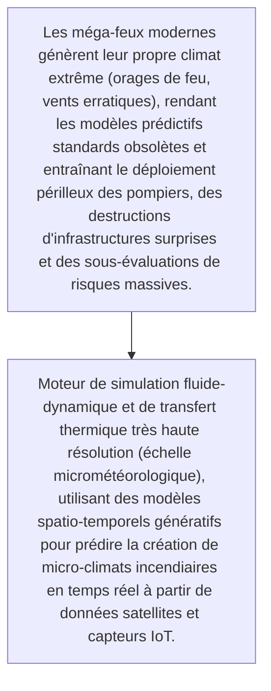
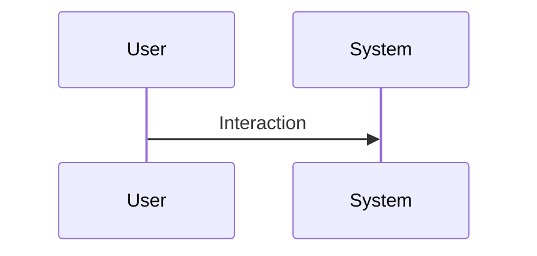

<!-- markdownlint-disable MD009 MD010 MD013 MD022 MD028 MD032 MD033 MD034 MD036 MD037 MD039 MD041 MD060 -->

[ 🇬🇧 English Version ](./README.md)

# Pyrocumulus Twin

> **Résumé exécutif :** Moteur de simulation fluide-dynamique et de transfert thermique très haute résolution (échelle micrométéorologique), utilisant des modèles spatio-temporels génératifs pour prédire la création de micro-climats incendiaires en temps réel à partir de données satellites et capteurs IoT.

---

## 1. Aperçu visuel & Effet Wahou

## 2. La thèse contrariante (Peter Thiel Style)

- **La croyance populaire :** C'est un problème de modélisation de physique du chaos nécessitant le calcul de dynamiques de fluides complexes, des jumeaux numériques 3D du terrain forestier, très différent d'un tableau de bord de data-visualisation météorologique classique.
- **La vérité cachée :** Moteur de simulation fluide-dynamique et de transfert thermique très haute résolution (échelle micrométéorologique), utilisant des modèles spatio-temporels génératifs pour prédire la création de micro-climats incendiaires en temps réel à partir de données satellites et capteurs IoT.

## 3. Le problème & La cible

- **Modèle économique :** B2B / B2G
- **Cible précise :** Agences forestières, gouvernements, assureurs réassurance, opérateurs de réseaux électriques
- **La douleur urgente :** Les méga-feux modernes génèrent leur propre climat extrême (orages de feu, vents erratiques), rendant les modèles prédictifs standards obsolètes et entraînant le déploiement périlleux des pompiers, des destructions d'infrastructures surprises et des sous-évaluations de risques massives.

## 4. Architecture technique & Plomberie

## 5. Modèle économique & Viabilité financière

| Métrique                    | Valeur                                                          |
| --------------------------- | --------------------------------------------------------------- |
| Structure de prix           | [Prix / Modèle d'abonnement / Commission]                       |
| Objectif 12 mois            | [Nombre exact de clients/utilisateurs/transactions nécessaires] |
| Calcul du CA (Target 100k€) | [Formule mathématique exacte]                                   |
| Marge brute estimée         | [Marge en %]                                                    |

## 6. Moteur de distribution & Fossé défensif (Moat)

- **Stratégie d'acquisition :** [Viralité B2C, réseau C2C, acquisition B2B directe, adhésion dev M2M]
- **Moat (Barrière à l'entrée) :** Besoin critique en puissance de calcul (HPC), intégration complexe des réseaux de capteurs épars, lenteur des cycles d'achat gouvernementaux.

## 7. Grille d'évaluation détaillée

| Critère                           | Score VC (/100) | Score Terrain (/100) |
| --------------------------------- | --------------- | -------------------- |
| Thèse & Monopole / Urgence        | 24 / 25         | -- / 25              |
| Moat / Résistance aux LLM natifs  | 21 / 25         | -- / 25              |
| Scalabilité / Friction d'adoption | 23 / 25         | -- / 25              |
| Unit Economics / ROI direct       | 22 / 25         | -- / 25              |
| TOTAL                             | 90 / 100        | -- / 100             |

> **Verdict VC :** Un jeu de monopole critique B2B/B2G à l'ère de la volatilité climatique. La complexité des simulations de dynamique des fluides agit comme un moat technique massif. Il transforme des catastrophes imprévisibles en modèles de risques quantifiables pour les assureurs et les gouvernements.
> **Verdict Terrain :** En attente d'évaluation.
