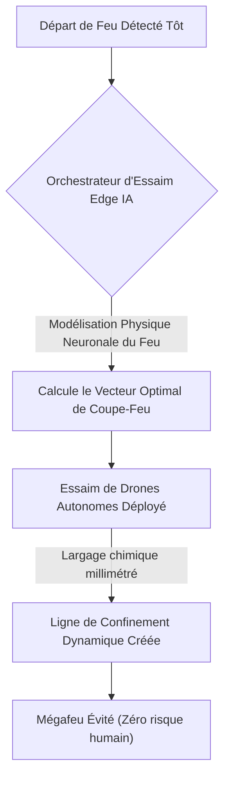
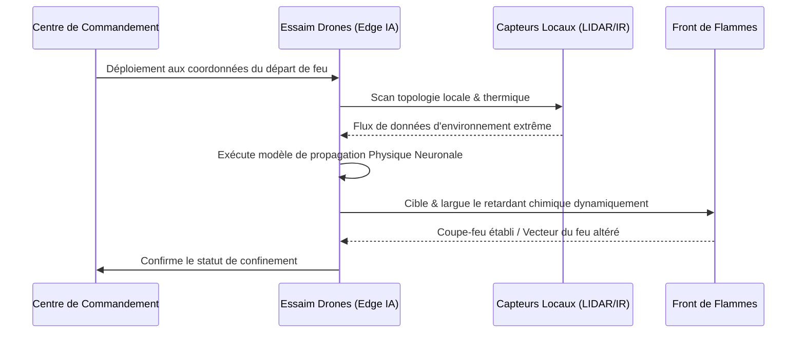

<!-- markdownlint-disable MD009 MD010 MD013 MD022 MD028 MD032 MD033 MD034 MD036 MD037 MD039 MD041 MD058 MD060 -->

[ 🇬🇧 English Version ](./README.md)

# Wildfire Swarm Containment

> **Résumé exécutif :** Des essaims de drones autonomes orchestrés par une Edge IA et des modèles de physique neuronale pour exécuter des lignes de confinement chimique de précision en temps réel, stoppant les mégafeux dès leur phase initiale critique.

---

## 1. Aperçu visuel & Effet Wahou

## 2. La thèse contrariante (Peter Thiel Style)

**La croyance populaire :** La seule façon de combattre les mégafeux induits par le climat est d'investir dans des avions bombardiers d'eau de plus en plus lourds et de déployer des équipes au sol massives.
**La vérité cachée :** Les avions lourds sont dangereusement lents à déployer, totalement aveugles de nuit et inutiles une fois que l'élan thermodynamique du feu s'intensifie ; les feux doivent être étouffés dans la fenêtre d'"attaque initiale" via des essaims de drones décentralisés et autonomes qui modélisent la physique du feu en temps réel et larguent des retardants chimiques en continu, même dans des conditions de visibilité nulle.

## 3. Le problème & La cible

**Modèle économique :** B2B / B2G
**Cible précise :** Agences gouvernementales de gestion des forêts et des feux, services d'urgence, et grandes compagnies d'assurance.
**La douleur urgente :** Les mégafeux deviennent incontrôlables en raison du changement climatique. Les méthodes de lutte actuelles (avions lourds, équipes au sol) sont dangereuses, ne peuvent pas voler de nuit, et sont trop lentes à déployer lors des premières heures critiques (l'attaque initiale) où le feu peut encore être contenu, entraînant des milliards de dégâts.

## 4. Architecture technique & Plomberie

## 5. Modèle économique & Viabilité financière

| Métrique                    | Valeur                                                             |
| --------------------------- | ------------------------------------------------------------------ |
| Structure de prix           | Location matériel + Licence SaaS annuelle d'Intelligence en Essaim |
| Objectif 12 mois            | 2 Déploiements Pilotes pour Agences Régionales (à 50 000€/an)      |
| Calcul du CA (Target 100k€) | 2 \* 50 000€ = 100 000€ de revenus annuels récurrents              |
| Marge brute estimée         | 75%                                                                |

## 6. Moteur de distribution & Fossé défensif (Moat)

**Stratégie d'acquisition :** Ventes B2G directes et programmes pilotes avec les départements d'incendie de l'État et les agences nationales d'intervention d'urgence.
**Moat (Barrière à l'entrée) :** L'orchestration d'un essaim dans un environnement thermique extrême (fumée, vents violents, absence de GPS) nécessite une fusion de capteurs locaux (LIDAR, infrarouge) et une intelligence distribuée au niveau du Edge. Un logiciel de contrôle de drone centralisé standard crashera instantanément dans ces conditions.

## 7. Grille d'évaluation détaillée

| Critère                           | Score VC (/100) | Score Terrain (/100) |
| --------------------------------- | --------------- | -------------------- |
| Thèse & Monopole / Urgence        | 23 / 25         | -- / 25              |
| Moat / Résistance aux LLM natifs  | 22 / 25         | -- / 25              |
| Scalabilité / Friction d'adoption | 20 / 25         | -- / 25              |
| Unit Economics / ROI direct       | 21 / 25         | -- / 25              |
| **TOTAL**                         | **86 / 100**    | **-- / 100**         |

> **Verdict VC :** Wildfire Swarm Containment modernise la réponse aux catastrophes avec une logistique de drones autonome pilotée par l'IA. L'intégration de l'imagerie thermique en temps réel et de la coordination décentralisée des essaims constitue une alternative redoutable aux largages aériens humains coûteux et dangereux. Bien qu'il y ait des obstacles réglementaires, les économies financières et humaines présentent une proposition de valeur urgente.
> **Verdict Terrain :** En attente d'évaluation.
