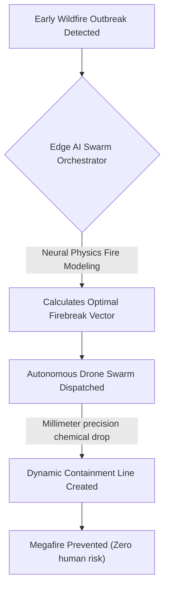
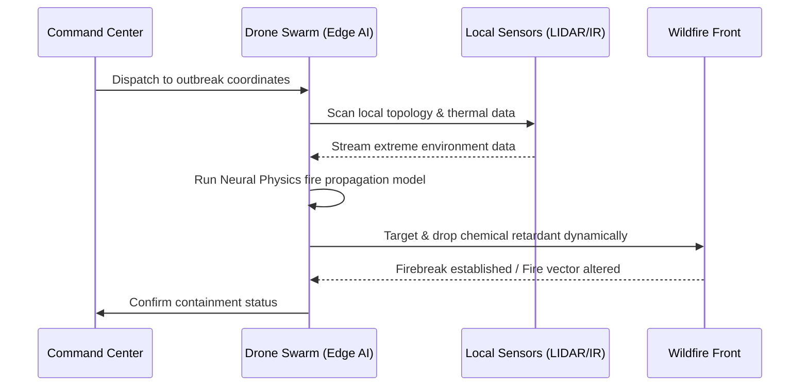

<!-- markdownlint-disable MD009 MD010 MD013 MD022 MD028 MD032 MD033 MD034 MD036 MD037 MD039 MD041 MD058 MD060 -->

[ 🇫🇷 Version Française ](./README.fr.md)

# Wildfire Swarm Containment

> **Executive Summary:** Autonomous drone swarms orchestrated by Edge AI and Neural Physics models to execute real-time, precision-targeted chemical containment lines, stopping megafires during their critical initial outbreak phase.

---

## 1. Visual Overview & Wow Effect

## 2. Contrarian Thesis (Peter Thiel Style)

**Popular Belief:** The only way to fight climate-induced megafires is by investing in larger, heavier water-bomber planes and deploying massive human ground crews.
**Hidden Truth:** Heavy aircraft are dangerously slow to deploy, completely blind at night, and useless once the fire's thermodynamic momentum scales; fires must be killed in the "initial attack" window via decentralized, autonomous drone swarms that model the fire's physics in real-time and drop chemical retardants continuously, even in zero-visibility conditions.

## 3. Problem & Target Market

**Business Model:** B2B / B2G
**Target Audience:** Government forestry and fire management agencies, emergency response services, and major infrastructure/insurance companies.
**Urgent Pain Point:** Megafires are becoming uncontrollable due to climate change. Current firefighting methods (heavy planes, ground crews) are dangerous, cannot fly at night, and are too slow to deploy during the critical first few hours (the initial attack) when a fire can actually still be contained, leading to billions in damages.

## 4. Technical Architecture & Infrastructure

## 5. Business Model & Financial Viability

| Metric                 | Value                                                      |
| ---------------------- | ---------------------------------------------------------- |
| Pricing Structure      | Hardware leasing + Annual Swarm Intelligence SaaS License  |
| 12-Month Target        | 2 Regional Fire Agency Pilot Deployments (at 50,000€/year) |
| Revenue Formula        | 2 \* 50,000€ = 100,000€ ARR                                |
| Estimated Gross Margin | 75%                                                        |

## 6. Distribution Engine & Moat

**Acquisition Strategy:** Direct B2G sales and pilot programs with state fire departments and national emergency response agencies.
**Moat (Defensibility):** Orchestrating a swarm in an extreme thermal environment (smoke, severe winds, GPS denial) requires the fusion of local sensors (LIDAR, IR) and distributed Edge AI. Standard centralized drone control software will instantly crash under these conditions.

## 7. Detailed Evaluation Grid

| Criterion                   | VC Score (/100) | Market Score (/100) |
| --------------------------- | --------------- | ------------------- |
| Thesis & Monopoly / Urgency | -- / 25         | -- / 25             |
| Moat / LLM Immunity         | -- / 25         | -- / 25             |
| Scalability / UX Friction   | -- / 25         | -- / 25             |
| Unit Economics / ROI        | -- / 25         | -- / 25             |
| **TOTAL**                   | **-- / 100**    | **-- / 100**        |

> **VC Verdict:** Pending evaluation.
> **Market Verdict:** Pending evaluation.
