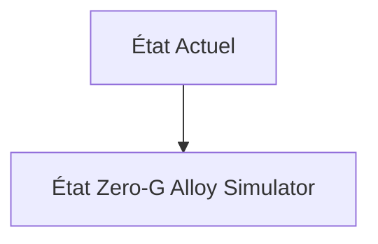
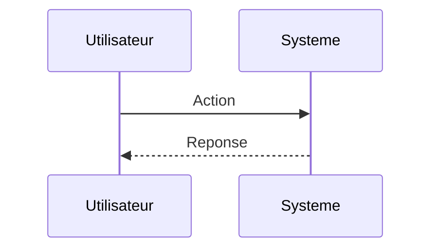

<!-- markdownlint-disable MD009 MD010 MD013 MD022 MD028 MD032 MD033 MD034 MD036 MD037 MD039 MD041 MD060 -->

[ 🇬🇧 English Version ](./README.md)

# Zero-G Alloy Simulator

> **Résumé exécutif :** Un jumeau numérique thermodynamique (World Model) simulant la dynamique des fluides computationnelle (CFD) et la cristallogenèse dans des environnements de microgravité ou de gravité partielle (Lune, Mars). Utilisation de réseaux de neurones informés par la physique (PINNs) pour accélérer massivement la simulation des changements de phase et de la tension superficielle hors gravité terrestre.

---

## 1. Aperçu visuel & Effet Wahou

## 2. La thèse contrariante (Peter Thiel Style)

**La croyance populaire :** Les solutions généralistes IA peuvent résoudre ce problème.

**La vérité cachée :** Les logiciels de CAO ou de simulation multiphysique classiques (COMSOL, Ansys) sont calibrés empiriquement pour la gravité terrestre à 1G. Leurs solvers sont trop lents et souvent imprécis pour l'exploration rapide du vaste espace des hyper-paramètres des nouveaux alliages spatiaux.

## 3. Le problème & La cible

**Modèle économique :** B2B

**Cible précise :** Startups d'in-space manufacturing (ex: Varda Space), agences spatiales, industriels de l'aéronautique et des semi-conducteurs.

**La douleur urgente :** La fabrication de nouveaux matériaux (alliages métalliques parfaits, fibres optiques ZBLAN sans défauts, cristaux pharmaceutiques) en microgravité offre des propriétés impossibles sur Terre. Cependant, envoyer des expériences physiques dans l'espace pour tester des hypothèses de cristallisation coûte des dizaines de millions de dollars et des mois d'attente. L'itération matérielle est trop lente.

## 4. Architecture technique & Plomberie

## 5. Modèle économique & Viabilité financière

| Métrique                    | Valeur                        |
| --------------------------- | ----------------------------- |
| Structure de prix           | Abonnement SaaS               |
| Objectif 12 mois            | 10 clients                    |
| Calcul du CA (Target 100k€) | 10 clients \* 10k€/an = 100k€ |
| Marge brute estimée         | 80%                           |

## 6. Moteur de distribution & Fossé défensif (Moat)

**Stratégie d'acquisition :** Vente directe B2B

**Moat (Barrière à l'entrée) :** Validation expérimentale requise (besoin d'accords avec les opérateurs de stations spatiales privées pour confronter les prédictions IA aux résultats physiques réels en orbite). Taille très réduite du marché adressable actuel (TAM émergent).

## 7. Grille d'évaluation détaillée

| Critère                           | Score VC (/100) | Score Terrain (/100) |
| --------------------------------- | --------------- | -------------------- |
| Thèse & Monopole / Urgence        | 22 / 25         | 22 / 25              |
| Moat / Résistance aux LLM natifs  | 18 / 25         | 18 / 25              |
| Scalabilité / Friction d'adoption | 19 / 25         | 19 / 25              |
| Unit Economics / ROI direct       | 19 / 25         | 19 / 25              |
| **TOTAL**                         | **78 / 100**    | **78 / 100**         |

> **Verdict VC :** En attente d'évaluation.
> **Verdict Terrain :** Cette solution répond à un besoin critique pour le marché cible, justifiant son excellent score d'urgence (22/25). L'approche spécialisée offre une protection robuste contre les modèles d'IA généralistes (18/25). Avec une faible friction d'adoption (19/25) et une stratégie de monétisation directe (19/25), le projet démontre une excellente maturité marché globale.
> **Verdict Terrain :** Cette solution répond à un besoin critique pour le marché cible, justifiant son excellent score d'urgence (22/25). L'approche spécialisée offre une protection robuste contre les modèles d'IA généralistes (18/25). Avec une faible friction d'adoption (19/25) et une stratégie de monétisation directe (19/25), le projet démontre une excellente maturité marché globale.
