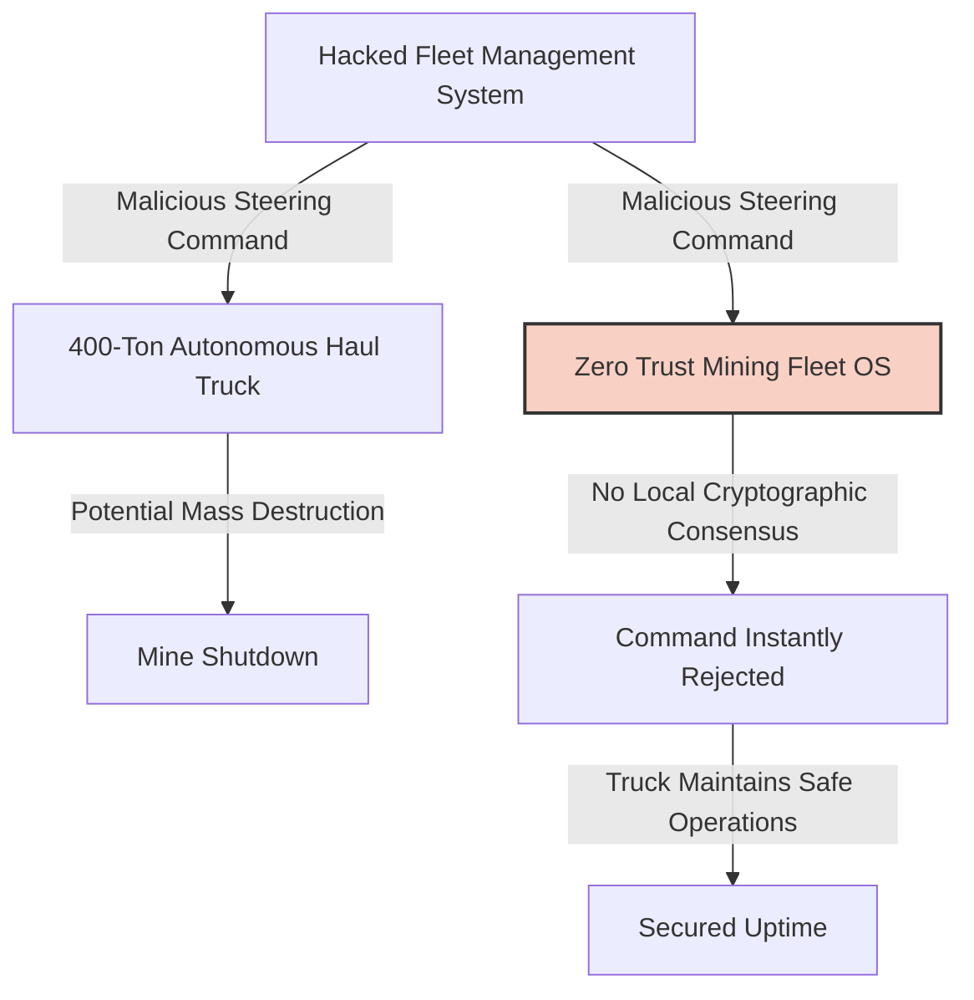
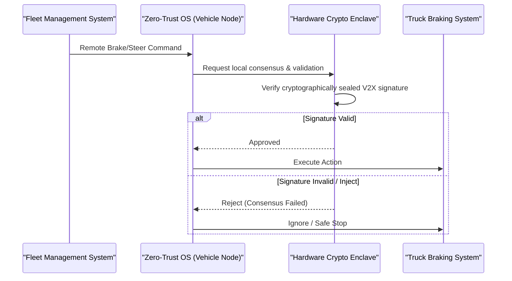

<!-- markdownlint-disable MD009 MD010 MD013 MD022 MD028 MD032 MD033 MD034 MD036 MD037 MD039 MD041 MD058 MD060 -->

[ 🇫🇷 Version Française ](./README.fr.md)

# Zero Trust Mining Fleet

> **Executive Summary:** A hardware-level Zero-Trust V2X operating system for massive autonomous mining fleets, preventing catastrophic cyber-physical attacks through localized cryptographic consensus.

---

## 1. Visual Overview & Wow Effect

## 2. Contrarian Thesis (Peter Thiel Style)

**Popular Belief:** To secure autonomous heavy machinery, you just need better cloud firewalls and standard IT VPNs on the Fleet Management System (FMS).
**Hidden Truth:** IT firewalls are useless when the internal OT (Operational Technology) network is compromised. Cloud authentication introduces fatal latency for 400-ton vehicles moving at speed. True security requires hardware-sealed, localized cryptographic consensus directly on the vehicle.

## 3. Problem & Target Market

**Business Model:** B2B
**Target Audience:** Global mining conglomerates (Rio Tinto, BHP) and operators of heavy autonomous infrastructure.
**Urgent Pain Point:** Massive autonomous haul trucks are giant IoT networks on wheels. A single hack of these vehicles or their management systems can cause massive physical destruction, costing millions per hour in downtime and risking human lives.

## 4. Technical Architecture & Infrastructure

## 5. Business Model & Financial Viability

| Metric                     | Value                                                   |
| :------------------------- | :------------------------------------------------------ |
| **Pricing Structure**      | Annual license per autonomous vehicle + Hardware module |
| **12-Month Target**        | 1 pilot fleet (10 vehicles)                             |
| **Revenue Formula**        | 10 vehicles \* €15k = €150k ARR                         |
| **Estimated Gross Margin** | 80% (Primarily software OS licensing)                   |

## 6. Distribution Engine & Moat

**Acquisition Strategy:** Direct B2B sales to mining operators, positioned as mandatory insurance against billion-dollar operational liabilities.
**Moat (Defensibility):** Requires extreme real-time reliability (99.999% uptime) and tight integration with closed OEM systems (Caterpillar, Komatsu). Standard cloud security software cannot operate with the millisecond latencies required for autonomous driving.

## 7. Detailed Evaluation Grid

| Criterion                       | VC Score (/100) | Market Score (/100) |
| :------------------------------ | :-------------- | :------------------ |
| **Thesis & Monopoly / Urgency** | -- / 25         | 24 / 25             |
| **Moat / LLM Immunity**         | -- / 25         | 25 / 25             |
| **Scalability / UX Friction**   | -- / 25         | 15 / 25             |
| **Unit Economics / ROI**        | -- / 25         | 23 / 25             |
| **TOTAL**                       | **-- / 100**    | **87 / 100**        |

> **VC Verdict:** Addresses a massive, un-sexy industrial vulnerability with severe financial and physical risks. Deep hardware integration with legacy mining OEMs creates an absolute lock-in and a robust moat. The B2B unit economics are highly profitable given the massive scale of autonomous fleet deployments.

> **Market Verdict:** Zero-trust-mining-fleet provides essential operational security for multi-billion dollar autonomous operations. The localized cryptographic consensus ensures it cannot be replicated or bypassed by cloud-based AIs. The clear ROI on preventing catastrophic accidents drives strong enterprise adoption despite integration challenges.
