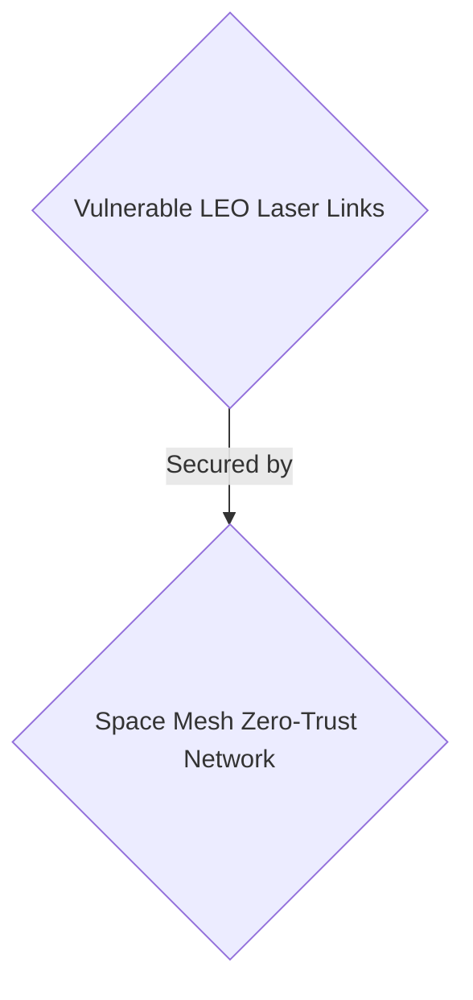
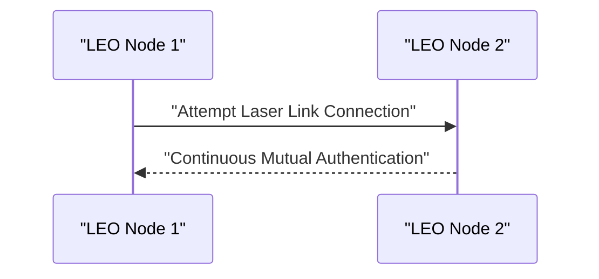

<!-- markdownlint-disable MD009 MD010 MD013 MD022 MD028 MD032 MD033 MD034 MD036 MD037 MD039 MD041 MD058 MD060 -->

[ 🇫🇷 Version Française ](./README.fr.md)

# Space Mesh ZT

> **Executive Summary:** A B2B Zero-Trust infrastructure targeting LEO satellite operators to secure space communications and dynamic routing in RTOS environments.

---

## 1. Visual Overview & Wow Effect

## 2. Contrarian Thesis (Peter Thiel Style)

- **Popular Belief:** Earth-bound Zero-Trust and standard encryption can be ported directly to satellites.
- **Hidden Truth:** Space environments face severe constraints in Size, Weight, and Power (SWaP) and compute, and experience propagation delays (Doppler). Terrestrial cloud Zero-Trust solutions (e.g. Zscaler) are incompatible.

## 3. Problem & Target Market

- **Business Model:** B2B
- **Target Audience:** LEO satellite constellation operators, space agencies, telecommunications providers (Space Systems Engineers, CISO).
- **Urgent Pain Point:** Space-based networks (LEOs) communicating via optical laser links are vulnerable to interception attacks, spoofing, and the takeover of a satellite node, threatening the overall integrity of the network.

## 4. Technical Architecture & Infrastructure

An ultra-lightweight Zero-Trust security infrastructure designed specifically for space real-time operating systems (RTOS). It implements continuous mutual authentication and dynamic routing resilient to cosmic radiation.

## 5. Business Model & Financial Viability

| Metric                 | Value                            |
| ---------------------- | -------------------------------- |
| Pricing Structure      | B2B SaaS Enterprise Subscription |
| 12-Month Target        | 100 constellations/operators     |
| Revenue Formula        | 100 \* 1000€ = 100k€             |
| Estimated Gross Margin | 85%                              |

## 6. Distribution Engine & Moat

- **Acquisition Strategy:** Direct sales and long-term contracts with space agencies and telecom providers.
- **Moat (Defensibility):** Space environments face severe constraints in Size, Weight, and Power (SWaP) and compute, and experience propagation delays (Doppler). Terrestrial cloud Zero-Trust solutions are incompatible. Long aerospace sales cycles and strict testing requirements.

## 7. Detailed Evaluation Grid

| Criterion                   | VC Score (/100) | Market Score (/100) |
| --------------------------- | --------------- | ------------------- |
| Thesis & Monopoly / Urgency | -- / 25         | -- / 25             |
| Moat / LLM Immunity         | -- / 25         | -- / 25             |
| Scalability / UX Friction   | -- / 25         | -- / 25             |
| Unit Economics / ROI        | -- / 25         | -- / 25             |
| TOTAL                       | -- / 100        | -- / 100            |

> **VC Verdict:** Pending evaluation.
> **Market Verdict:** Pending evaluation.
