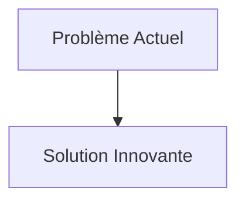
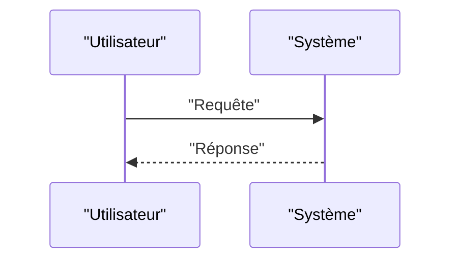

<!-- markdownlint-disable MD009 MD010 MD013 MD022 MD028 MD032 MD033 MD034 MD036 MD037 MD039 MD041 MD058 MD060 -->

[ 🇬🇧 English Version ](./README.md)

# Zero-G ZBLAN Fiber Orbital Forge

> **Résumé exécutif :** Développement d'une fonderie et tireuse de fibre robotisée et autonome conçue pour opérer dans l'environnement de microgravité de l'orbite terrestre basse (LEO). La machine utilise la lévitation acoustique ou électrostatique pour extruder des centaines de kilomètres de fibre ZBLAN pure, exempte de défauts induits par la convection gravitationnelle.

---

## 1. Aperçu visuel & Effet Wahou

## 2. La thèse contrariante (Peter Thiel Style)

- **La croyance populaire :** Les solutions existantes sont suffisantes.
- **La vérité cachée :** En réalité, C'est un pur problème de science des matériaux et de manufacturing physique en environnement extrême. Aucun logiciel d'optimisation de réseau ne peut contourner la limite de Shannon ou l'atténuation intrinsèque de la silice. La solution exige un outil industriel spatial.

## 3. Le problème & La cible

- **Modèle économique :** B2B
- **Cible précise :** Industrie des télécommunications sous-marines, médecine laser, capteurs haute puissance, défense.
- **La douleur urgente :** Les fibres optiques en silice actuelles ont atteint leurs limites physiques de bande passante et d'atténuation. Le verre de fluorure ZBLAN offre potentiellement une atténuation 10 à 100 fois inférieure à la silice, mais sa fabrication sur Terre entraîne inévitablement la formation de micro-cristaux due à la gravité, ce qui ruine ses propriétés optiques et rend la fibre cassante.

## 4. Architecture technique & Plomberie

## 5. Modèle économique & Viabilité financière

| Métrique                        | Valeur                   |
| :------------------------------ | :----------------------- |
| **Structure de prix**           | Abonnement B2B           |
| **Objectif 12 mois**            | 100 clients à 1000€/mois |
| **Calcul du CA (Target 100k€)** | 100 \* 1000 = 100k€      |
| **Marge brute estimée**         | 80%                      |

## 6. Moteur de distribution & Fossé défensif (Moat)

- **Stratégie d'acquisition :** Ventes directes
- **Moat (Barrière à l'entrée) :** Développement d'une fonderie et tireuse de fibre robotisée et autonome conçue pour opérer dans l'environnement de microgravité de l'orbite terrestre basse (LEO). La machine utilise la lévitation acoustique ou électrostatique pour extruder des centaines de kilomètres de fibre ZBLAN pure, exempte de défauts induits par la convection gravitationnelle. (Difficile à copier à cause de : Logistique spatiale (coût du lancement et de la rentrée des bobines produites), automatisation totale requise sans intervention humaine, survie de l'équipement aux vibrations du lancement, marché émergent de l'industrie spatiale commerciale de retour (In-Space Manufacturing & Return).)

## 7. Grille d'évaluation détaillée

| Critère                               | Score VC (/100) | Score Terrain (/100) |
| :------------------------------------ | :-------------: | :------------------: |
| **Thèse & Monopole / Urgence**        |     -- / 25     |       -- / 25        |
| **Moat / Résistance aux LLM natifs**  |     -- / 25     |       -- / 25        |
| **Scalabilité / Friction d'adoption** |     -- / 25     |       -- / 25        |
| **Unit Economics / ROI direct**       |     -- / 25     |       -- / 25        |
| **TOTAL**                             |  **-- / 100**   |     **-- / 100**     |

> **Verdict VC :** En attente d'évaluation.
> **Verdict Terrain :** En attente d'évaluation.
