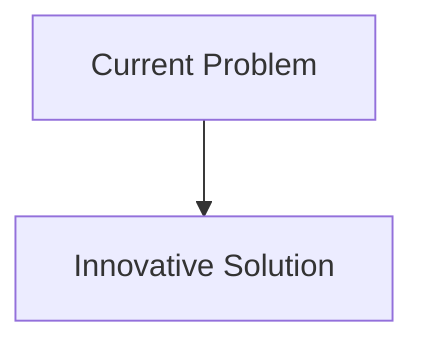
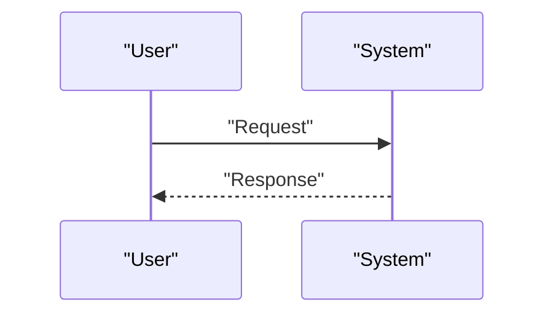

<!-- markdownlint-disable MD009 MD010 MD013 MD022 MD028 MD032 MD033 MD034 MD036 MD037 MD039 MD041 MD058 MD060 -->

[ 🇫🇷 Version Française ](./README.fr.md)

# Zero-G ZBLAN Fiber Orbital Forge

> **Executive Summary:** Development of a robotic, autonomous fiber foundry and puller designed to operate in the microgravity environment of Low Earth Orbit (LEO). The machine uses acoustic or electrostatic levitation to extrude hundreds of kilometers of pure ZBLAN fiber, free from defects induced by gravitational convection.

---

## 1. Visual Overview & Wow Effect

## 2. Contrarian Thesis (Peter Thiel Style)

- **Popular Belief:** Existing solutions are sufficient.
- **Hidden Truth:** In reality, it is a pure problem of materials science and physical manufacturing in extreme environments. No network optimization software can circumvent the Shannon limit or intrinsic silica attenuation. The solution requires a space industrial tool.

## 3. Problem & Target Market

- **Business Model:** B2B
- **Target Audience:** Underwater telecommunications industry, laser medicine, high-power sensors, defense.
- **Urgent Pain Point:** Current silica optical fibers have reached their physical limits of bandwidth and attenuation. ZBLAN fluoride glass potentially offers 10 to 100 times lower attenuation than silica, but manufacturing it on Earth inevitably results in the formation of micro-crystals due to gravity, which ruins its optical properties and makes the fiber brittle.

## 4. Technical Architecture & Infrastructure

## 5. Business Model & Financial Viability

| Metric                     | Value                        |
| :------------------------- | :--------------------------- |
| **Pricing Structure**      | B2B Subscription             |
| **12-Month Target**        | 100 customers at 1000€/month |
| **Revenue Formula**        | 100 \* 1000 = 100k€          |
| **Estimated Gross Margin** | 80%                          |

## 6. Distribution Engine & Moat

- **Acquisition Strategy:** Direct Sales
- **Moat (Defensibility):** Development of a robotic, autonomous fiber foundry and puller designed to operate in the microgravity environment of Low Earth Orbit (LEO). The machine uses acoustic or electrostatic levitation to extrude hundreds of kilometers of pure ZBLAN fiber, free from defects induced by gravitational convection.(Difficult to copy due to: Space logistics (cost of launch and re-entry of produced spools), full automation required without human intervention, survival of equipment to launch vibrations, emerging commercial space industry market of return (In-Space Manufacturing & Return).)

## 7. Detailed Evaluation Grid

| Criterion                       | VC Score (/100) | Market Score (/100) |
| :------------------------------ | :-------------: | :-----------------: |
| **Thesis & Monopoly / Urgency** |     -- / 25     |       -- / 25       |
| **Moat / LLM Immunity**         |     -- / 25     |       -- / 25       |
| **Scalability / UX Friction**   |     -- / 25     |       -- / 25       |
| **Unit Economics / ROI**        |     -- / 25     |       -- / 25       |
| **TOTAL**                       |  **-- / 100**   |    **-- / 100**     |

> **VC Verdict:** Pending evaluation.
> **Market Verdict:** Pending evaluation.
