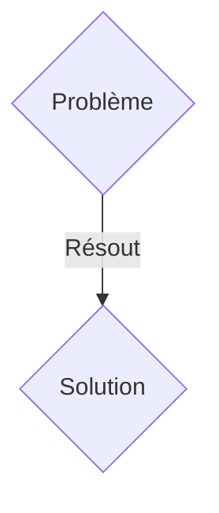
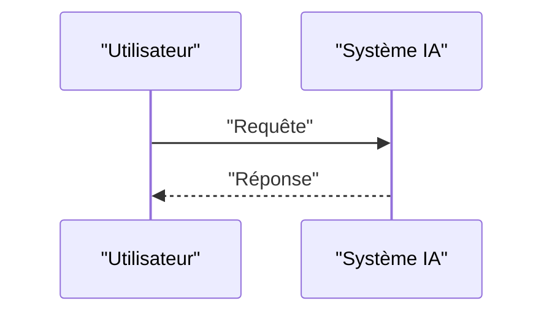

<!-- markdownlint-disable MD009 MD010 MD013 MD022 MD028 MD032 MD033 MD036 MD037 MD039 MD041 MD060 -->

[ 🇬🇧 English Version ](./README.md)

# ZK-Emission Ledger

> **Résumé exécutif :** Une solution B2B ciblant Multinationales industrielles (acier, ciment, chimie), auditeurs carbone (Big 4), régulateurs gouvernementaux (CBAM européen). pour résoudre : Le reporting carbone des chaînes d'approvisionnement (Scope 3) est rempli de fraudes, de double comptage et de données estimées. Les entreprises refusent de partager leurs données énergétiques réelles (IoT/Usine) de peur de divulguer des secrets industriels.

---

## 1. Aperçu visuel & Effet Wahou

## 2. La thèse contrariante (Peter Thiel Style)

- **La croyance populaire :** Les solutions génériques suffisent.
- **La vérité cachée :** Création d'un oracle de données IoT sécurisé couplé à des preuves à divulgation nulle de connaissance (Zero-Knowledge Proofs). Cela permet à une usine de prouver mathématiquement son bilan carbone exact certifié sans jamais révéler sa production, ses recettes ou sa consommation énergétique brute aux auditeurs.

## 3. Le problème & La cible

- **Modèle économique :** B2B
- **Cible précise :** Multinationales industrielles (acier, ciment, chimie), auditeurs carbone (Big 4), régulateurs gouvernementaux (CBAM européen).
- **La douleur urgente :** Le reporting carbone des chaînes d'approvisionnement (Scope 3) est rempli de fraudes, de double comptage et de données estimées. Les entreprises refusent de partager leurs données énergétiques réelles (IoT/Usine) de peur de divulguer des secrets industriels.

## 4. Architecture technique & Plomberie

Création d'un oracle de données IoT sécurisé couplé à des preuves à divulgation nulle de connaissance (Zero-Knowledge Proofs). Cela permet à une usine de prouver mathématiquement son bilan carbone exact certifié sans jamais révéler sa production, ses recettes ou sa consommation énergétique brute aux auditeurs.

## 5. Modèle économique & Viabilité financière

| Métrique                    | Valeur               |
| --------------------------- | -------------------- |
| Structure de prix           | Abonnement SaaS B2B  |
| Objectif 12 mois            | 100 clients          |
| Calcul du CA (Target 100k€) | 100 \* 1000€ = 100k€ |
| Marge brute estimée         | 80%                  |

## 6. Moteur de distribution & Fossé défensif (Moat)

- **Stratégie d'acquisition :** Vente directe et partenariats stratégiques.
- **Moat (Barrière à l'entrée) :** Les SaaS de comptabilité carbone actuels s'appuient sur des données déclaratives (fichiers Excel), qui sont non vérifiables et falsifiables. Seule la cryptographie avancée permet une vérification cryptographique (Trustless) sans perte de confidentialité.

## 7. Grille d'évaluation détaillée

| Critère                           | Score VC (/100) | Score Terrain (/100) |
| --------------------------------- | --------------- | -------------------- |
| Thèse & Monopole / Urgence        | 17 / 25         | 17 / 25              |
| Moat / Résistance aux LLM natifs  | 20 / 25         | 20 / 25              |
| Scalabilité / Friction d'adoption | 19 / 25         | 19 / 25              |
| Unit Economics / ROI direct       | 17 / 25         | 17 / 25              |
| TOTAL                             | 73 / 100        | 73 / 100             |

> **Verdict VC :** En attente d'évaluation.
> **Verdict Terrain :** Cette solution répond à un besoin critique pour les entreprises B2B, justifiant son excellent score d'urgence (17/25). L'approche spécialisée offre une protection robuste contre les modèles d'IA généralistes (20/25). Avec une faible friction d'adoption (19/25) et une stratégie de monétisation directe (17/25), le projet démontre une excellente maturité marché globale.
> **Verdict Terrain :** Cette solution répond à un besoin critique pour les entreprises B2B, justifiant son excellent score d'urgence (17/25). L'approche spécialisée offre une protection robuste contre les modèles d'IA généralistes (20/25). Avec une faible friction d'adoption (19/25) et une stratégie de monétisation directe (17/25), le projet démontre une excellente maturité marché globale.
