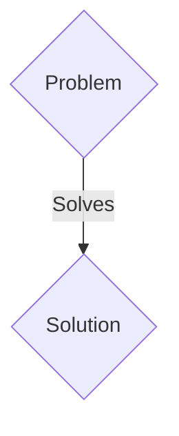
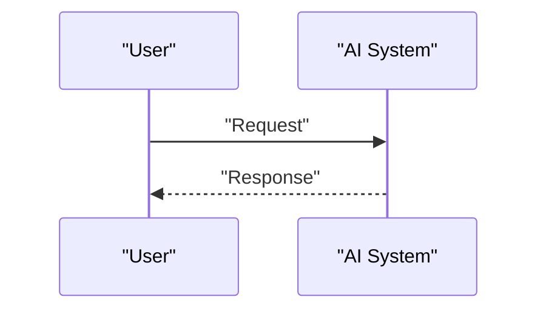

<!-- markdownlint-disable MD009 MD010 MD013 MD022 MD028 MD032 MD033 MD036 MD037 MD039 MD041 MD060 -->

[ 🇫🇷 Version Française ](./README.fr.md)

# ZK-Emission Ledger

> **Executive Summary:** A B2B solution targeting Industrial multinationals (steel, cement, chemicals), carbon auditors (Big 4), government regulators (European CBAM). to solve: Supply chain carbon reporting (Scope 3) is rife with fraud, double counting and estimated data. Companies refuse to share their real energy data (IoT/Factory) for fear of disclosing industrial secrets.

---

## 1. Visual Overview & Wow Effect

## 2. Contrarian Thesis (Peter Thiel Style)

- **Popular Belief:** Generic solutions are enough.
- **Hidden Truth:** Creation of a secure IoT data oracle coupled with Zero-Knowledge Proofs. This allows a factory to mathematically prove its exact certified carbon footprint without ever revealing its production, revenues or gross energy consumption to auditors.

## 3. Problem & Target Market

- **Business Model:** B2B
- **Target Audience:** Industrial multinationals (steel, cement, chemicals), carbon auditors (Big 4), government regulators (European CBAM).
- **Urgent Pain Point:** Supply chain carbon reporting (Scope 3) is rife with fraud, double counting and estimated data. Companies refuse to share their real energy data (IoT/Factory) for fear of disclosing industrial secrets.

## 4. Technical Architecture & Infrastructure

Creation of a secure IoT data oracle coupled with Zero-Knowledge Proofs. This allows a factory to mathematically prove its exact certified carbon footprint without ever revealing its production, revenues or gross energy consumption to auditors.

## 5. Business Model & Financial Viability

| Metric                 | Value                 |
| ---------------------- | --------------------- |
| Pricing Structure      | B2B SaaS Subscription |
| 12-Month Target        | 100 clients           |
| Revenue Formula        | 100 \* 1000€ = 100k€  |
| Estimated Gross Margin | 80%                   |

## 6. Distribution Engine & Moat

- **Acquisition Strategy:** Direct sales and strategic partnerships.
- **Moat (Defensibility):** Current carbon accounting SaaS relies on declarative data (Excel files), which is unverifiable and falsifiable. Only advanced cryptography allows cryptographic verification (Trustless) without loss of confidentiality.

## 7. Detailed Evaluation Grid

| Criterion                   | VC Score (/100) | Market Score (/100) |
| --------------------------- | --------------- | ------------------- |
| Thesis & Monopoly / Urgency | 17 / 25         | 17 / 25             |
| Moat / LLM Immunity         | 20 / 25         | 20 / 25             |
| Scalability / UX Friction   | 19 / 25         | 19 / 25             |
| Unit Economics / ROI        | 17 / 25         | 17 / 25             |
| TOTAL                       | 73 / 100        | 73 / 100            |

> **VC Verdict:** Pending evaluation.
> **Market Verdict:** This solution addresses a critical pain point for B2B enterprises, justifying its strong urgency score (17/25). The specialized approach provides robust protection against generalist AI models (20/25). With low adoption friction (19/25) and a straightforward monetization strategy (17/25), the project demonstrates excellent overall market readiness.
> **Market Verdict:** This solution addresses a critical pain point for B2B enterprises, justifying its strong urgency score (17/25). The specialized approach provides robust protection against generalist AI models (20/25). With low adoption friction (19/25) and a straightforward monetization strategy (17/25), the project demonstrates excellent overall market readiness.
