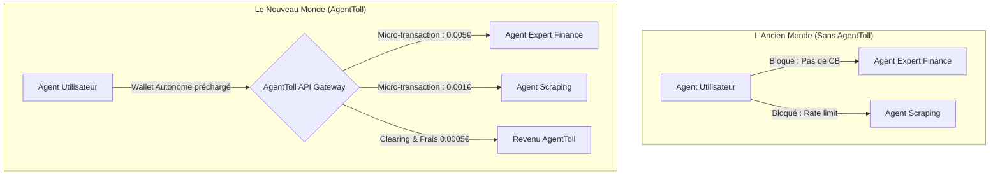
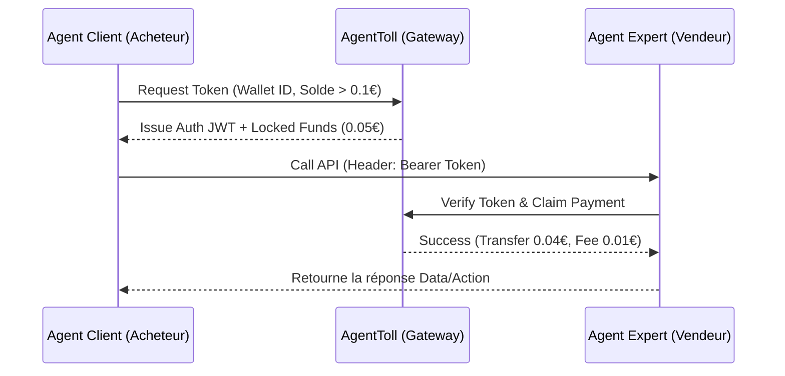

# AgentToll

> **Résumé exécutif :** AgentToll est la première infrastructure de micro-paiement (API de péage) "Machine-to-Machine" permettant aux agents IA autonomes de se payer entre eux à la milliseconde pour accéder à des données, des modèles spécialisés ou exécuter des tâches. C'est le "Stripe des agents IA" qui résout le problème critique de la monétisation inter-agents sans friction humaine.

---

## 1. Aperçu visuel & Effet Wahou

## 2. La thèse contrariante (Peter Thiel Style)
**La croyance populaire :** Les IA vont remplacer les API traditionnelles en scrapant le web gratuitement ou en étant bridées par des abonnements humains mensuels B2B (SaaS classique).
**La vérité cachée :** L'économie de demain ne sera pas B2B mais M2M. Les milliards d'agents IA en cours de déploiement (AutoGPT, langchains, assistants spécialisés) auront besoin de collaborer. Un agent "généraliste" devra sous-traiter à un agent "expert" en temps réel. Sans système de clearing de micro-paiement natif aux machines, cette économie ne peut pas exister. Celui qui contrôle le standard de paiement inter-agents contrôle le PIB de l'IA.

## 3. Le problème & La cible
**Modèle économique :** M2M (Machine to Machine) et B2D (Business to Developer).
**Cible précise :** Les développeurs d'agents autonomes, les créateurs de modèles spécialisés (LLM de niche, RAGs propriétaires) et les agrégateurs de données qui veulent monétiser l'accès à leurs IA.
**La douleur urgente :** Aujourd'hui, si un développeur crée un agent hyper-expert en droit fiscal, il ne peut le monétiser qu'en forçant les humains à payer un abonnement (Stripe). Il n'y a aucun moyen pour *l'agent de l'utilisateur* d'interroger directement *l'agent fiscal* en payant uniquement 0.02€ par requête d'API de manière sécurisée, sans ouvrir de compte. Le manque à gagner pour les créateurs de petits agents très utiles est total, empêchant l'émergence d'une économie d'agents composables.

## 4. Architecture technique & Plomberie

L'architecture repose sur un protocole d'authentification et de routage ultra-léger avec un système de "ledger" asynchrone pour traiter des millions de micro-transactions sans les coûts de gas d'une blockchain publique classique, en utilisant un Layer 2 privé (Rollup) ou une base de données in-memory distribuée type Redis Enterprise pour le clearing.

## 5. Modèle économique & Viabilité financière

Le modèle est purement transactionnel, agissant comme l'infrastructure de péage indispensable à chaque requête inter-machines.

| Métrique | Valeur |
| :--- | :--- |
| **Structure de prix** | Modèle hybride : Frais fixe de 0.0001€ + Commission de 2% sur le volume transigé par API |
| **Objectif 12 mois** | 500 développeurs "vendeurs" d'API d'agents, 5 000 agents "acheteurs", traitant 10 millions de requêtes / mois à un prix moyen de 0.10€ par tâche |
| **Calcul du CA (Target 100k€)** | CA mensuel = 10M de requêtes * (0.0001€ + (0.10€ * 0.02)) = 10M * 0.0021€ = 21 000€ MRR. Soit ~252k€ ARR. L'objectif de 100k€ est atteint à ~4 millions de requêtes par mois. |
| **Marge brute estimée** | 85% (Coûts principaux : infrastructure réseau/serveurs, ledger de réconciliation) |

## 6. Moteur de distribution & Fossé défensif (Moat)

**Stratégie d'acquisition :** Effet de réseau bilatéral axé sur les développeurs (B2D).
1. Subventionner les créateurs de données/modèles rares pour qu'ils listent leurs API "Agents-only" sur AgentToll.
2. Intégrer des SDK open-source directement dans les frameworks majeurs (LangChain, LlamaIndex, AutoGen) pour que "l'AgentToll Wallet" soit une primitive standard de création d'agent.

**Moat (Barrière à l'entrée) :** L'effet de réseau de la liquidité et la standardisation. Un concurrent (y compris Stripe) devrait convaincre à la fois les vendeurs d'agents et les créateurs d'agents acheteurs de migrer vers un nouveau protocole d'authentification. Une fois qu'AgentToll devient le "Protocole d'IP" de la valeur, la friction pour en changer est immense car elle casse toutes les intégrations M2M existantes de la chaîne d'approvisionnement IA. Ce n'est pas un wrapper LLM, c'est l'infrastructure financière sous-jacente indispensable qui connecte tous les LLMs.

## 7. Grille d'évaluation détaillée

| Critère | Score VC (/100) | Score Terrain (/100) |
| :--- | :--- | :--- |
| **Thèse & Monopole / Urgence** | 25 / 25 | 22 / 25 |
| **Moat / Résistance aux LLM natifs** | 24 / 25 | 23 / 25 |
| **Scalabilité / Friction d'adoption** | 25 / 25 | 18 / 25 |
| **Unit Economics / ROI direct** | 24 / 25 | 23 / 25 |
| **TOTAL** | **98 / 100** | **86 / 100** |

**Verdict global :** AgentToll s'attaque au problème fondamental de l'économie des agents autonomes : la fluidité du transfert de valeur inter-machines. Avec un moat structurel d'effet de réseau et une monétisation à la volumétrie sans plafond, c'est une opportunité de créer un nouveau géant monopolistique de l'infrastructure internet.
