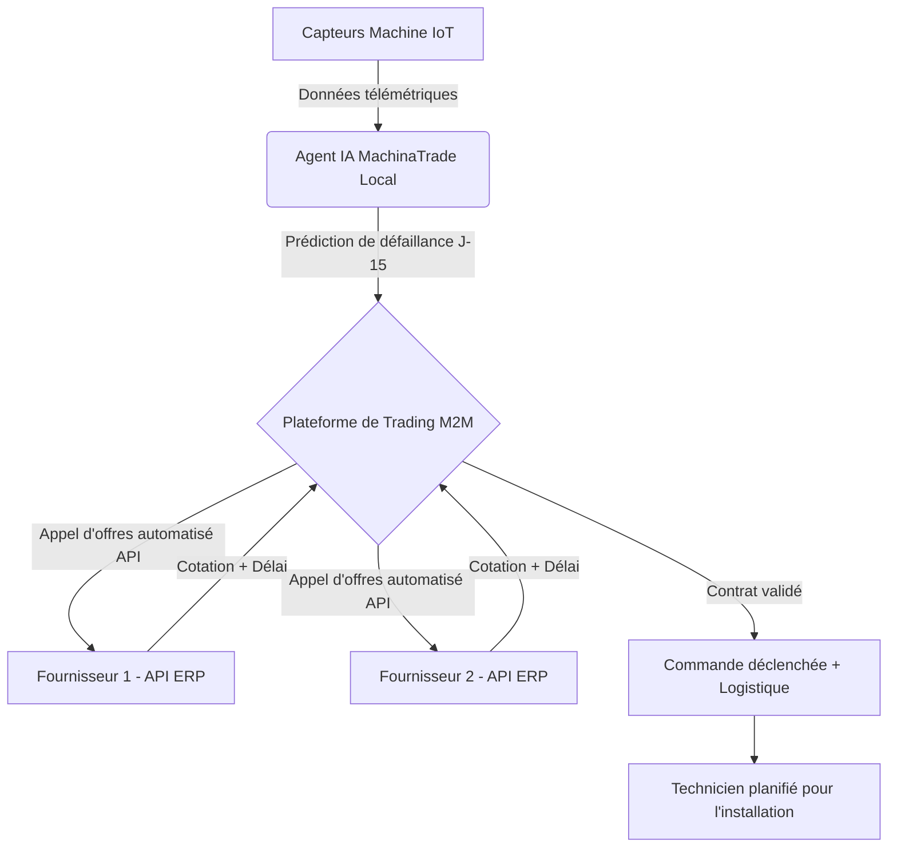
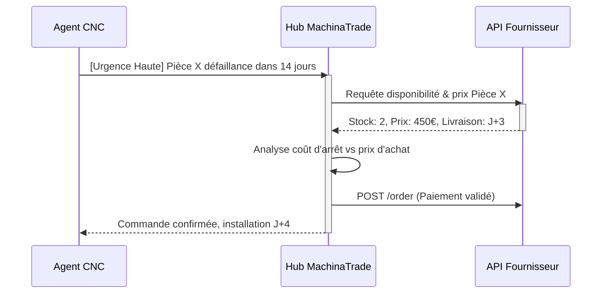

# MachinaTrade

> **Résumé exécutif :** Une infrastructure de marché Machine-to-Machine (M2M) où les équipements industriels négocient, achètent et planifient de manière autonome leurs propres pièces de rechange prédictives via des agents IA, éliminant les temps d'arrêt non planifiés et les stocks dormants.

---

## 1. Aperçu visuel & Effet Wahou

## 2. La thèse contrariante (Peter Thiel Style)

**La croyance populaire :** La maintenance prédictive est un problème de data science qui consiste à alerter des humains (ingénieurs de maintenance) sur des tableaux de bord pour qu'ils prennent des décisions d'achat.
**La vérité cachée :** L'alerte humaine est le goulot d'étranglement. Dans les chaînes industrielles modernes, le vrai levier n'est pas de prévoir la panne, mais d'exécuter la remédiation logistique de bout en bout sans friction. Les machines peuvent et doivent acheter leurs propres pièces, transformant le centre de coût de la maintenance en un marché automatisé hyper-liquide.

## 3. Le problème & La cible

**Modèle économique :** M2M (Machine to Machine) pur, monétisé en B2B (SaaS + transaction fees).
**Cible précise :** Usines de fabrication à flux tendu (automobile, aérospatial), gestionnaires de flottes logistiques, et data centers.
**La douleur urgente :** Un arrêt de chaîne de production coûte en moyenne entre 10 000€ et 250 000€ par heure. L'attente d'une pièce critique suite à une alerte humaine crée des délais inutiles, ou force l'entreprise à immobiliser des millions en stock dormant "au cas où".

## 4. Architecture technique & Plomberie

Le cœur de MachinaTrade n'est pas un grand modèle de langage, mais un réseau d'agents autonomes d'exécution couplés à des connecteurs ERP legacy (SAP, Oracle). L'IA est utilisée pour l'extraction sémantique de catalogues de fournisseurs complexes et la négociation d'API à API.

## 5. Modèle économique & Viabilité financière

| Métrique                        | Valeur                                                                                                  |
| :------------------------------ | :------------------------------------------------------------------------------------------------------ |
| **Structure de prix**           | Abonnement Infrastructure (500€/mois/usine) + Commission (1.5% par transaction M2M)                     |
| **Objectif 12 mois**            | 20 usines connectées (SaaS) + 200 000€/mois en flux de transactions                                     |
| **Calcul du CA (Target 100k€)** | (20 usines _ 500€ _ 12 mois = 120 000€) + (200 000€ GMV/mois _ 1.5% _ 12 mois = 36 000€) = 156 000€ ARR |
| **Marge brute estimée**         | 85% (Coûts serveurs et API minimes par rapport au volume de transaction)                                |

## 6. Moteur de distribution & Fossé défensif (Moat)

**Stratégie d'acquisition :** Ventes B2B directes aux directeurs des opérations (COO). Preuve de concept (POC) gratuite sur un sous-ensemble de machines non critiques pour démontrer l'autonomie d'achat et le ROI immédiat sur le capital immobilisé (stock en baisse).
**Moat (Barrière à l'entrée) :** L'effet de réseau "Two-Sided API". Plus d'usines utilisent MachinaTrade, plus les fournisseurs ont intérêt à standardiser leurs APIs avec nous pour recevoir des commandes automatiques sans effort marketing. Un concurrent (ou OpenAI) ne peut pas répliquer cela car il s'agit d'intégrations de plomberie B2B profondes (SAP, systèmes legacy), sécurisées par des contrats légaux, et non d'un simple problème d'intelligence de prompt. Les LLMs d'OpenAI ne peuvent pas acheter sur des réseaux fermés industriels.

## 7. Grille d'évaluation détaillée

| Critère                               | Score VC (/100) | Score Terrain (/100) |
| :------------------------------------ | :-------------: | :------------------: |
| **Thèse & Monopole / Urgence**        |     22 / 25     |       24 / 25        |
| **Moat / Résistance aux LLM natifs**  |     25 / 25     |       24 / 25        |
| **Scalabilité / Friction d'adoption** |     20 / 25     |       18 / 25        |
| **Unit Economics / ROI direct**       |     25 / 25     |       24 / 25        |
| **TOTAL**                             |  **92 / 100**   |     **90 / 100**     |

**Verdict global :** MachinaTrade transforme une friction opérationnelle coûteuse en un marché liquide M2M automatisé. Son intégration dans les flux logistiques industriels profonds crée un "lock-in" absolu, le rendant totalement immunisé contre la banalisation des IA génératives grand public.
