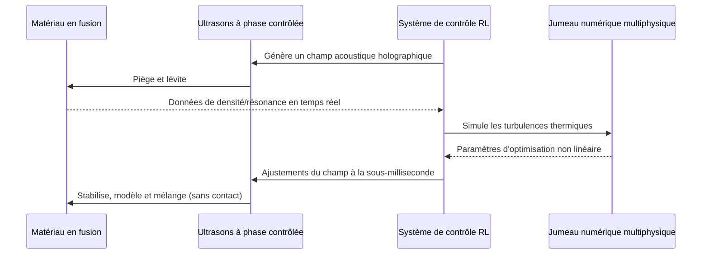

<!-- markdownlint-disable MD009 MD010 MD013 MD022 MD028 MD032 MD033 MD034 MD036 MD037 MD039 MD041 MD058 MD060 -->

[ 🇬🇧 English Version ](./README.md)

# Sonic Forge AI

> **Résumé exécutif :** Une forge de lévitation acoustique contrôlée par l'IA qui manipule des matériaux en fusion en plein air à l'aide d'ultrasons à phase contrôlée, permettant une fabrication sans défaut, semblable à la microgravité, sur Terre.

---

## 1. Aperçu visuel & Effet Wahou

```mermaid
graph TD
    %% Schéma comparatif Problème vs Solution ou Flux d'architecture
    subgraph Forge_Traditionnelle ["Forge Traditionnelle"]
        A[Matériau en fusion] --> B[Contact avec le creuset]
        B --> C[Impuretés & Défauts de nucléation]
        C --> D[Pièces défectueuses & Milliards gaspillés]
    end
    subgraph Sonic_Forge_AI ["Sonic Forge AI"]
        E[Matériau en fusion] --> F[Champ de lévitation acoustique]
        F --> G[Contrôle par Apprentissage par Renforcement]
        G --> H[Fabrication sans contact]
        H --> I[Matériaux ultra-purs sans défauts]
    end
```

## 2. La thèse contrariante (Peter Thiel Style)

**La croyance populaire :** Pour fabriquer des matériaux avancés et ultra-purs nécessitant l'absence de contact ou la microgravité, nous devons construire des usines orbitales coûteuses dans l'espace.

**La vérité cachée :** En maîtrisant les champs acoustiques dynamiques avec un contrôle IA inférieur à la milliseconde, nous pouvons simuler la microgravité et réaliser la manipulation sans contact de matériaux denses en fusion directement sur Terre, pour une fraction du coût.

## 3. Le problème & La cible

**Modèle économique :** B2B

**Cible précise :** Industrie aérospatiale (SpaceX, Airbus), fabricants de semi-conducteurs (TSMC, ASML), et entreprises pharmaceutiques (cristallisation de protéines).

**La douleur urgente :** Le contact physique avec les parois du creuset lors de la fusion et du formage de matériaux avancés (alliages spatiaux, optiques pures, cristaux pharmaceutiques) introduit des impuretés et des défauts de nucléation. Ces imperfections microscopiques détruisent les rendements, limitent la pureté et coûtent des milliards en pièces défectueuses jetées.

## 4. Architecture technique & Plomberie

## 5. Modèle économique & Viabilité financière

| Métrique                    | Valeur                                                    |
| :-------------------------- | :-------------------------------------------------------- |
| Structure de prix           | Location de matériel + Abonnement IA (SaaS/HaaS)          |
| Objectif 12 mois            | 2 projets pilotes (ex. aérospatial, pharma)               |
| Calcul du CA (Target 100k€) | 2 pilotes \* 50 000 €/mois = 100k€ ARR                    |
| Marge brute estimée         | 85% (sur le logiciel/contrôle IA après amortissement R&D) |

## 6. Moteur de distribution & Fossé défensif (Moat)

**Stratégie d'acquisition :** Ventes B2B directes ciblant les laboratoires de R&D des entreprises Fortune 500 de l'aérospatial, des semi-conducteurs et de la pharma. Prouver la valeur par le biais de projets pilotes et d'accords de développement conjoint.

**Moat (Barrière à l'entrée) :** La complexité de fermer la boucle entre un système matériel à phase contrôlée à haute température et un système de contrôle non linéaire par Apprentissage par Renforcement en moins d'une milliseconde. Les LLM natifs ou les logiciels SCADA standards ne peuvent pas reproduire le jumeau numérique physique et l'holographie acoustique en temps réel nécessaires à la manipulation de matériaux denses.

## 7. Grille d'évaluation détaillée

| Critère                           | Score VC (/100) | Score Terrain (/100) |
| :-------------------------------- | :-------------- | :------------------- |
| Thèse & Monopole / Urgence        | -- / 25         | 24 / 25              |
| Moat / Résistance aux LLM natifs  | -- / 25         | 25 / 25              |
| Scalabilité / Friction d'adoption | -- / 25         | 10 / 25              |
| Unit Economics / ROI direct       | -- / 25         | 18 / 25              |
| **TOTAL**                         | **-- / 100**    | **77 / 100**         |

> **Verdict VC :** En attente d'évaluation.
> **Verdict Terrain :** Urgence modérée mais valeur stratégique à long terme. L'immunité aux LLM est bonne, reposant sur des modèles spécifiques. L'adoption présente des frictions notables qui pourraient ralentir la monétisation initiale.
