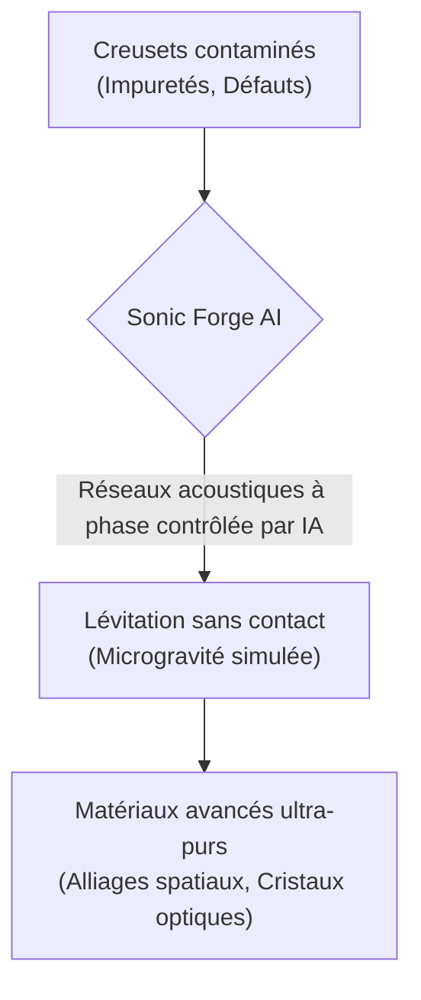
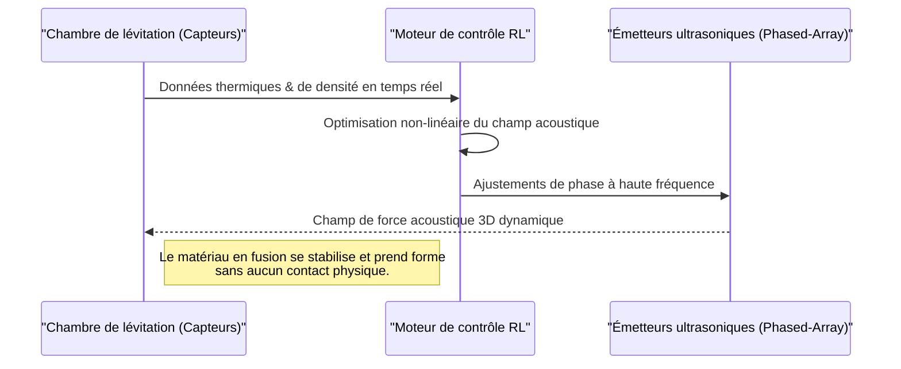

<!-- markdownlint-disable MD009 MD010 MD013 MD022 MD028 MD032 MD033 MD034 MD036 MD037 MD039 MD041 MD060 -->

[ 🇬🇧 English Version ](./README.md)

# Sonic Forge AI

> **Résumé exécutif :** Sonic Forge AI élimine la contamination des matériaux lors de la fabrication d'alliages et de cristaux avancés grâce à une forge de lévitation acoustique contrôlée par l'IA. Elle permet de fondre et modeler sans contact, simulant la microgravité sur Terre pour produire des composants ultra-purs pour l'aérospatiale, les semi-conducteurs et la pharmacie.

---

## 1. Aperçu visuel & Effet Wahou

## 2. La thèse contrariante (Peter Thiel Style)

**La croyance populaire :** Il faut aller dans l'espace (en orbite) pour fabriquer des matériaux parfaits et sans défauts en microgravité, sans contamination par un contenant.
**La vérité cachée :** La gravité terrestre peut être contrée par l'holographie acoustique dynamique. En utilisant l'apprentissage par renforcement pour contrôler les champs ultrasoniques en temps réel, il est possible de faire léviter et de manipuler des matériaux en fusion sur Terre, atteignant une pureté de niveau spatial sans les coûts astronomiques de la fabrication orbitale.

## 3. Le problème & La cible

**Modèle économique :** B2B
**Cible précise :** Industrie aérospatiale (SpaceX, Airbus), fabricants de semi-conducteurs (TSMC, ASML), et pharmaceutiques (cristallisation de protéines en apesanteur synthétique).
**La douleur urgente :** Lors de la fabrication de matériaux avancés (alliages spatiaux, composants optiques purs, cristaux pharmaceutiques), le simple contact physique du matériau en fusion avec les parois du creuset de fusion introduit des impuretés et des défauts de nucléation. Ces imperfections microscopiques ruinent les rendements, limitent la pureté et coûtent des milliards en pièces défectueuses jetées, rendant impossible la fabrication terrestre de certains matériaux nécessitant la microgravité.

## 4. Architecture technique & Plomberie

## 5. Modèle économique & Viabilité financière

| Métrique                | Valeur                                                          |
| ----------------------- | --------------------------------------------------------------- |
| **Structure de prix**   | Contrat de location du système / RaaS (Resilience as a Service) |
| **Objectif 12 mois**    | 2-3 déploiements pilotes (Labos aérospatiale/semi-conducteurs)  |
| **Calcul du CA**        | 3 Pilotes \* 35k€ setup + 5k€/mois licence                      |
| **Marge brute estimée** | >75% (Focus sur la licence logicielle & IP)                     |

## 6. Moteur de distribution & Fossé défensif (Moat)

**Stratégie d'acquisition :** Ventes B2B directes (programmes pilotes avec les départements R&D), publications scientifiques, partenariats avec les instituts de science des matériaux.
**Moat (Barrière à l'entrée) :** La manipulation des ondes acoustiques 3D en temps réel face à un matériau changeant d'état (densité/résonance) requiert un contrôle en boucle fermée à la milliseconde qu'un logiciel SaaS industriel standard ne peut accomplir. Le jumeau numérique multiphysique complexe nécessaire pour entraîner l'IA, associé aux transducteurs sur mesure résistant aux très hautes températures, constitue un fossé défensif technologique majeur.

## 7. Grille d'évaluation détaillée

| Critère                               | Score VC (/100) | Score Terrain (/100) |
| ------------------------------------- | --------------- | -------------------- |
| **Thèse & Monopole / Urgence**        | -- / 25         | -- / 25              |
| **Moat / Résistance aux LLM natifs**  | -- / 25         | -- / 25              |
| **Scalabilité / Friction d'adoption** | -- / 25         | -- / 25              |
| **Unit Economics / ROI direct**       | -- / 25         | -- / 25              |
| **TOTAL**                             | -- / 100        | -- / 100             |

> **Verdict VC :** En attente d'évaluation.
> **Verdict Terrain :** En attente d'évaluation.
