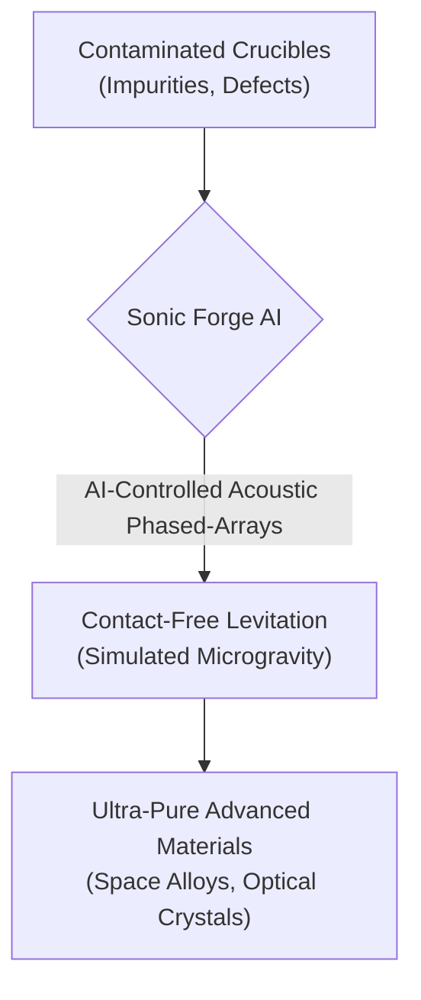
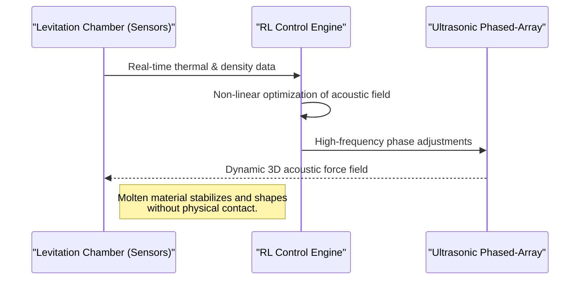

<!-- markdownlint-disable MD009 MD010 MD013 MD022 MD028 MD032 MD033 MD034 MD036 MD037 MD039 MD041 MD060 -->

[ 🇫🇷 Version Française ](./README.fr.md)

# Sonic Forge AI

> **Executive Summary:** Sonic Forge AI eliminates material contamination during the manufacturing of advanced alloys and crystals by using an AI-controlled acoustic levitation forge. This allows for contact-free melting and shaping, simulating microgravity conditions on Earth to produce ultra-pure components for the aerospace, semiconductor, and pharmaceutical industries.

---

## 1. Visual Overview & Wow Effect

## 2. Contrarian Thesis (Peter Thiel Style)

**Popular Belief:** You must go to space (orbit) to manufacture perfect, defect-free materials in microgravity without container contamination.
**Hidden Truth:** Terrestrial gravity can be counteracted with dynamic acoustic holography. By using reinforcement learning to control ultrasonic fields in real-time, we can levitate and manipulate molten materials on Earth, achieving space-grade purity without the astronomical cost of orbital manufacturing.

## 3. Problem & Target Market

**Business Model:** B2B
**Target Audience:** Aerospace industry (SpaceX, Airbus), semiconductor manufacturers (TSMC, ASML), and pharmaceuticals (synthetic microgravity protein crystallization).
**Urgent Pain Point:** Physical contact between molten materials and crucible walls introduces impurities and nucleation defects. These microscopic imperfections ruin yields, limit purity, and cost billions in discarded defective parts, making terrestrial manufacturing of certain microgravity-dependent materials impossible.

## 4. Technical Architecture & Infrastructure

## 5. Business Model & Financial Viability

| Metric                     | Value                                                                                   |
| -------------------------- | --------------------------------------------------------------------------------------- |
| **Pricing Structure**      | RaaS (Resilience as a Service) + System Lease / High-value material processing contract |
| **12-Month Target**        | 2-3 pilot deployments in Tier-1 aerospace/semiconductor labs                            |
| **Revenue Formula**        | 3 Pilots \* €35k setup + €5k/mo license                                                 |
| **Estimated Gross Margin** | >75% (Software & IP licensing focus)                                                    |

## 6. Distribution Engine & Moat

**Acquisition Strategy:** Direct B2B sales (pilot programs with R&D departments), scientific whitepapers, and partnerships with material science institutes.
**Moat (Defensibility):** The real-time, non-linear control loop required to manage changing states (density/resonance) of molten materials at the millisecond level cannot be replicated by standard SCADA software. The proprietary multiphysics digital twin used to train the RL AI, combined with complex custom hardware (high-temp transducers), creates a massive barrier to entry.

## 7. Detailed Evaluation Grid

| Criterion                       | VC Score (/100) | Market Score (/100) |
| ------------------------------- | --------------- | ------------------- |
| **Thesis & Monopoly / Urgency** | -- / 25         | -- / 25             |
| **Moat / LLM Immunity**         | -- / 25         | -- / 25             |
| **Scalability / UX Friction**   | -- / 25         | -- / 25             |
| **Unit Economics / ROI**        | -- / 25         | -- / 25             |
| **TOTAL**                       | -- / 100        | -- / 100            |

> **VC Verdict:** Pending evaluation.
> **Market Verdict:** Pending evaluation.
