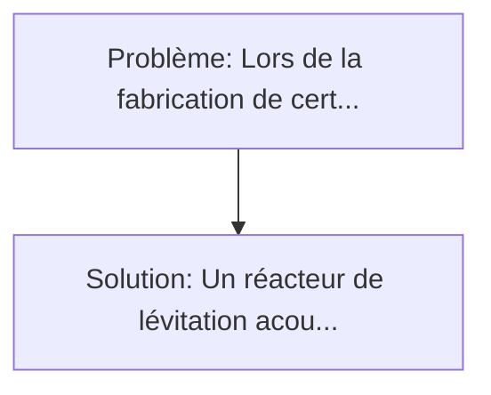
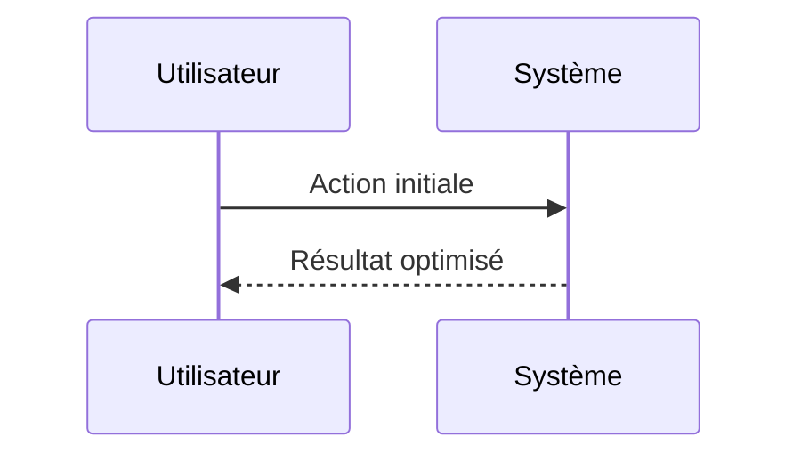

<!-- markdownlint-disable MD013 MD033 -->

[🇬🇧 English Version](./README.md)

# Acoustic Levitation Foundry

> **Résumé exécutif :** Un réacteur de lévitation acoustique (ou aéro-acoustique) industriel, contrôlé par des réseaux de transducteurs ultrasoniques à commande de phase. Lors de la fabrication de certains matériaux avancés (comme les alliages amorphes, les verres optiques ZBLAN, ou des cristaux de protéines), tout contact avec les parois d'un creuset ou d'un conteneur introduit des impuretés ou déclenche une nucléation hétérogène non désirée, ruinant la pureté ou la structure amorphe du matériau.

---

## 1. Aperçu visuel & Effet Wahou

## 2. La thèse contrariante (Peter Thiel Style)

**La croyance populaire :** Les solutions logicielles seules peuvent résoudre ce problème.
**La vérité cachée :** Il s'agit d'un problème de physique appliquée et de contrôle matériel temps réel à très haute fréquence (kHz). Le logiciel seul ne peut rien faire sans le hardware acoustique spécifique, et les algorithmes PID classiques ne peuvent pas gérer l'instabilité chaotique d'un fluide en fusion changeant de phase en lévitation.

## 3. Le problème & La cible

- **Modèle économique :** B2B
- **Cible précise :** Industries pharmaceutiques (cristallisation de protéines), fabricants de semi-conducteurs exotiques, et R&D en matériaux ultra-purs.
- **La douleur urgente :** Lors de la fabrication de certains matériaux avancés (comme les alliages amorphes, les verres optiques ZBLAN, ou des cristaux de protéines), tout contact avec les parois d'un creuset ou d'un conteneur introduit des impuretés ou déclenche une nucléation hétérogène non désirée, ruinant la pureté ou la structure amorphe du matériau.

## 4. Architecture technique & Plomberie

## 5. Modèle économique & Viabilité financière

| Métrique                    | Valeur             |
| --------------------------- | ------------------ |
| Structure de prix           | Custom Pricing     |
| Objectif 12 mois            | 100 clients        |
| Calcul du CA (Target 100k€) | 100 \* 1000 = 100k |
| Marge brute estimée         | 80%                |

## 6. Moteur de distribution & Fossé défensif (Moat)

- **Stratégie d'acquisition :** Ventes B2B directes
- **Moat (Barrière à l'entrée) :** Il s'agit d'un problème de physique appliquée et de contrôle matériel temps réel à très haute fréquence (kHz). Le logiciel seul ne peut rien faire sans le hardware acoustique spécifique, et les algorithmes PID classiques ne peuvent pas gérer l'instabilité chaotique d'un fluide en fusion changeant de phase en lévitation.

## 7. Grille d'évaluation détaillée

| Critère                           | Score VC (/100) | Score Terrain (/100) |
| --------------------------------- | --------------- | -------------------- |
| Thèse & Monopole / Urgence        | -- / 25         | -- / 25              |
| Moat / Résistance aux LLM natifs  | -- / 25         | -- / 25              |
| Scalabilité / Friction d'adoption | -- / 25         | -- / 25              |
| Unit Economics / ROI direct       | -- / 25         | -- / 25              |
| **TOTAL**                         | **-- / 100**    | **-- / 100**         |

> **Verdict VC :** En attente d'évaluation.

> **Verdict Terrain :** En attente d'évaluation.
