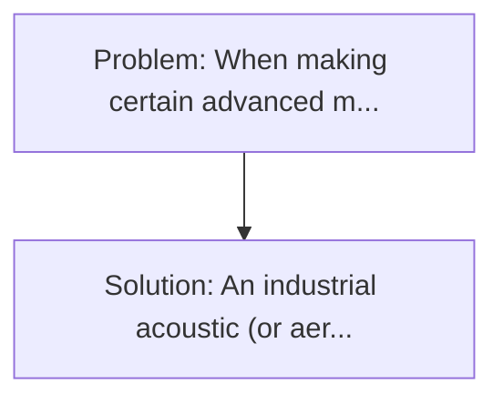
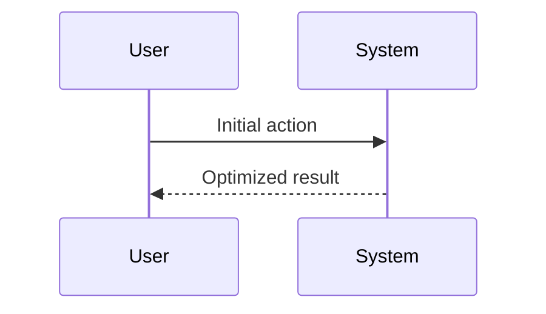

<!-- markdownlint-disable MD013 MD033 -->

[🇫🇷 Version Française](./README.fr.md)

# Acoustic Levitation Foundry

> **Executive Summary:** An industrial acoustic (or aero-acoustic) levitation reactor, controlled by phase-controlled ultrasonic transducer networks. When making certain advanced materials (such as amorphous alloys, ZBLAN optical lenses, or protein crystals), any contact with the walls of a crucible or container introduces impurities or triggers unwanted heterogeneous nucleation, ruining the purity or amorphous structure of the material.

---

## 1. Visual Overview & Wow Effect

## 2. Contrarian Thesis (Peter Thiel Style)

**Popular Belief:** Generic software solutions can solve this.
**Hidden Truth:** This is a problem of applied physics and real time hardware control at very high frequency (kHz). Software alone can do nothing without specific acoustic hardware, and conventional PID algorithms cannot manage the chaotic instability of a fusion fluid from phase to levitation.

## 3. Problem & Target Market

- **Business Model:** B2B
- **Target Audience:** Pharmaceutical industries (protein crystallization), manufacturers of exotic semiconductors, and R&D in ultra-pure materials.
- **Urgent Pain Point:** When making certain advanced materials (such as amorphous alloys, ZBLAN optical lenses, or protein crystals), any contact with the walls of a crucible or container introduces impurities or triggers unwanted heterogeneous nucleation, ruining the purity or amorphous structure of the material.

## 4. Technical Architecture & Infrastructure

## 5. Business Model & Financial Viability

| Metric                 | Value              |
| ---------------------- | ------------------ |
| Pricing Structure      | Custom Pricing     |
| 12-Month Target        | 100 customers      |
| Revenue Formula        | 100 \* 1000 = 100k |
| Estimated Gross Margin | 80%                |

## 6. Distribution Engine & Moat

- **Acquisition Strategy:** Direct B2B Sales
- **Moat (Defensibility):** This is a problem of applied physics and real time hardware control at very high frequency (kHz). Software alone can do nothing without specific acoustic hardware, and conventional PID algorithms cannot manage the chaotic instability of a fusion fluid from phase to levitation.

## 7. Detailed Evaluation Grid

| Criterion                   | VC Score (/100) | Market Score (/100) |
| --------------------------- | --------------- | ------------------- |
| Thesis & Monopoly / Urgency | -- / 25         | -- / 25             |
| Moat / LLM Immunity         | -- / 25         | -- / 25             |
| Scalability / UX Friction   | -- / 25         | -- / 25             |
| Unit Economics / ROI        | -- / 25         | -- / 25             |
| **TOTAL**                   | **-- / 100**    | **-- / 100**        |

> **VC Verdict:** Pending evaluation.

> **Market Verdict:** Pending evaluation.
