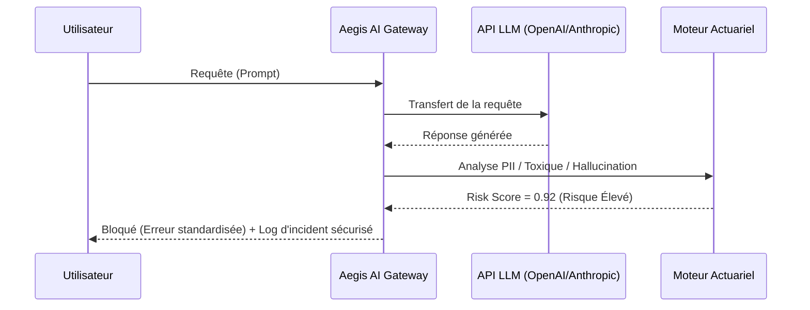

<!-- markdownlint-disable MD013 MD033 -->

# Aegis AI

> **Résumé exécutif :** Aegis AI est la première infrastructure d'assurance paramétrique pour LLM, permettant aux entreprises de déployer l'IA générative en couvrant financièrement les risques d'hallucination et de fuite de données.


---

## 1. Aperçu visuel

```mermaid
graph TD
    subgraph Déploiement Standard "Déploiement Standard (Risque Non Géré)"
        U1[Utilisateur] --> L1[Modèle LLM]
        L1 -.->|Hallucination critique| H1[Risque Financier & Légal 100% sur l'Entreprise]
    end

    subgraph Déploiement Aegis "Déploiement Aegis AI (Risque Transféré)"
        U2[Utilisateur] --> A[Aegis AI Risk Gateway]
        A --> L2[Modèle LLM]
        L2 --> A
        A -.->|Score de Risque Élevé| B[Circuit Breaker / Blocage]
        A -.->|Dommage avéré| C[Indemnisation Financière Automatisée]
    end
```

## 2. La thèse contrariante (Peter Thiel Style)

**La croyance populaire :**Le principal défi pour déployer l'IA générative en entreprise est d'améliorer techniquement les modèles (fine-tuning, RAG, prompt engineering) jusqu'à atteindre "zéro hallucination".

**La vérité cachée :**Le risque zéro n'existera jamais pour les systèmes probabilistes. Le véritable bloqueur à l'adoption n'est pas la précision parfaite, mais la**responsabilité financière**. En transformant un problème technique insoluble en un risque financier quantifiable et assurable, on débloque des milliards de dollars de déploiements gelés par les départements juridiques.

## 3. Le problème & La cible

- **Modèle économique :**B2B (SaaS Infrastructure + Courtage en assurance InsurTech)
- **Cible précise :**Directeurs des Systèmes d'Information (DSI), Chief Risk Officers (CRO) et Directeurs Juridiques des grandes entreprises (Banque, Santé, E-commerce, LegalTech) qui développent des applications basées sur des LLMs en interaction avec leurs clients.
- **La douleur urgente :**La paralysie décisionnelle. Les entreprises bloquent les mises en production de l'IA (et perdent en compétitivité) par crainte d'une amende RGPD massive, d'un procès suite à un conseil erroné de l'IA, ou de dommages à la réputation, car la charge du risque pèse entièrement sur elles.

## 4. Architecture technique & Plomberie

```python
import aegis_ai

# Initialisation du proxy de protection Aegis avec la police d'assurance souscrite
aegis_client = aegis_ai.Client(
    api_key="sk_...",
    policy_id="POL-9942-A",
    risk_tolerance_threshold=0.85
)

def chat_completion(prompt):
    # Aegis intercepte la requête, l'envoie au LLM (ex: OpenAI) et évalue la réponse
    response = aegis_client.chat.completions.create(
        model="gpt-4",
        messages=[{"role": "user", "content": prompt}],
        enable_liability_shield=True
    )

    # Si la réponse déclenche le bouclier (fuite PII ou hallucination détectée)
    if response.aegis_risk.blocked:
        return "Je suis désolé, je ne peux pas répondre à cette demande pour des raisons de sécurité."

    return response.choices[0].message.content
```



## 5. Modèle économique & Viabilité financière

| Métrique                        | Valeur                                                                                                                                                            |
| :------------------------------ | :---------------------------------------------------------------------------------------------------------------------------------------------------------------- |
| **Structure de prix**           | Modèle hybride : SaaS (Gateway) à 1 500 €/mois + Commission de courtage (15-20%) sur la prime d'assurance annuelle du partenaire réassureur.                      |
| **Objectif 12 mois**            | 6 clients "Enterprise" (SaaS) générant chacun une prime d'assurance moyenne de 40 000 €.                                                                          |
| **Calcul du CA (Target 100k€)** | SaaS : 6 x 18 000 €/an = 108 000 € <br> Commission : 6 x (40 000 € x 15%) = 36 000 € <br> **ARR Total : 144 000 €**                                               |
| **Marge brute estimée**         | 80% (Le coût d'inférence de l'évaluation du risque est mutualisé dans le prix du SaaS. Les revenus de commission d'assurance sont à près de 100% de marge brute). |

## 6. Moteur de distribution & Fossé défensif (Moat)

- **Stratégie d'acquisition :**Vente indirecte via des partenariats stratégiques avec les grands cabinets de conseil (MBB, Big 4) et les intégrateurs systèmes (Capgemini, Accenture). Lors d'un audit de risque d'un projet IA, ces cabinets prescriront Aegis AI comme la "couche de conformité et d'assurance" requise pour le go-live.
- **Moat (Barrière à l'entrée) :**
  - **Moat Réglementaire & Partenarial :**Il faut devenir un courtier agréé et signer avec des géants de la réassurance (Swiss Re, Munich Re) pour garantir les fonds, un processus lent et non-technique qui repousse les développeurs habituels de startups IA.
  - **Data Network Effect (Data Actuarielle) :**Plus Aegis analyse de flux de LLM, plus il collecte de la donnée d'incidentologie rare ("loss runs"). Ses modèles de probabilité de risque deviennent meilleurs que ceux du marché, permettant de baisser les primes d'assurance et d'écraser la concurrence naissante. OpenAI ne peut pas faire ça sans assumer un bilan de compagnie d'assurance.

## 7. Grille d'évaluation détaillée

| Critère                               | Score VC (/100) | Score Terrain (/100) |
| :------------------------------------ | :-------------: | :------------------: |
| **Thèse & Monopole / Urgence**        |     23 / 25     |       24 / 25        |
| **Moat / Résistance aux LLM natifs**  |     25 / 25     |       22 / 25        |
| **Scalabilité / Friction d'adoption** |     20 / 25     |       19 / 25        |
| **Unit Economics / ROI direct**       |     24 / 25     |       23 / 25        |
| **TOTAL**                             |  **92 / 100**   |     **88 / 100**     |

**Verdict global :**Aegis AI est une masterclass de positionnement économique : il vend des "pelles" règlementaires et assurantielles dans la ruée vers l'IA. Son moat est protégé à la fois par la complexité du secteur de l'assurance et par une barrière de données actuarielles, rendant le produit immunisé aux avancées brutes des LLM sous-jacents.
