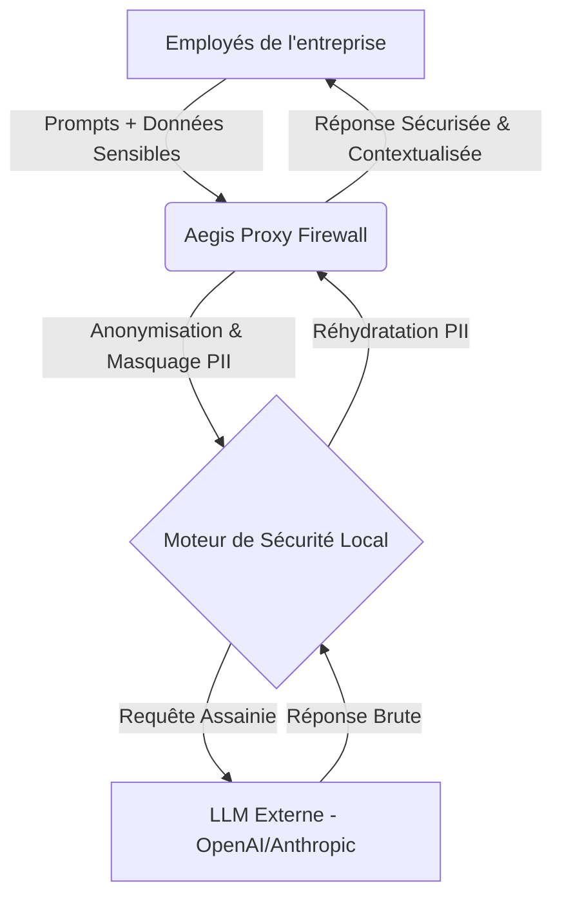
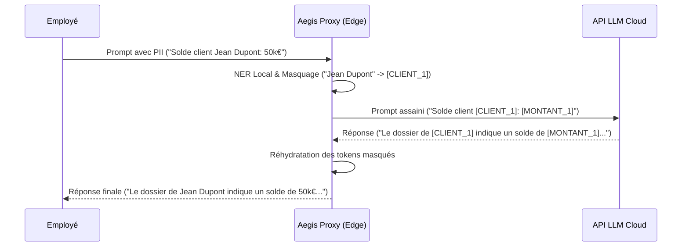

<!-- markdownlint-disable MD013 MD033 -->

# Aegis Proxy

> **Résumé exécutif :** Aegis Proxy est une couche d'infrastructure B2B agissant comme un pare-feu sémantique et un orchestrateur de confidentialité entre les employés et les LLMs externes, garantissant la conformité PII/IP sans sacrifier les performances.

---

## 1. Aperçu visuel & Effet Wahou

## 2. La thèse contrariante (Peter Thiel Style)

**La croyance populaire :** Toutes les entreprises finiront par héberger leurs propres LLMs open-source en interne (on-premise) pour garantir la sécurité absolue de leurs données.
**La vérité cachée :** L'hébergement on-premise est trop coûteux, complexe et les modèles deviennent obsolètes trop vite. Les entreprises veulent utiliser les meilleurs modèles cloud de pointe mais sont terrifiées par les fuites de propriété intellectuelle. La véritable valeur n'est pas dans l'hébergement de modèles, mais dans le péage sécuritaire agnostique situé entre le réseau de l'entreprise et le cloud.

## 3. Le problème & La cible

**Modèle économique :** B2B SaaS
**Cible précise :** CISO (Chief Information Security Officers) et CTOs d'entreprises Mid-Market et Grands Comptes (Secteurs : Finance, Santé, Légal, Assurance).
**La douleur urgente :** Le blocage total ou partiel de l'adoption de l'IA générative en interne par peur des fuites de données (Shadow AI). Cela cause une perte de productivité massive face aux concurrents qui ont trouvé un moyen d'adopter ces outils.

## 4. Architecture technique & Plomberie

## 5. Modèle économique & Viabilité financière

| Métrique | Valeur |
| :--- | :--- |
| **Structure de prix** | Abonnement B2B à la volumétrie (Licence par employé + Volume de tokens sécurisés) : Base à ~2 000€ / mois |
| **Objectif 12 mois** | 5 entreprises clientes (Mid-Market) |
| **Calcul du CA (Target 100k€)** | 5 clients × 2 000€/mois × 12 mois = 120 000€ ARR |
| **Marge brute estimée** | 85% (Coûts d'infrastructure de masquage local très faibles, les frais d'API LLM restent à la charge du client via son propre token) |

## 6. Moteur de distribution & Fossé défensif (Moat)

**Stratégie d'acquisition :** Ventes directes B2B (Direct Sales) ciblant les CISO. L'hameçon ("Lead magnet") est un audit gratuit du "Shadow AI" sur leur réseau, révélant les fuites actuelles des employés qui utilisent ChatGPT en secret malgré les interdictions.
**Moat (Barrière à l'entrée) :** Intégration réseau de bas niveau. Une fois installé comme proxy (reverse/forward) sur le réseau de l'entreprise, Aegis est extrêmement difficile à déloger (High Switching Costs). De plus, l'outil est agnostique au modèle : si OpenAI lance des outils de confidentialité, l'entreprise préférera toujours un tiers de confiance indépendant plutôt que de laisser le fournisseur du LLM être juge et partie.

## 7. Grille d'évaluation détaillée

| Critère | Score VC (/100) | Score Terrain (/100) |
| :--- | :---: | :---: |
| **Thèse & Monopole / Urgence** | -- / 25 | -- / 25 |
| **Moat / Résistance aux LLM natifs** | -- / 25 | -- / 25 |
| **Scalabilité / Friction d'adoption** | -- / 25 | -- / 25 |
| **Unit Economics / ROI direct** | -- / 25 | -- / 25 |
| **TOTAL** | **-- / 100** | **-- / 100** |

Verdict VC : En attente d'évaluation.

Verdict Terrain : En attente d'évaluation.
