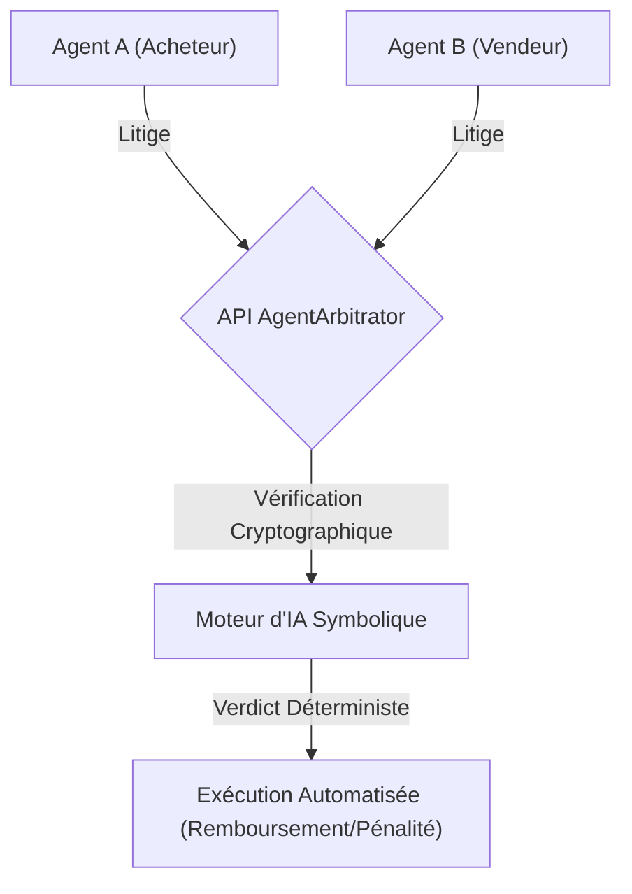
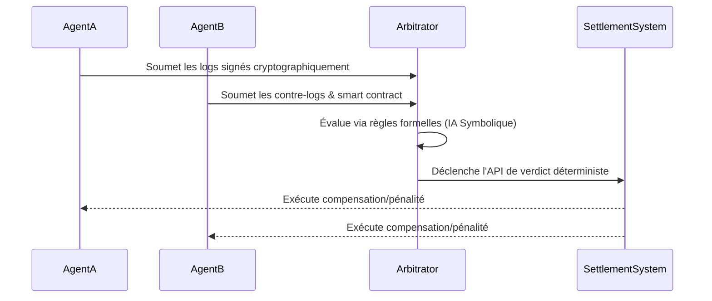

<!-- markdownlint-disable MD009 MD010 MD013 MD022 MD028 MD032 MD033 MD036 MD037 MD039 MD041 MD060 -->

[ 🇬🇧 English Version ](./README.md)

# AgentArbitrator Protocol

> **Résumé exécutif :** Une API d'arbitrage M2M déterministe conçue pour résoudre instantanément les impasses et litiges algorithmiques entre agents IA autonomes via des règles formelles hybrides et des logs cryptographiques.

---

## 1. Aperçu visuel

## 2. La thèse contrariante (Peter Thiel Style)

- **La croyance populaire :** Les agents autonomes négocieront de manière fluide pour atteindre des résultats optimaux sans intervention humaine.
- **La vérité cachée :** Les agents rencontreront inévitablement des blocages logiques et des injections de prompt adverses lors de litiges, nécessitant un système tiers neutre et déterministe pour éviter les boucles de négociation infinies.

## 3. Le problème & La cible

- **Modèle économique :** B2B / M2M
- **Cible précise :** Les plateformes e-commerce, réseaux logistiques, et marketplaces où des agents IA acheteurs et vendeurs négocient de manière autonome.
- **La douleur urgente :** Les boucles de négociation infinies ("gridlocks") entre agents conflictuels détruisent la productivité de l'automatisation et font exploser les coûts de support si une escalade humaine est nécessaire pour les micro-litiges.

## 4. Architecture technique & Plomberie

## 5. Modèle économique & Viabilité financière

| Métrique                    | Valeur                                   |
| --------------------------- | ---------------------------------------- |
| Structure de prix           | Par Appel d'API d'Arbitrage / Abonnement |
| Objectif 12 mois            | 10 000 000 d'arbitrages                  |
| Calcul du CA (Target 100k€) | 10M \* 0.01€ par arbitrage = 100k€       |
| Marge brute estimée         | 90%                                      |

## 6. Moteur de distribution & Fossé défensif (Moat)

- **Stratégie d'acquisition :** Intégration dans les principaux frameworks d'orchestration d'agents IA et les marketplaces M2M B2B comme standard de résolution de conflits par défaut.
- **Moat (Barrière à l'entrée) :** Neutralité vérifiable cryptographiquement et exécution hybride via IA symbolique, impossibles à répliquer de manière fiable par des LLM génératifs non déterministes en 24h. Les LLM généralistes sont vulnérables aux attaques de prompt injection.

## 7. Grille d'évaluation détaillée

| Critère                           | Score VC (/100) | Score Terrain (/100) |
| --------------------------------- | --------------- | -------------------- |
| Thèse & Monopole / Urgence        | -- / 25         | -- / 25              |
| Moat / Résistance aux LLM natifs  | -- / 25         | -- / 25              |
| Scalabilité / Friction d'adoption | -- / 25         | -- / 25              |
| Unit Economics / ROI direct       | -- / 25         | -- / 25              |
| **TOTAL**                         | **-- / 100**    | **-- / 100**         |

> **Verdict VC :** En attente d'évaluation.

> **Verdict Terrain :** En attente d'évaluation.
