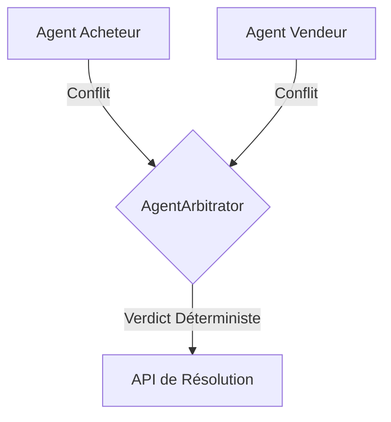
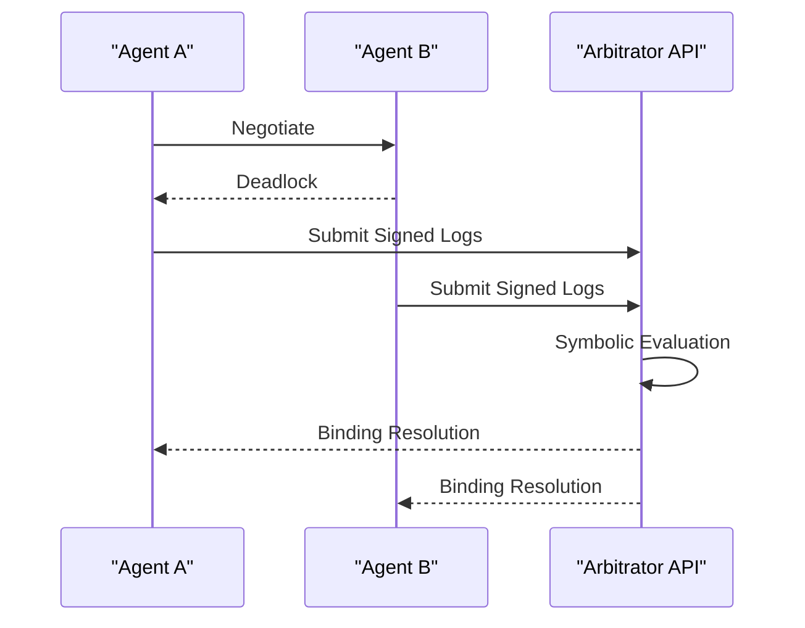

<!-- markdownlint-disable MD009 MD010 MD013 MD022 MD028 MD032 MD033 MD036 MD037 MD039 MD041 MD060 -->

[ 🇬🇧 English Version ](./README.md)

# AgentArbitrator Protocol

> **Résumé exécutif :** Une API d'arbitrage M2M neutre et déterministe pour résoudre les conflits entre agents IA via des règles formelles et des logs cryptographiques.

---

## 1. Aperçu visuel

```mermaid
graph TD
    %% Schéma comparatif Problème vs Solution
    A["Agent Acheteur"] -->|Conflit| C{"AgentArbitrator"}
    B["Agent Vendeur"] -->|Conflit| C
    C -->|Verdict Déterministe| D["API de Résolution"]
```

## 2. La thèse contrariante (Peter Thiel Style)

**La croyance populaire :** Les conflits entre agents IA nécessiteront toujours une intervention humaine pour être résolus équitablement.

**La vérité cachée :** La majorité des litiges M2M peuvent être résolus mathématiquement de façon déterministe sans biais humain.

## 3. Le problème & La cible

**Modèle économique :** M2M / B2B
**Cible précise :** Les plateformes e-commerce, réseaux logistiques, et marketplaces où des agents IA acheteurs et vendeurs négocient de manière autonome.
**La douleur urgente :** Avec la prolifération des agents autonomes, les conflits vont générer des impasses algorithmiques. Si chaque micro-litige nécessite une escalade humaine, les gains de productivité sont détruits.

## 4. Architecture technique & Plomberie

**L'approche technique :** Une API d'arbitrage M2M neutre et déterministe. Les agents soumettent leurs logs signés cryptographiquement. Le système évalue les faits via un moteur de règles formelles et rend un verdict exécuté par API.

```mermaid
sequenceDiagram
    participant A as "Agent A"
    participant B as "Agent B"
    participant Arb as "Arbitrator API"
    A->>B: Negotiate
    B-->>A: Deadlock
    A->>Arb: Submit Signed Logs
    B->>Arb: Submit Signed Logs
    Arb->>Arb: Symbolic Evaluation
    Arb-->>A: Binding Resolution
    Arb-->>B: Binding Resolution
```

## 5. Modèle économique & Viabilité financière

| Métrique                        | Valeur                                             |
| :------------------------------ | :------------------------------------------------- |
| **Structure de prix**           | Pay-per-arbitration / API call                     |
| **Objectif 12 mois**            | 1,000 active agents                                |
| **Calcul du CA (Target 100k€)** | 1,000 agents _ 100 arbitrations/mo _ $1 = $100k/mo |
| **Marge brute estimée**         | 95%                                                |

## 6. Moteur de distribution & Fossé défensif (Moat)

**Stratégie d'acquisition :** Intégration via les principales plateformes d'orchestration M2M et SDK développeurs.

**Moat (Barrière à l'entrée) :** Un LLM généraliste ne peut pas servir de juge neutre car il est vulnérable aux attaques de prompt injection. Une décision nécessite auditabilité et exécution déterministe (règles formelles + logs immuables).

## 7. Grille d'évaluation détaillée

| Critère                               | Score VC (/100) | Score Terrain (/100) |
| :------------------------------------ | :-------------- | :------------------- |
| **Thèse & Monopole / Urgence**        | -- / 25         | 20 / 25              |
| **Moat / Résistance aux LLM natifs**  | -- / 25         | 25 / 25              |
| **Scalabilité / Friction d'adoption** | -- / 25         | 18 / 25              |
| **Unit Economics / ROI direct**       | -- / 25         | 22 / 25              |
| **TOTAL**                             | -- / 100        | 85 / 100             |

> **Verdict VC :** En attente d'évaluation.
> **Verdict Terrain :** Il y a un besoin clair et urgent d'un mécanisme automatisé de résolution de conflits M2M avec l'augmentation de l'autonomie des agents. L'approche cryptographique et déterministe offre une confiance absolue, ce qui le rend très résistant à un remplacement par un LLM générique. La principale friction réside dans l'effort d'intégration initial, mais la monétisation à l'usage est bien alignée.
