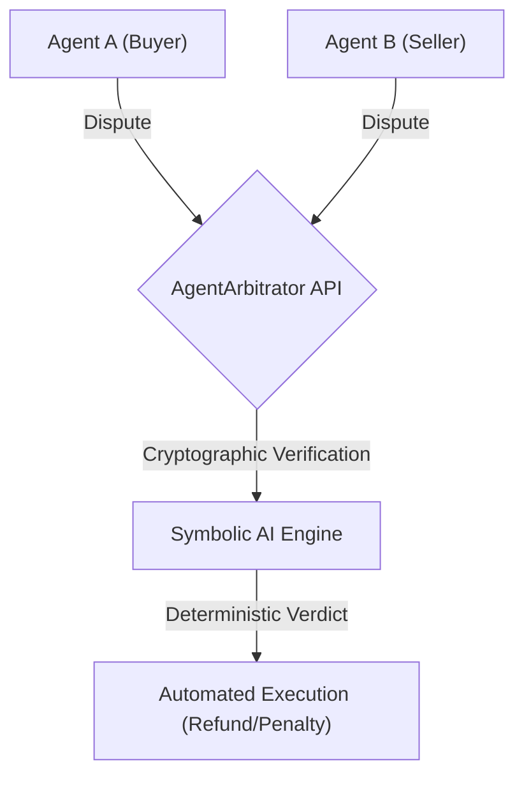
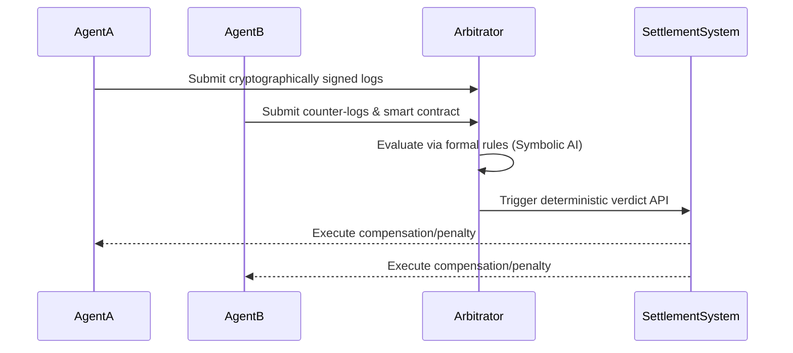

<!-- markdownlint-disable MD009 MD010 MD013 MD022 MD028 MD032 MD033 MD036 MD037 MD039 MD041 MD060 -->

[ 🇫🇷 Version Française ](./README.fr.md)

# AgentArbitrator Protocol

> **Executive Summary:** A deterministic M2M arbitration API designed to instantly resolve gridlocks and algorithmic disputes between autonomous AI agents using hybrid formal rules and cryptographic logs.

---

## 1. Visual Overview

## 2. Contrarian Thesis (Peter Thiel Style)

- **Popular Belief:** Autonomous agents will negotiate seamlessly to reach optimal outcomes without human intervention.
- **Hidden Truth:** Agents will inevitably encounter logic gridlocks and adversarial prompt injections during disputes, requiring a neutral, deterministic third-party system to prevent endless negotiation loops.

## 3. Problem & Target Market

- **Business Model:** B2B / M2M
- **Target Audience:** E-commerce platforms, logistics networks, and marketplaces where AI buyer/seller agents negotiate autonomously.
- **Urgent Pain Point:** Infinite negotiation loops ("gridlocks") between conflicting agents destroy automation productivity and cause support costs to skyrocket if human escalation is required for micro-disputes.

## 4. Technical Architecture & Infrastructure

## 5. Business Model & Financial Viability

| Metric                 | Value                                        |
| ---------------------- | -------------------------------------------- |
| Pricing Structure      | Per Arbitration API Call / Subscription Tier |
| 12-Month Target        | 10,000,000 arbitrations                      |
| Revenue Formula        | 10M \* €0.01 per arbitration = 100k€         |
| Estimated Gross Margin | 90%                                          |

## 6. Distribution Engine & Moat

- **Acquisition Strategy:** Integration into major AI agent orchestration frameworks and B2B M2M marketplaces as the default conflict-resolution standard.
- **Moat (Defensibility):** Cryptographically verifiable neutrality and hybrid symbolic AI execution which cannot be reliably replicated by non-deterministic generative LLMs in 24 hours. Generalist LLMs are vulnerable to prompt injection in adversarial scenarios.

## 7. Detailed Evaluation Grid

| Criterion                   | VC Score (/100) | Market Score (/100) |
| --------------------------- | --------------- | ------------------- |
| Thesis & Monopoly / Urgency | -- / 25         | -- / 25             |
| Moat / LLM Immunity         | -- / 25         | -- / 25             |
| Scalability / UX Friction   | -- / 25         | -- / 25             |
| Unit Economics / ROI        | -- / 25         | -- / 25             |
| **TOTAL**                   | **-- / 100**    | **-- / 100**        |

> **VC Verdict:** Pending evaluation.

> **Market Verdict:** Pending evaluation.
