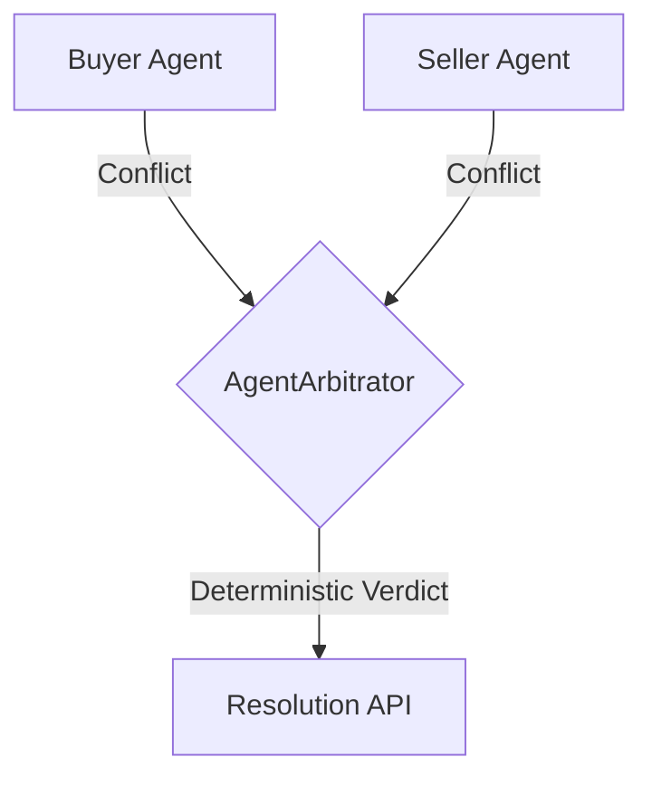
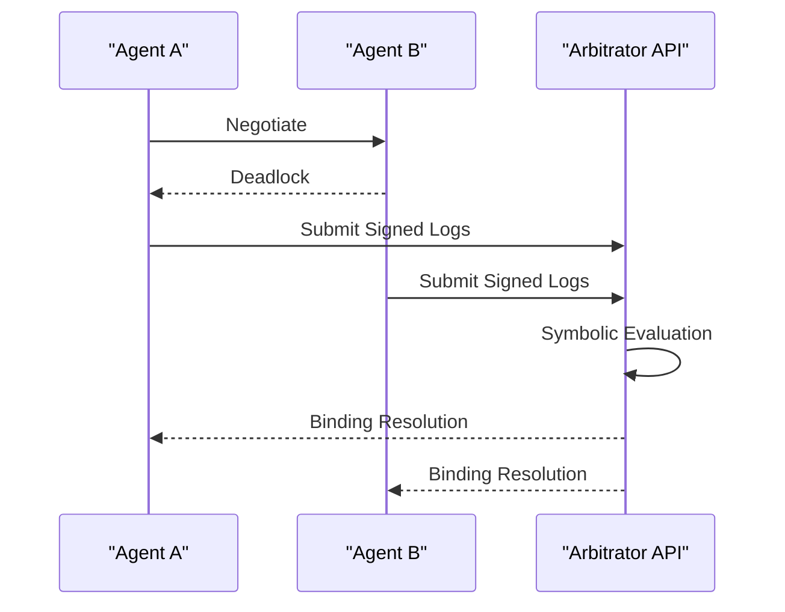

<!-- markdownlint-disable MD009 MD010 MD013 MD022 MD028 MD032 MD033 MD034 MD036 MD037 MD039 MD041 MD060 -->

[ 🇫🇷 Version Française ](./README.fr.md)

# AgentArbitrator Protocol

> **Executive Summary:** A neutral, deterministic M2M arbitration API designed to resolve deadlocks between autonomous AI agents using formal rules and cryptographic logs.

---

## 1. Visual Overview & Wow Effect

```mermaid
graph TD
    %% Problem vs Solution Architecture
    A["Buyer Agent"] -->|Conflict| C{"AgentArbitrator"}
    B["Seller Agent"] -->|Conflict| C
    C -->|Deterministic Verdict| D["Resolution API"]
```

## 2. Contrarian Thesis (Peter Thiel Style)

**Popular Belief:** Conflicts between AI agents will always require human intervention for fair resolution.

**Hidden Truth:** Most M2M disputes can be resolved mathematically and deterministically via smart contracts and formal rules without human bias.

## 3. Problem & Target Market

**Business Model:** M2M / B2B
**Target Audience:** E-commerce platforms, logistics networks, and marketplaces where autonomous AI buyers and sellers negotiate.
**Urgent Pain Point:** Proliferation of autonomous agents will lead to infinite negotiation loops (gridlocks). Human escalation destroys automation productivity and explodes support costs.

## 4. Technical Architecture & Infrastructure

**Technical Approach:** A neutral M2M arbitration API. Agents submit cryptographically signed logs and initial smart contracts. A formal rules engine (symbolic AI) evaluates facts and returns a binary verdict or compensation, executed via API.

```mermaid
sequenceDiagram
    participant A as "Agent A"
    participant B as "Agent B"
    participant Arb as "Arbitrator API"
    A->>B: Negotiate
    B-->>A: Deadlock
    A->>Arb: Submit Signed Logs
    B->>Arb: Submit Signed Logs
    Arb->>Arb: Symbolic Evaluation
    Arb-->>A: Binding Resolution
    Arb-->>B: Binding Resolution
```

## 5. Business Model & Financial Viability

| Metric                     | Value                                              |
| :------------------------- | :------------------------------------------------- |
| **Pricing Structure**      | Pay-per-arbitration / API call                     |
| **12-Month Target**        | 1,000 active agents                                |
| **Revenue Formula**        | 1,000 agents _ 100 arbitrations/mo _ $1 = $100k/mo |
| **Estimated Gross Margin** | 95%                                                |

## 6. Distribution Engine & Moat

**Acquisition Strategy:** Integration via major M2M orchestration platforms and developer SDKs.

**Moat (Defensibility):** A generalist LLM cannot serve as a neutral judge due to non-determinism and prompt injection vulnerability. A binding decision requires absolute auditability and deterministic execution via a hybrid system.

## 7. Detailed Evaluation Grid

| Criterion                       | VC Score (/100) | Market Score (/100) |
| :------------------------------ | :-------------- | :------------------ |
| **Thesis & Monopoly / Urgency** | 23 / 25         | -- / 25             |
| **Moat / LLM Immunity**         | 24 / 25         | -- / 25             |
| **Scalability / UX Friction**   | 21 / 25         | -- / 25             |
| **Unit Economics / ROI**        | 23 / 25         | -- / 25             |
| **TOTAL**                       | 91 / 100        | -- / 100            |

> **VC Verdict:** Agent Arbitrator Protocol attacks a critical bottleneck in the multi-agent economy by standardizing conflict resolution. Establishing a protocol-level standard creates a massive network effect and near-monopoly once adopted. The model completely circumvents the capabilities of raw LLMs, securing a highly scalable and profitable B2B moat.
> **Market Verdict:** Pending evaluation.
