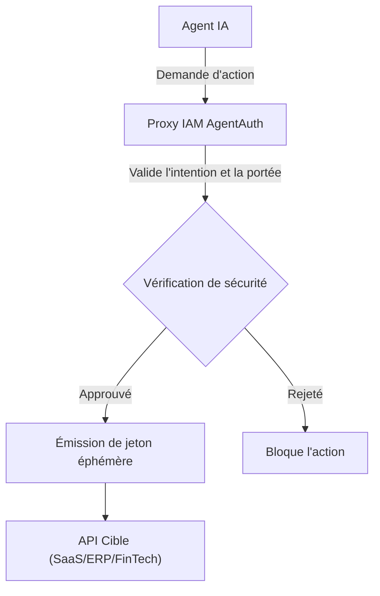
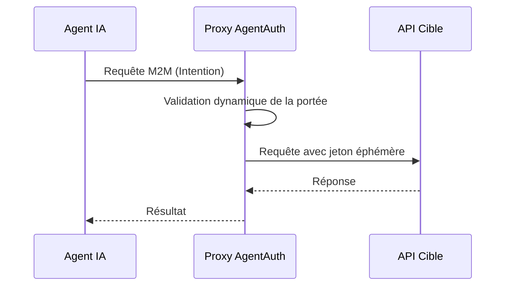

<!-- markdownlint-disable MD013 MD028 MD033 MD036 MD039 MD041 MD060 -->

[ 🇬🇧 English Version ](./README.md)

# AgentAuth

> **Résumé exécutif :** Infrastructure IAM (Identity and Access Management) conçue pour les agents autonomes IA interagissant avec des API internes ou tierces.

---

## 1. Aperçu visuel

## 2. La thèse contrariante (Peter Thiel Style)

La croyance populaire : Les développeurs peuvent sécuriser les agents IA en utilisant des prompts système bien conçus pour restreindre leurs actions.
La vérité cachée : Les LLM probabilistes ne peuvent pas appliquer de manière fiable leurs propres politiques de sécurité. Seul un proxy déterministe, cryptographique et au niveau de l'infrastructure peut garantir la sécurité contre les injections de prompt et les hallucinations.

## 3. Le problème & La cible

Modèle économique : M2M
Cible précise : Les entreprises déployant des agents autonomes IA qui interagissent avec des API internes ou tierces (SaaS, ERP, FinTech).
La douleur urgente : Donner aux agents des clés d'API globales (souvent celles d'utilisateurs humains) avec des privilèges excessifs crée un risque de sécurité critique. En cas d'attaque (prompt injection) ou d'hallucination, l'agent peut exécuter des actions destructrices non autorisées.

## 4. Architecture technique & Plomberie

## 5. Modèle économique & Viabilité financière

| Métrique                    | Valeur                                                   |
| --------------------------- | -------------------------------------------------------- |
| Structure de prix           | Abonnement basé sur l'usage (appels API)                 |
| Objectif 12 mois            | 100 clients entreprise / volume critique de requêtes M2M |
| Calcul du CA (Target 100k€) | Clients \* Abonnement moyen                              |
| Marge brute estimée         | 80-90%                                                   |

## 6. Moteur de distribution & Fossé défensif (Moat)

Stratégie d'acquisition : Adhésion dev M2M, SDKs open-source, ventes directes (SecOps).
Moat (Barrière à l'entrée) : Intégration profonde dans l'infrastructure de sécurité, couche cryptographique externe indépendante des LLMs, empêchant ChatGPT ou Gemini de répliquer la valeur de manière native en 24h.

## 7. Grille d'évaluation détaillée

| Critère                           | Score VC (/100) | Score Terrain (/100) |
| --------------------------------- | --------------- | -------------------- |
| Thèse & Monopole / Urgence        | -- / 25         | -- / 25              |
| Moat / Résistance aux LLM natifs  | -- / 25         | -- / 25              |
| Scalabilité / Friction d'adoption | -- / 25         | -- / 25              |
| Unit Economics / ROI direct       | -- / 25         | -- / 25              |
| **TOTAL**                         | **-- / 100**    | **-- / 100**         |

Verdict VC : En attente d'évaluation.

> **Verdict Terrain :** En attente d'évaluation.
