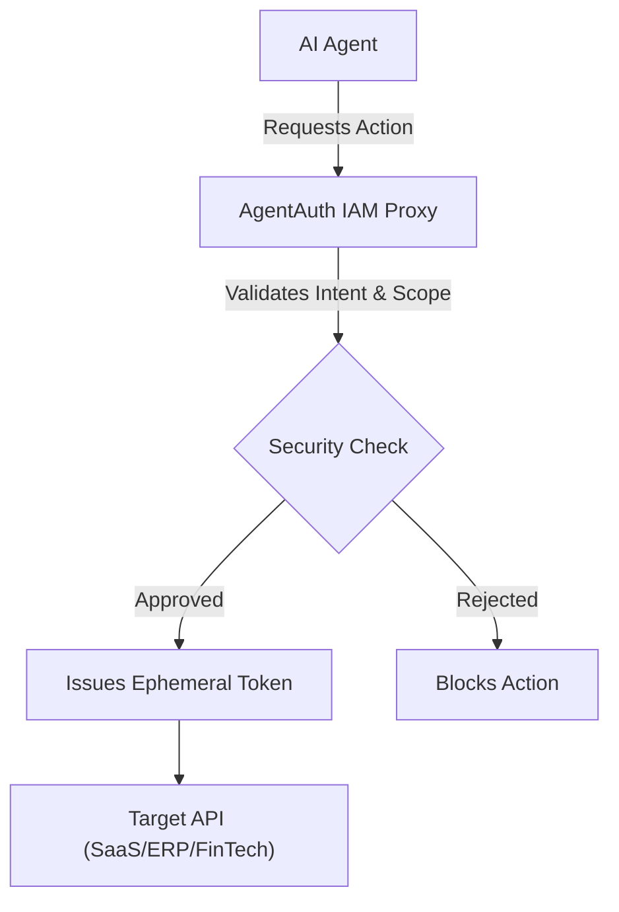
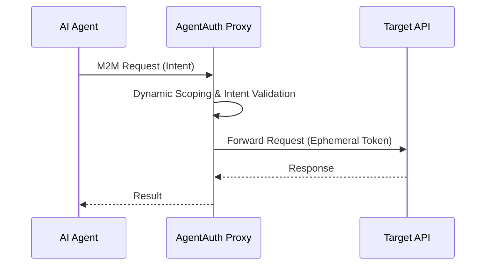

<!-- markdownlint-disable MD013 MD028 MD033 MD036 MD039 MD041 MD060 -->

[ 🇫🇷 Version Française ](./README.fr.md)

# AgentAuth

> **Executive Summary:** Identity and Access Management (IAM) infrastructure designed specifically for autonomous AI agents interacting with internal or third-party APIs.

---

## 1. Visual Overview

## 2. Contrarian Thesis (Peter Thiel Style)

Popular Belief: Developers can secure AI agents by using well-crafted system prompts to restrict their actions.
Hidden Truth: Probabilistic LLMs cannot reliably enforce their own security policies. Only a deterministic, cryptographic, and infrastructure-level proxy can guarantee safety against prompt injections and hallucinations.

## 3. Problem & Target Market

Business Model: M2M
Target Audience: Companies deploying autonomous AI agents that interact with internal or third-party APIs (SaaS, ERP, FinTech).
Urgent Pain Point: Giving agents global API keys (often tied to human users) with excessive privileges creates a critical security risk. A prompt injection or hallucination can lead to destructive, unauthorized actions that cost millions.

## 4. Technical Architecture & Infrastructure

## 5. Business Model & Financial Viability

| Metric                 | Value                                                     |
| ---------------------- | --------------------------------------------------------- |
| Pricing Structure      | Usage-based / Tiered API requests subscription            |
| 12-Month Target        | 100 enterprise customers or millions of secured M2M calls |
| Revenue Formula        | Customers \* Avg Subscription + Overages                  |
| Estimated Gross Margin | 80-90%                                                    |

## 6. Distribution Engine & Moat

Acquisition Strategy: Developer adoption, open-source SDKs, direct enterprise sales (SecOps).
Moat (Defensibility): Deep integration into enterprise infrastructure, cryptographic trust, and a deterministic security layer that native LLMs (like ChatGPT or Gemini) cannot inherently provide due to their probabilistic nature.

## 7. Detailed Evaluation Grid

| Criterion                   | VC Score (/100) | Market Score (/100) |
| --------------------------- | --------------- | ------------------- |
| Thesis & Monopoly / Urgency | 22 / 25         | 25 / 25             |
| Moat / LLM Immunity         | 24 / 25         | 25 / 25             |
| Scalability / UX Friction   | 20 / 25         | 18 / 25             |
| Unit Economics / ROI        | 23 / 25         | 17 / 25             |
| **TOTAL**                   | **89 / 100**    | **85 / 100**        |

> **Verdict Terrain :** The AgentAuth solution addresses a very targeted business need with tangible ROI. Its positioning as an API infrastructure guarantees good immunity against generalist LLMs. Even though adoption requires integration effort, the viability of the economic model is supported by the value delivered.
> **VC Verdict:** Agent-Auth solves the crucial identity crisis of the machine web. By providing verifiable credentials for AI agents, it positions itself as the SSO (Single Sign-On) of the autonomous era. Extremely sticky API integration ensures deep structural defensibility.
