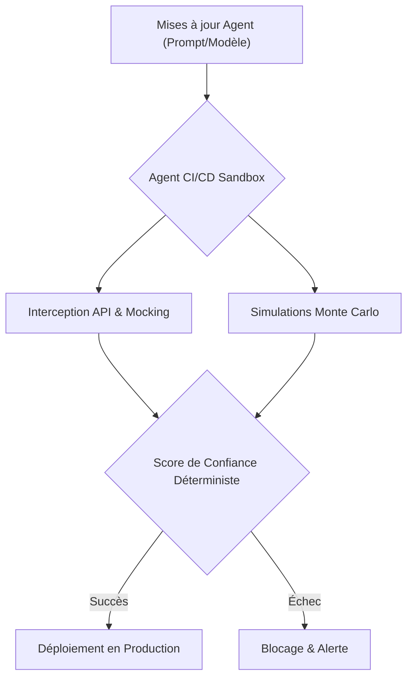
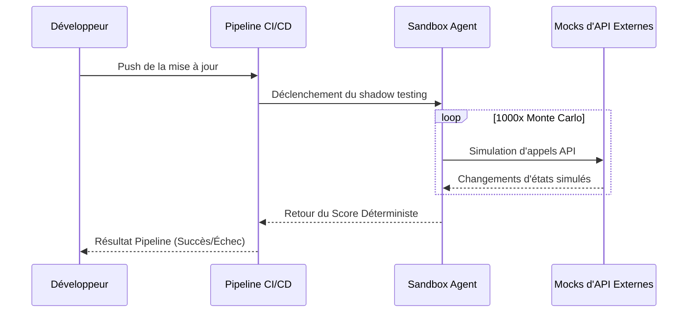

<!-- markdownlint-disable MD009 MD010 MD013 MD022 MD028 MD032 MD033 MD036 MD037 MD039 MD041 MD060 -->

[ 🇬🇧 English Version ](./README.md)

# Agent CI/CD Sandbox

> **Résumé exécutif :** Une infrastructure de "Shadow Testing" et de bac à sable pour exécuter des milliers de simulations Monte Carlo et calculer un score de confiance déterministe avant le déploiement d'agents autonomes en production.

---

## 1. Aperçu visuel

## 2. La thèse contrariante (Peter Thiel Style)

- **La croyance populaire :** Les tests unitaires standards et les benchmarks d'évaluation de LLM suffisent pour s'assurer qu'un agent se comporte correctement en production.
- **La vérité cachée :** Les agents autonomes ont des comportements non déterministes et émergents. Une simple modification peut causer des régressions silencieuses en cascade. Seul un shadow testing statistique au niveau de l'infrastructure peut garantir la sécurité.

## 3. Le problème & La cible

- **Modèle économique :** B2B
- **Cible précise :** Équipes DevOps, ML Engineers et développeurs intégrant des agents autonomes en production.
- **La douleur urgente :** Les comportements non déterministes provoquent des régressions silencieuses (appels API erronés, corruption de données, hallucinations), coûtant très cher en temps de débogage et en pertes d'exploitation.

## 4. Architecture technique & Plomberie

## 5. Modèle économique & Viabilité financière

| Métrique                    | Valeur                                           |
| --------------------------- | ------------------------------------------------ |
| Structure de prix           | Abonnement par Paliers / Par Puissance de Calcul |
| Objectif 12 mois            | 100 Équipes Entreprise                           |
| Calcul du CA (Target 100k€) | 100 _ 1000€ / mois _ 12 = 1.2M€                  |
| Marge brute estimée         | 85%                                              |

## 6. Moteur de distribution & Fossé défensif (Moat)

- **Stratégie d'acquisition :** Intégration comme plugin standard pour GitHub Actions, GitLab CI, et les frameworks d'agents majeurs (LangChain, AutoGen).
- **Moat (Barrière à l'entrée) :** Nécessite une lourde plomberie d'infrastructure pour le clonage de trafic, le mocking d'état et l'évaluation statistique continue, impossible à réaliser par un simple LLM qui s'auto-évalue.

## 7. Grille d'évaluation détaillée

| Critère                           | Score VC (/100) | Score Terrain (/100) |
| --------------------------------- | --------------- | -------------------- |
| Thèse & Monopole / Urgence        | -- / 25         | -- / 25              |
| Moat / Résistance aux LLM natifs  | -- / 25         | -- / 25              |
| Scalabilité / Friction d'adoption | -- / 25         | -- / 25              |
| Unit Economics / ROI direct       | -- / 25         | -- / 25              |
| **TOTAL**                         | **-- / 100**    | **-- / 100**         |

> **Verdict VC :** En attente d'évaluation.

> **Verdict Terrain :** En attente d'évaluation.
