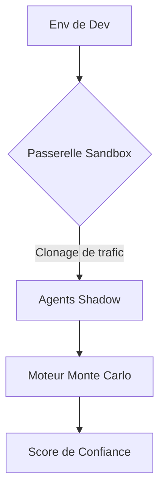
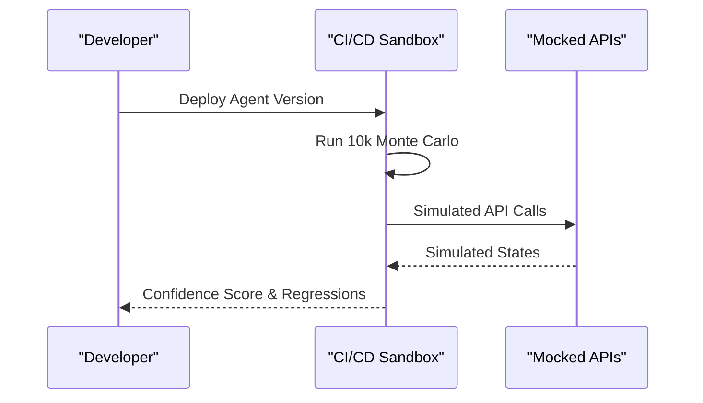

<!-- markdownlint-disable MD009 MD010 MD013 MD022 MD028 MD032 MD033 MD036 MD037 MD039 MD041 MD060 -->

[ 🇬🇧 English Version ](./README.md)

# Agent CI/CD Sandbox

> **Résumé exécutif :** Une infrastructure de Shadow Testing et de bac à sable pour intercepter et simuler les appels API des agents afin de garantir leur fiabilité avant le déploiement en production.

---

## 1. Aperçu visuel

```mermaid
graph TD
    %% Flux d'architecture
    A["Env de Dev"] --> B{"Passerelle Sandbox"}
    B -->|Clonage de trafic| C["Agents Shadow"]
    C --> D["Moteur Monte Carlo"]
    D --> E["Score de Confiance"]
```

## 2. La thèse contrariante (Peter Thiel Style)

**La croyance populaire :** Les agents IA peuvent être testés comme des logiciels classiques avec des tests unitaires.

**La vérité cachée :** Le comportement des agents est non déterministe ; ils nécessitent un shadow testing continu pour éviter des régressions coûteuses en production.

## 3. Le problème & La cible

**Modèle économique :** B2B
**Cible précise :** Équipes DevOps, ML Engineers et développeurs intégrant des agents autonomes en production.
**La douleur urgente :** Les comportements non déterministes provoquent des régressions silencieuses coûtant très cher en temps de débogage et pertes d'exploitation.

## 4. Architecture technique & Plomberie

**L'approche technique :** Infrastructure de Shadow Testing interceptant les appels API, simulant les environnements externes et exécutant des simulations de Monte Carlo pour valider le déploiement.

```mermaid
sequenceDiagram
    participant Dev as "Developer"
    participant Sandbox as "CI/CD Sandbox"
    participant Mock as "Mocked APIs"
    Dev->>Sandbox: Deploy Agent Version
    Sandbox->>Sandbox: Run 10k Monte Carlo
    Sandbox->>Mock: Simulated API Calls
    Mock-->>Sandbox: Simulated States
    Sandbox-->>Dev: Confidence Score & Regressions
```

## 5. Modèle économique & Viabilité financière

| Métrique                        | Valeur                                                      |
| :------------------------------ | :---------------------------------------------------------- |
| **Structure de prix**           | SaaS Subscription / Usage-based                             |
| **Objectif 12 mois**            | 100 Enterprise Teams                                        |
| **Calcul du CA (Target 100k€)** | 100 teams \* $1k/mo = $100k ARR target roughly (or $833/mo) |
| **Marge brute estimée**         | 85%                                                         |

## 6. Moteur de distribution & Fossé défensif (Moat)

**Stratégie d'acquisition :** Marketplaces d'outils dev, intégrations GitHub Actions, ventes B2B directes aux labs IA.

**Moat (Barrière à l'entrée) :** Un LLM ne peut pas s'auto-évaluer de manière fiable sur des workflows asynchrones. Cela nécessite une plomberie d'infrastructure dédiée (clonage, mocking).

## 7. Grille d'évaluation détaillée

| Critère                               | Score VC (/100) | Score Terrain (/100) |
| :------------------------------------ | :-------------- | :------------------- |
| **Thèse & Monopole / Urgence**        | -- / 25         | 23 / 25              |
| **Moat / Résistance aux LLM natifs**  | -- / 25         | 24 / 25              |
| **Scalabilité / Friction d'adoption** | -- / 25         | 19 / 25              |
| **Unit Economics / ROI direct**       | -- / 25         | 21 / 25              |
| **TOTAL**                             | -- / 100        | 87 / 100             |

> **Verdict VC :** En attente d'évaluation.
> **Verdict Terrain :** Le test des agents autonomes est un goulot d'étranglement critique, créant une immense urgence. Un bac à sable déterministe simulant les boucles infinies offre un fossé défensif puissant. Une friction d'adoption existe au niveau de l'intégration CI/CD, mais le ROI clair pour éviter les catastrophes justifie le prix.
