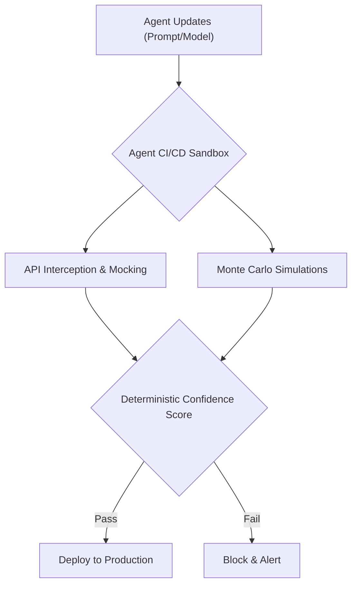
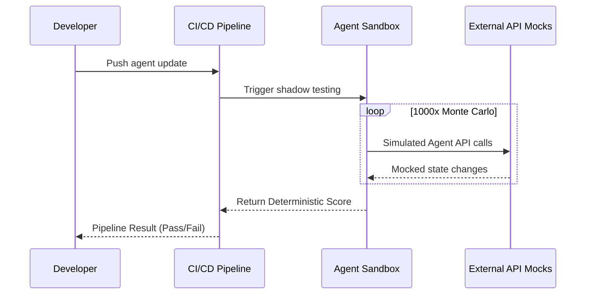

<!-- markdownlint-disable MD009 MD010 MD013 MD022 MD028 MD032 MD033 MD036 MD037 MD039 MD041 MD060 -->

[ 🇫🇷 Version Française ](./README.fr.md)

# Agent CI/CD Sandbox

> **Executive Summary:** A dedicated Shadow Testing and sandbox infrastructure for autonomous agents to run Monte Carlo simulations and calculate deterministic confidence scores before production deployment.

---

## 1. Visual Overview

## 2. Contrarian Thesis (Peter Thiel Style)

- **Popular Belief:** Standard unit testing and LLM evaluation benchmarks (like MMLU) are sufficient to ensure an agent behaves correctly in production.
- **Hidden Truth:** Autonomous agents exhibit non-deterministic, emergent behaviors where a single prompt tweak can cause cascading silent regressions and API corruptions. Only statistical, infrastructure-level shadow testing can guarantee production safety.

## 3. Problem & Target Market

- **Business Model:** B2B
- **Target Audience:** DevOps teams, ML Engineers, and developers integrating autonomous agents into production.
- **Urgent Pain Point:** Non-deterministic agent behaviors cause silent regressions (erroneous API calls, data corruption, hallucinations) resulting in massive debugging time and operational losses in production.

## 4. Technical Architecture & Infrastructure

## 5. Business Model & Financial Viability

| Metric                 | Value                                        |
| ---------------------- | -------------------------------------------- |
| Pricing Structure      | Tiered Subscription / Per Simulation Compute |
| 12-Month Target        | 100 Enterprise Teams                         |
| Revenue Formula        | 100 _ €1,000 / month _ 12 = 1.2M€            |
| Estimated Gross Margin | 85%                                          |

## 6. Distribution Engine & Moat

- **Acquisition Strategy:** Integration as a standard plugin for GitHub Actions, GitLab CI, and leading agent frameworks (LangChain, AutoGen).
- **Moat (Defensibility):** Heavy infrastructure plumbing for traffic cloning, state mocking, and continuous statistical evaluation, which cannot be solved by a standalone LLM prompting itself.

## 7. Detailed Evaluation Grid

| Criterion                   | VC Score (/100) | Market Score (/100) |
| --------------------------- | --------------- | ------------------- |
| Thesis & Monopoly / Urgency | -- / 25         | -- / 25             |
| Moat / LLM Immunity         | -- / 25         | -- / 25             |
| Scalability / UX Friction   | -- / 25         | -- / 25             |
| Unit Economics / ROI        | -- / 25         | -- / 25             |
| **TOTAL**                   | **-- / 100**    | **-- / 100**        |

> **VC Verdict:** Pending evaluation.

> **Market Verdict:** Pending evaluation.
