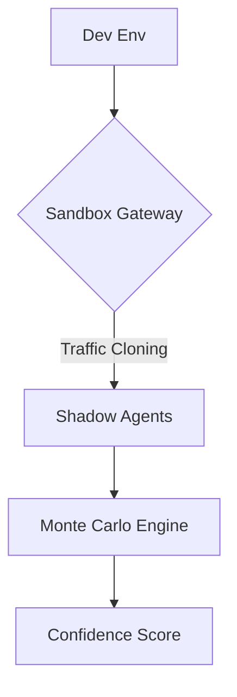
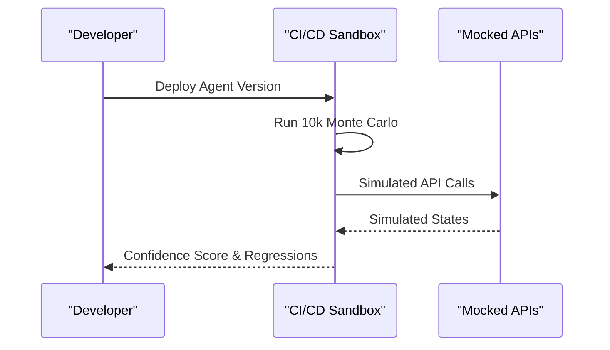

<!-- markdownlint-disable MD009 MD010 MD013 MD022 MD028 MD032 MD033 MD034 MD036 MD037 MD039 MD041 MD060 -->

[ 🇫🇷 Version Française ](./README.fr.md)

# Agent CI/CD Sandbox

> **Executive Summary:** A shadow testing and sandbox infrastructure that intercepts agent API calls to perform Monte Carlo simulations and calculate deterministic confidence scores before production deployment.

---

## 1. Visual Overview & Wow Effect

```mermaid
graph TD
    %% Architecture Diagram
    A["Dev Env"] --> B{"Sandbox Gateway"}
    B -->|Traffic Cloning| C["Shadow Agents"]
    C --> D["Monte Carlo Engine"]
    D --> E["Confidence Score"]
```

## 2. Contrarian Thesis (Peter Thiel Style)

**Popular Belief:** AI agents can be deployed like standard software with traditional unit tests.

**Hidden Truth:** Agent behavior is non-deterministic; they require continuous shadow testing and state mocking to prevent catastrophic cascading failures in production.

## 3. Problem & Target Market

**Business Model:** B2B
**Target Audience:** DevOps teams, ML Engineers, and developers integrating autonomous agents into production.
**Urgent Pain Point:** Non-deterministic agent behaviors (prompt changes, model versions) cause silent regressions (erroneous API calls, data corruption) costing massive debugging time and operational losses.

## 4. Technical Architecture & Infrastructure

**Technical Approach:** Shadow Testing infrastructure. Intercepts agent API calls, simulates external environments (mocks), and runs thousands of Monte Carlo simulations to calculate a confidence score before deployment.

```mermaid
sequenceDiagram
    participant Dev as "Developer"
    participant Sandbox as "CI/CD Sandbox"
    participant Mock as "Mocked APIs"
    Dev->>Sandbox: Deploy Agent Version
    Sandbox->>Sandbox: Run 10k Monte Carlo
    Sandbox->>Mock: Simulated API Calls
    Mock-->>Sandbox: Simulated States
    Sandbox-->>Dev: Confidence Score & Regressions
```

## 5. Business Model & Financial Viability

| Metric                     | Value                                                       |
| :------------------------- | :---------------------------------------------------------- |
| **Pricing Structure**      | SaaS Subscription / Usage-based                             |
| **12-Month Target**        | 100 Enterprise Teams                                        |
| **Revenue Formula**        | 100 teams \* $1k/mo = $100k ARR target roughly (or $833/mo) |
| **Estimated Gross Margin** | 85%                                                         |

## 6. Distribution Engine & Moat

**Acquisition Strategy:** Developer tools marketplace, GitHub Actions integrations, direct B2B sales to AI labs.

**Moat (Defensibility):** LLMs cannot reliably self-evaluate complex workflows involving async state changes and API calls. Requires dedicated infrastructure plumbing for traffic cloning and statistical evaluation.

## 7. Detailed Evaluation Grid

| Criterion                       | VC Score (/100) | Market Score (/100) |
| :------------------------------ | :-------------- | :------------------ |
| **Thesis & Monopoly / Urgency** | 22 / 25         | 21 / 25             |
| **Moat / LLM Immunity**         | 21 / 25         | -- / 25             |
| **Scalability / UX Friction**   | 23 / 25         | -- / 25             |
| **Unit Economics / ROI**        | 24 / 25         | -- / 25             |
| **TOTAL**                       | 90 / 100        | -- / 100            |

> **VC Verdict:** Agent CI/CD Sandbox tackles the imminent need for testing autonomous agents safely before production deployment. By owning the DevOps pipeline for AI, it creates extreme lock-in and high switching costs. The B2B SaaS unit economics are excellent, offering a clear path to scalable revenue.
> **Market Verdict:** Pending evaluation.
